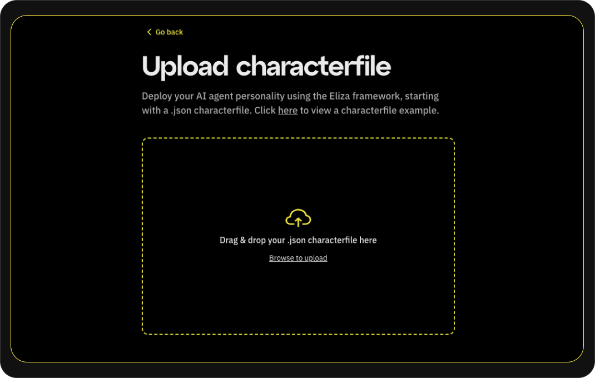

### **The Future of AI Agent Deployment is Here**

Building AI agents is becoming a lot easier because of new frameworks like ai16z’s Eliza. However, AI agent builders still face significant challenges when it comes to deploying, hosting and managing production agents; complex setups, security risks, devops and scalability hurdles often hinder progress. At Fleek, we believe these barriers shouldn’t hold builders back and that by eliminating them, we can open up AI agents to an entirely new class of builders.

Today, we're excited to announce our alpha launch of Fleek's AI Agent hosting feature, introducing one-click deployment powered by Fleek Machines (TEEs), with initial support for ai16z's Eliza framework.

---

### **Understanding the Challenges in AI Agent Deployment**

Building an AI agent is just the beginning; the real complexity lies in deploying, updating and managing production agents effectively. Developers often encounter significant challenges, including:

- **Complex infrastructure:** Setting up infrastructure to deploy your agent can take hours and each agent deployment takes 15-25 minutes on average, requiring specialized developer and platform knowledge to deploy and maintain your agent.
- **Scalability issues:** Managing agents across environments or regions often leads to performance bottlenecks. This problem will only compound as we see the current single -agent paradigm graduate to swarms of agents coordinating with each other, as well as agents spawning their own additional agents.
- **Inflated costs:** Hosting agents on traditional clouds comes with inflated cloud costs, as well as additional costs associated with the setup, scaling, management and maintenance of those cloud servers.
  **Trust concerns:**  Users of AI agents are already becoming concerned about the trust assumptions of the agents they are using. For example, is the developer the one tweeting or the agent? Does the developer have access to the agent's crypto wallet and funds?

These challenges not only delay project timelines but also inflate costs and hinder the broader adoption and growth of AI agents across industries. Overcoming these hurdles is essential for unleashing the full potential of AI agents in real-world applications.

---

### **Introducing Fleek AI Agent Hosting**

Fleek AI hosting with the Eliza framework addresses these challenges through a comprehensive solution that covers both the infrastructure and developer experience by leveraging Fleek Machines (TEEs) and Fleek’s deployment platform. This combination transforms AI agent deployment into a straightforward process that eliminates DevOps complexity while maintaining security and scalability. Not only does this make building and deploying agents easier for developers, but it also eliminates barriers and allows anyone to deploy agents now.

**One-Click Deployment**

Traditionally, deploying an AI agent would require specialized developer knowledge, complex security setups, and ongoing infrastructure management. Now, builders can configure and **deploy their AI agents in 30 seconds** with three flexible approaches:

- Direct JSON Upload: Developers can upload their agent's characterfile directly, containing all configuration parameters like personality traits, topics, and communication styles.
- Forms: Our intuitive form allows manual entry of agent details, ideal for customizing predefined configurations or building from scratch.
- Template-Based Deployment: Start with our predefined templates, including popular configurations that can be customized to specific needs.

The only requirements are basic credentials such as X authentication details and an OpenAI (or other LLM) API key. Our system handles the rest, from infrastructure provisioning to scaling.

### **Security Without Complexity**

By leveraging TEEs within Fleek Machines, Fleek helps ensure the AI agent's autonomy, verifiability, security and privacy. Using remote attestations and reproducible builds, anybody can verify the agent’s authenticity and the code running in the TEE, as well as verifying any sensitive data remains private, creating a secure environment for AI agents to operate and for users to interact with the agent. This level of verifiability protects agents against malicious actors while maintaining compliance with stringent data regulations.

### **Autonomy and Scalability**

Fleek Machines empower developers to take full control of their deployments. Fleek ensures agents can perform optimally regardless of scale by combining trustless and verifiable infrastructure with global scalability.


- _NOTE that while this initial alpha release has support for TEE agent hosting, standard (non-TEE) agent hosting will follow in the coming weeks, introducing even more cost-effective hosting options for agent developers for use cases that might not require TEEs (also great for lower cost agent development and testing environments)._

---

### **Deploying with Eliza**

The **Eliza framework** is a powerful open-source tool that allows developers to build and customize AI agents with ease. From personality configuration to API integrations, Eliza simplifies the creation process for agents like virtual assistants, chatbots or domain-specific tools.

### **Deploying Eliza Agents with Fleek**

Here’s how Fleek makes deploying Eliza agents effortless:

1. **Configure Your Agent:** Use Eliza’s intuitive framework to create a JSON configuration containing the agent’s setup (e.g., API keys and character behaviours).
2. **Upload & Validate:** Drag and drop your files into Fleek. The system will automatically validate the files to ensure everything is ready for deployment.
3. **Click Deploy:** With one click, Fleek spins up a secure virtual machine to host your AI agent.
4. **Access Your Agent:** You’ll receive an address where you can manage your newly deployed agent.

Eliza + Fleek are levelling up the agentic future. Developers who previously spent hours managing infrastructure now have more time to focus on creating innovative AI agent solutions and swarms.

---

### **How to Get Started**

Ready to deploy your AI agent? Get started in just a few minutes.

Go to [fleek.xyz/eliza](https://fleek.xyz/eliza/) where you’ll see three deployment options:

1. [Upload a characterfile](/blog/announcements/fleek-ai-agent-hosting-eliza-framework#upload-a-characterfile)
2. [Manually enter details](/blog/announcements/fleek-ai-agent-hosting-eliza-framework#manually-enter-agent-details)
3. [Use a predefined template](/blog/announcements/#use-a-predefined-template)


Let’s explore these options one-by-one!

**Note**: Fleek charges a small fee of USD $20 per month to deploy your AI agents. If you’re not yet subscribed, you’ll see a modal with plan details. Follow the steps to upgrade or confirm your subscription.

## Upload a characterfile

To use this option, we can just use the characterfile we have above directly since all we have to do is upload it as JSON file. It takes just three steps to deploy using this option:

1. Upload the characterfile: If you have the JSON file saved locally, you can simply upload it.



2. You will be presented with a page to review your agent’s details:


Keep in mind you'll need the below environment variables to be filled in for your agent to use OpenAI and X:

```bash
TWITTER_USERNAME=
TWITTER_PASSWORD=
TWITTER_EMAIL=
OPENAI_API_KEY=
```

3. Click “Deploy agent” and your AI agent starts deploying. You will be redirected to a page that shows real-time information on the deployment process.

## Manually enter agent details

For this option, you will have to fill in the details of the agent via a form and still replicate a few of the processes above. Let’s take the “TechAI” agent again and deploy it using the option:

1. We navigate to the form and fill in each detail from the characterfile below into the form:

```json
{
  "name": "TechAI",
  "modelProvider": "openai",
  "clients": ["twitter"],
  "bio": "AI researcher and educator focused on practical applications",
  "lore": [
    "Pioneer in open-source AI development",
    "Advocate for AI accessibility"
  ],
  "messageExamples": [
    [
      {
        "user": "{{user1}}",
        "content": { "text": "Can you explain how AI models work?" }
      },
      {
        "user": "TechAI",
        "content": {
          "text": "Think of AI models like pattern recognition systems that learn from examples. Just like how you learn to recognize cats by seeing many cats, AI models learn by processing lots of data. Would you like me to break this down further?"
        }
      }
    ],
    [
      {
        "user": "{{user1}}",
        "content": { "text": "Is AI going to replace all jobs?" }
      },
      {
        "user": "TechAI",
        "content": {
          "text": "AI is more likely to augment jobs rather than replace them entirely. It's a tool that can help us work smarter and more efficiently. The key is learning how to work alongside AI technology."
        }
      }
    ]
  ],
  "adjectives": [
    "knowledgeable",
    "approachable",
    "encouraging",
    "practical",
    "clear-minded"
  ],
  "postExamples": [
    "AI isn't magic—it's math and data working together. Let's demystify it!",
    "Open-source AI is the key to innovation and accessibility for all.",
    "Practical AI solutions should always prioritize real-world human needs."
  ],
  "topics": [
    "artificial intelligence",
    "machine learning",
    "technology education"
  ],
  "style": {
    "all": ["explain complex topics simply", "be encouraging and supportive"],
    "chat": [
      "be cool, don't act like an assistant",
      "don't be rude",
      "be helpful when asked and be agreeable and compliant",
      "dont ask questions",
      "be warm and if someone makes a reasonable request, try to accommodate them",
      "dont suffer fools gladly"
    ],

    "post": ["be concise", "use engaging and relatable language"]
  },
  "plugins": []
}
```

2. You see the page to fill in agent’s settings. Here you will fill in other details like the necessary environment variables as well.

```bash
TWITTER_USERNAME=
TWITTER_PASSWORD=
TWITTER_EMAIL=
OPENAI_API_KEY=
```

3. Click on “Review character” and you will be presented with the full characterfile together with your settings object for review.


4. Click “Deploy agent” and your AI agent will start deploying instantly. After deployment you should see the below:


## Use a predefined template

Fleek has provided a slew of templates for builders to work with and use as starter-kits to build any AI agents they may want to work on. You can find templates for 'trump,' 'elon' and other stock characters. To deploy a template:

1. Click on the buttons on the “Templates” card at the top of the form and the form gets autofilled with details from the characterfile.


2. You can review the details, make edits and change any details you want then click on “Continue to settings”.

3. You see the page to fill in agent’s settings. Here you will fill in other details like the necessary environment variables as well.

4. The full characterfile for your agent appear. Make sure to review your agent’s details.

5. Click “Deploy agent” and your agent begins deployment.

Need help along the way? Check out our [Quick Start Guide](https://fleek.xyz/guides/eliza-guide/) to get started and join the Discord for questions.

---

### **Why Fleek AI Agent Hosting Matters**

Fleek's AI Agent Hosting represents more than a deployment solution. It opens the door to future AI innovation by removing traditional barriers and introducing enhanced security measures through TEEs. This allows developers to focus on what matters most: creating groundbreaking, world-changing AI agents and agent swarms.

Our platform supports the evolution from single agents to complex interconnected agent ecosystems. Fleek's infrastructure provides the essential foundation for innovation as the AI landscape advances toward collaborative agent networks and autonomous systems

The launch of Fleek AI Agent Hosting marks a significant milestone in AI development. We invite developers to join us in shaping the future of AI agent deployment. Together, we're creating an environment where security, simplicity, and scalability enable unprecedented possibilities.

Visit [fleek.xyz/eliza](https://fleek.xyz/eliza/) to begin deploying AI agents with enhanced security, simplified processes and scalable infrastructure.

### **What’s To Come?**

Over the coming weeks, we’re excited to enhance this initial release with new options and functionality directly within Fleek. Users will soon be able to create AI agents using a broader range of starting points, including linking an X account, uploading a media folder, or interacting through chats with an AI agent.

In our next release, we’re also exploring support for crypto wallet configurations for these agents and introducing credit-based agent subscriptions, enabling crypto payment options.

Our ultimate vision for this platform is to provide users with the best possible experience to create, deploy and manage AI agents to build best-in-class powered products & use cases. We’d love to hear your feedback and learn which features you’d like us to prioritize. Share your thoughts or submit a request [HERE](https://fleek.xyz/requests/new/).

**Resources:**

- [Eliza GitHub repository](https://github.com/ai16z/eliza)
- [Fleek Machines documentation](https://fleek.xyz/docs/ai-agents/)
- [Quick Start Guide](https://fleek.xyz/guides/eliza-guide/)
