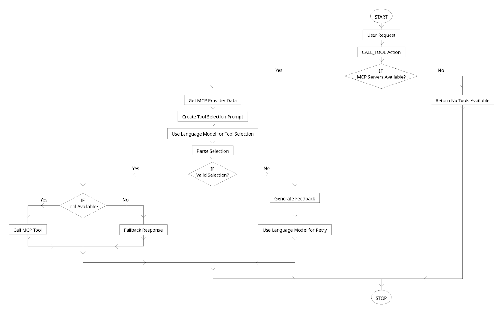

**Fleek just made a major contribution that will supercharge the Eliza agent framework.** With our new [MCP plugin for ElizaOS](https://github.com/fleek-platform/eliza-plugin-mcp), agents can now connect to **any website, app, or API** through the Model Context Protocol (MCP) – with zero custom code.

---

## Why This Plugin Is a Big Deal

MCP is the new hot thing in the agent ecosystem. It’s an open protocol that gives agents structured access to external tools, APIs, and data sources. Want your agent to read a GitHub repo? Fetch data from a third-party service? Interact with your internal tools? MCP makes that easy – and standardized.

**Until now, Eliza didn’t support MCP.** This plugin changes that.

With this release:

- **Every Eliza agent** can now access the full MCP ecosystem.
- Agents can **reason across multiple servers**, pick the right tool for the job, and handle complex tasks.
- It’s **configuration only** – no code needed to connect agents to new capabilities.
- MCP servers now **live alongside your agent**, no need to host them separately, which drastically improves the developer experience.

---

## How It Works

At its core, the plugin lets your Eliza agent:

1. Discover tools across registered MCP servers
2. Choose the right one based on the user's query
3. Execute that tool
4. Handle any errors and retry with a feedback loop
5. Store the response in memory and reply

This is possible because of the way we built the plugin: it runs MCP servers **directly with the agent**, rather than requiring local or remote hosting. It also supports remote SSE-based servers if you want to connect to external services.

## Plugin Flow:



Want to dive deeper? **Check out the [GitHub Readme](https://github.com/fleek-platform/eliza-plugin-mcp?tab=readme-ov-file#mcp-plugin-for-elizaos)**

---

## How to Use It

Install the plugin in your Eliza character project:

```bash
npm install @fleek-platform/eliza-plugin-mcp
```

# or

```bash
pnpm install @fleek-platform/eliza-plugin-mcp
```
# or
```bash
yarn add @fleek-platform/eliza-plugin-mcp
```

# or

```bash
bun add @fleek-platform/eliza-plugin-mcp
```

Then, add this to your config:

```json
{

"name": "Your Character",

"plugins": ["@fleek-platform/eliza-plugin-mcp"],

"settings": {

"mcp": {

"servers": {

"github": {

"type": "stdio",

"name": "Code Server",

"command": "npx",

"args": ["-y", "@modelcontextprotocol/server-github"]

  }
}
```

Now your agent can interact with that GitHub server – and anything else you plug in.

---

## Explore the MCP Ecosystem

You can browse and discover new servers through these registries:

- 🌐 [https://mcp-get.com](https://mcp-get.com/)
- 🛠️ [https://smithery.ai](https://smithery.ai/)
- 🧠 [https://mcp.so](https://mcp.so/)

There are servers for browsing, coding, scraping, querying databases, and more. Just add a config and your agent can use them.

---

## What This Unlocks

This plugin opens the door for Eliza agents to:

- **Access powerful external tools** through a single standard
- Perform **complex tasks across domains** (e.g., research, coding, scraping)
- **Collaborate across multiple servers** with context-awareness and memory
- Be more than just chatbots – they become smart, capable assistants

---

## Wrapping Up

The MCP plugin is a huge leap for the Eliza ecosystem and agent development in general. It makes agents smarter, more useful, and dramatically easier to extend.

We’re just getting started – and we’d love to hear what you build.

🔗 [GitHub Repo + ReadMe](https://github.com/fleek-platform/eliza-plugin-mcp) 
📚 [Learn more about MCP](https://fleek.xyz/blog/learn/model-context-protocol-mcp-ai/) 
💬 Have questions or feedback? [Join our Discord](http://discord.gg/fleek)