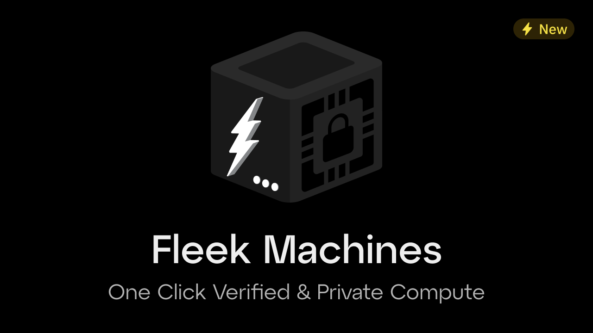

Let’s face it: the term "Trusted Execution Environment" (TEE) sounds complicated, but it doesn’t have to be. TEEs are becoming increasingly valuable for developers because they let you run private and secure computations in a way you can trust.

Think of it as having a secret, tamper-proof room in your computer where sensitive stuff can happen safely — no interruptions, no prying eyes. Sounds good, right?

In this blog, we’ll break down TEEs, why they’re useful, and how they work—all in a simple, accessible way. We’ll also explore real-world use cases, including how they change the game for payments, blockchain, AI agents, and even hosting solutions like Fleek.

Read on to learn how TEEs can solve challenging security and privacy problems without giving you a headache. Let’s dive in! ✨

---

### **What is a TEE?**

A Trusted Execution Environment (TEE) is like a locked, private room inside a device or computer server. It’s a secure computing area with read/write capabilities for any inputs, creating verifiable and protected outputs.

Imagine you have a special safe where you can put documents, and the safe reads the documents, performs an analysis of the contents of the documents, and spits out a summary or answer along with a verifiable guarantee (let’s just use a stamp for simplicity’s sake). Crucially, no one can see or access any of the contents of the documents or analysis within the safe.

### The safe is the TEE. It guarantees that the calculations were done securely and correctly without revealing the sensitive information inside, all the while providing a guarantee (aka an attestation) that verifies the output.

### **Key Benefits**

- **Isolation**: Maintains separation between the secure enclave and the rest of the server.
- **Tamper-Resistant**: Even if your device gets hacked, the TEE remains secure.
- **Secure Execution**: Ensures that only trusted code runs inside the TEE.

In short, a TEE is like a coprocessing safe for your applications, allowing you to handle sensitive data or computations with provability and peace of mind.

---

### **Why do developers need to know about TEEs?**

TEEs are no longer just a tool for big tech companies—they’re important for developers everywhere. Here’s why:

### **Common Use Cases**

- **Secure Payments**: Protect sensitive payment details during transactions.
- **Web3 Applications**: Power apps and chains with secure co-processing or provable computation.
- **Data Privacy**: Safeguard personal or sensitive information, ensuring it stays private.
- **Verifiability**: Cryptographically prove that code or computation hasn’t been tampered with.
- **Digital Rights Management (DRM)**: Prevent unauthorized access to content like movies or music.
- **AI Agents**: Securely store and process AI models, agents, and more.

### **Why It Matters**

- **In Cloud Development**: TEEs can protect data processed on shared or third-party servers, enabling new use cases.
- **In Mobile Apps**: They enhance user trust by keeping highly sensitive data secure, even on potentially compromised devices.

With TEEs, you’re not just adding security—you’re rebuilding valuable trust with users who all too often experience the opposite.

---

### **3. How Do TEEs Work?**

To break it down simply, a TEE is a secure server that sits apart from a standard server — e.g., the server that runs traditional operations required of applications, agents, etc.

This architecture creates two worlds:

1. **The Normal World**: This is where your non-sensitive operations run.
2. **The Trusted World**: This is the TEE, where sensitive read/write can occur.

Imagine the ‘Trusted’ world as if it were a secret clubhouse inside your computer. It's a restricted area where only members with the proper secret handshake (code) can enter. This means that sensitive operations and data can be processed safely without being snooped on by others.

### **Interaction Between Normal and Secure Worlds**

The two worlds can communicate, but only through a strict set of rules. For example, a regular world app might send a request to the clubhouse (our TEE) to perform a secure function (like encrypting data). The TEE processes the request and sends back a verified result, all while staying isolated in our clubhouse environment.

### **Key Components**

- **Trusted OS**: A lightweight operating system running inside the TEE.
- **Trusted Applications**: Programs that handle sensitive tasks, like encryption or secure storage.

In summary, TEEs create a private area inside your device for operations that require verified protection.

---

### **Popular TEE Implementations**

TEEs are not just abstract ideas—they’re already used in many familiar applications.

### **Everyday Applications**

- **iPhone’s Secure Enclave**: Protects sensitive data like Face ID, Touch ID, and Apple Pay information.
- **Signal Messaging**: Keeps encryption keys in a secure environment to ensure private communication and secure friend suggestions.
- **Secure API Keys**: TEEs can safely store API keys to prevent leaks or mismanagement.
- **Payment Security**: Mobile wallets like Google Pay and Apple Pay use TEEs to protect card details.

### **Web3 and Emerging Use Cases**

- **Flashbots MEV (BuilderNet)**: TEEs ensure secure and private blockchain transactions.
- **Autonomous AI Agents**: Securely process sensitive AI workloads.

---

### **What Can Developers Build with TEEs?**

### **Real-World Applications**

- **Autonomous AI Agents**: Securely host and process sensitive AI workloads.
- **Sensitive User Data**: Protect health records, passwords, and other private information.
- **Secure API Interactions**: Safeguard API keys and sensitive configurations.
- **Blockchain Applications**: Process transactions or run smart contracts securely.

---

### **Common Myths About TEEs**

### **Myth 1: "TEEs Are Too Complex."**

**Truth**: Many tools simplify integration, like Docker-supported solutions.

### **Myth 2: "Only Big Companies Use TEEs."**

**Truth**: TEEs are accessible to developers of all sizes, thanks to open-source tools.

### **Myth 3: "TEEs Aren’t Secure."**

**Truth**: While no system is perfect, TEEs add a robust layer of protection and are constantly improving.

---

### **Fleek’s Potential Role in TEE Implementation**

Fleek simplifies TEE adoption with [Fleek Machines](https://fleek.xyz/blog/announcements/fleek-machines-fleek-functions/) — lightweight, Docker-supported virtual machines designed for secure and verifiable compute. With one-click deployments, developers can focus on building apps without worrying about hardware or infrastructure complexity.

Fleek Machines are perfect for hosting AI agents, processing sensitive data, and powering blockchain use cases, making TEEs more accessible.

[Join the early access program](https://fleek.typeform.com/machinesaccess)

---

### **And now you know…**

TEEs offer developers a simple way to build secure and private applications. Whether protecting data, running AI agents, or building blockchain applications, TEEs provide a trusted environment for your most critical tasks.

Now’s the time to explore how TEEs can enhance your projects—and Fleek Machines are here to make that journey even easier.

Let’s build the future of secure computing together. ✨

Further Reading:

- Fleek Machines: https://fleek.xyz/blog/announcements/fleek-machines-fleek-functions/
- Fleek Functions: https://fleek.xyz/docs/cli/functions/
- Decentralized frontend hosting with TEEs: https://fleek.xyz/blog/announcements/decentralized-trustless-frontend-hosting-fleek/
- Beginners guide to Intel SGX: https://fleek.xyz/blog/learn/intel-sgx-beginners-guide/
