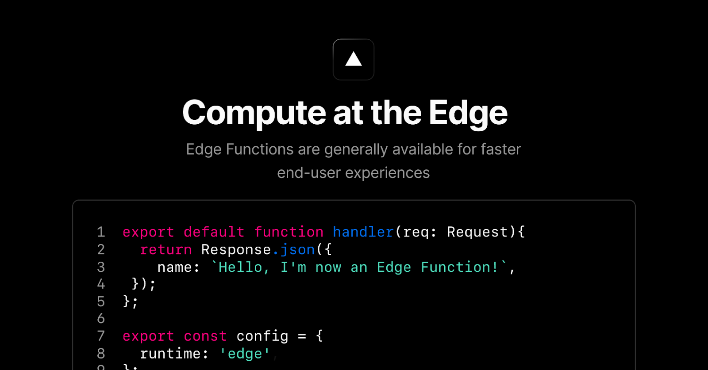
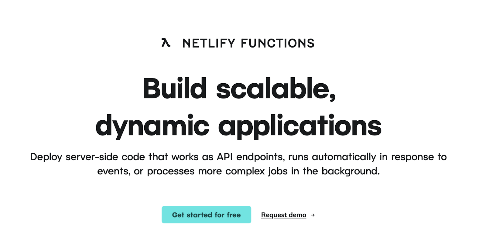

As developers strive to create lightweight, responsive apps and websites, serverless computing platforms are becoming integral to the modern tech stack.

They provide an ideal balance of performance, cost-efficiency, and scalability, and enable developers to focus on building robust applications without worrying about infrastructure management.

Today, in 2024, a growing number of serverless computing platforms provide diverse capabilities, from enhanced flexibility and edge optimization to the rise of decentralized options.

But to choose the right platform, it’s important to check out all the key players in the market, and evaluate several key factors.

**_So, in this article, we will dive into the best serverless computing platforms available today and explore how to select the ideal one for your next project._**

## **What is Serverless Computing?**

Serverless computing is a cloud application model where developers focus solely on writing and deploying code without managing the underlying infrastructure.

While servers are still required to run applications, in the serverless model, the service provider takes care of tasks like provisioning, scaling, maintenance, security patches, and load balancing. This allows developers to focus solely on coding without worrying about managing the underlying infrastructure.

Additionally, developers benefit from **_faster deployment, automatic scaling, and a pay-for-usage pricing model_**, making it a cost-effective and scalable solution for modern application development.

## **Best Serverless Computing Platforms to Build On**

Choosing the right serverless computing platform is crucial for developers looking to build scalable, efficient, and cost-effective applications.

So, we’ve listed platforms that stand out for their robust features and help developers build performant apps based on their needs.

1. **Fleek Functions**

[Fleek Functions](https://fleek.xyz/docs/platform/fleek-functions/) is a serverless compute solution built on [Fleek Network](http://fleek.network/)'s edge-optimized infra. They enable on-demand code execution with edge optimization for minimal latency, cost-efficiency, and scalability. More importantly, Functions are permissionless computing i.e. unstoppable and uncensorable.

**Key features of Fleek Functions are:**

1. **Reliable performance: Edge-optimized execution, decentralized design, and high fault tolerance ensures Function offers rich and reliable compute.**
2. **Low latency: Functions are executed on Fleek Network's globally distributed edge infra, reducing latency and improving responsiveness.**
3. **Developer-friendly: Functions are easy to create, deploy, and manage using the Fleek CLI and platform UI, making it accessible to all developers.**
4. **Agnostic and open-source: Fleek infra and services are open source and permissionless, meaning developers can embed them into any tech stack.**
5. **Uncensorable compute: Fleek Functions provide a trustless and permissionless environment, immune to deplatforming or censorship.**

Moreover, the agnosticism and non-opinionated nature of Fleek Platform adds to the flexibility of Functions.

**Developers can use Fleek Functions to:**

1. Call APIs to retrieve or populate data on the user interface
2. Make routing requests
3. Implement server-side rendering (SSR) for your entire application
4. Build use cases like Next.js hosting
5. Perform image optimization and resize images

Ideally, using Functions, developers can replace any existing serverless, edge, or cloud functions they currently use.

💡Read Fleek’s official documentation of [Functions](https://fleek.xyz/docs/platform/fleek-functions/)

---

2. **Vercel Functions**

[Vercel Functions](https://vercel.com/docs/functions) are serverless functions that execute server-side logic without the developers needing to manage servers or infrastructure. They are particularly suited for front-end developers aiming to create highly performant applications with a simplified deployment workflow.

**Why should developers consider Vercel Functions?**

- **Front-end optimization: Vercel Functions comes with built-in optimizations like automatic image compression, intelligent caching, and code-splitting for front-end assets.**
- **Deployment pipeline:** Integrated CI/CD with automatic builds, deployments, and global distribution.
- **Framework support:** Native integration with Next.js, React, and Vue.js for unified frontend and serverless development.

**Limitations of Vercel Functions**

- **Limited to lightweight functions: Vercel Functions may not handle backend-heavy tasks involving long-running processes or intensive database interactions effectively.**
- **Possible vendor lock-in with Next.js: Vercel’s strong integration with Next.js makes migration to other platforms more challenging.**

---

3. **AWS Lambda**

[AWS Lambda](https://serverless.com/aws-lambda) is an event-driven, serverless compute service that allows developers to execute code in response to various triggers without managing servers. Its integration with services like [S3](https://aws.amazon.com/s3/) and [DynamoDB](https://aws.amazon.com/dynamodb/) within the AWS ecosystem makes it highly versatile for a range of use cases.

**Why should developers consider AWS Lambda?**

- **Tight integration with the AWS ecosystem: AWS Lambda’s integration with the extensive AWS ecosystem makes it easy to connect with other AWS services such as S3, DynamoDB, and API Gateway.**
- **Automatic scaling:** AWS Lambda scales applications by automatically creating multiple instances of the code to handle incoming requests.
- **Multiple language support:** Lambda supports various programming languages, including Node.js, Python, Java, Go, and .NET, allowing developers to work with familiar tools and libraries.

**Limitations of AWS Lambda**

- **Unpredictable pricing: AWS Lambda's pay-as-you-go pricing makes cost prediction challenging, especially with high inter-service interactions.**
- **Cold start latency:**  AWS Lambda functions can experience "cold starts" after periods of inactivity, leading to response delays.

---

4. **Netlify Functions**

[Netlify Functions](https://www.netlify.com/platform/core/functions/) is a serverless computing layer built on AWS Lambda, designed specifically for web applications and [Jamstack](https://jamstack.org/) architectures. It provides server-side execution capabilities directly integrated with Netlify's deployment and hosting platform.

**Why should developers consider Netlify Functions?**

- **Simplified deployment:** Functions are deployed automatically with a straightforward folder-based setup (netlify/functions), and deployment is triggered directly by Git pushes.
- **Unified front-End and back-End:** Netlify’s platform allows simultaneous deployment of front-end and server-side logic, reducing errors and streamlining development workflows.
- **Flexible execution types:** Netlify offers synchronous and asynchronous execution, enabling developers to optimize performance and scalability based on their application requirements.

**Limitations of Netlify Functions**

- **Lacks advanced integration:** Function execution is limited by AWS Lambda's underlying restrictions on memory and computing resources.
- **Cold starts:** Netlify Functions are infamous for their cold starts which means they’re out of consideration for latency-sensitive applications.

---

5. **Cloudflare Workers**

[Cloudflare Workers](https://workers.cloudflare.com/) is a serverless platform that is designed for lightweight and high-performance applications. On this, developers can deploy JavaScript and Web Assembly functions that run on Cloudflare's edge network.

**Why should developers consider Cloudflare Workers?**

- **Global edge network deployment: Workers run on Cloudflare’s global edge network, reducing latency and providing faster response times.**
- **Zero cold start delays: Cloudflare Workers support 0ms cold starts globally, making it ideal for performance-critical applications.**
- **Developer-friendly:** Cloudflare Workers supports multiple languages (via WebAssembly), provides robust tooling like CLI and templates, and integrates seamlessly with JavaScript and frameworks.

**Limitations of Cloudflare Workers**

- **Performance limits: Cloudflare Workers comes with performance limits like restricted memory, CPU time, and startup time.**
- **Limited scaling:** Manage high traffic with Workers requires developers to implement custom strategies like load balancing and traffic distribution.
- **Fewer integrations:** Workers offer very few pre-built integrations with external services, increasing the complexity of integrating third-party APIs.

**_Having looked at a bunch of popular serverless computing platforms, the decision-making might seem difficult given the use cases and features each platform has to offer. In the next section, we will see a few factors to consider before making the final choice of a serverless computing platform._**

## **How to Choose the Right Serverless Computing Platform in 2024?**

Below are the key factors to consider when choosing a serverless computing platform:

1. **Performance and global reach**

Today, app or website performance demands more than just raw computing power, it requires consistent performance across 200+ nations with minimal latency. To make this happen, a globally distributed infra with intelligent routing and zero cold starts is a must-have.

2. **Censorship resistance**

Traditional cloud platforms are infamous for:

- Service discontinuation
- Platform policy changes
- Account suspension
- Regional restrictions

To ensure future-proofing and continuity, looking for a permissionless infra without any single points of failure would be the ideal way out.

3. **Flexibility and developer experience**

Developer productivity depends on flexible tooling that adapts to existing workflows rather than forcing specific patterns.

Ideally, look for platforms offering straightforward deployment processes, comprehensive documentation, and framework-agnostic approaches that integrate seamlessly with your preferred tech stack.

4. **Privacy and security**

Basic encryption and security practices are just not enough to protect today’s web apps and digital services. The attack vectors are widespread and are only growing.

Modern applications require verifiable execution environments and data protection guarantees. Platforms supporting trusted execution environments (TEEs) and cryptographic verification provide stronger security assurances than traditional cloud infrastructure with shared execution environments.

5. **Openness and control**

Open-source infrastructure with transparent operations gives developers full visibility and control over their apps.

This eliminates vendor lock-in risks, enabling flexibility for future migrations or customizations. Moreover, open-source infra enables the community to directly involve and contribute to the development of the platform. This effectively ensures the infra is aligned with real developer needs and not money or power.

## **Making the Choice: Fleek Functions**

**Fleek Functions** with a balance of performance, privacy, and long-term reliability emerges as a compelling choice for serverless computing.

Here’s why Fleek Functions stand out:

1. Fleek Functions run on a decentralized, permissionless network, ensuring applications are immune to deplatforming or censorship.
2. Developer experience is second to none with Fleek as it offers an intuitive CLI, SDK, and platform UI for easy deployment and management.
3. Fleek Functions are framework-agnostic and open-source, seamlessly integrating with existing development workflows.
4. Automated scaling, transparent pricing, and native compatibility with modern frameworks further ease developer efforts on Fleek.
5. With support for Intel SGX-backed TEEs, Fleek Functions provide a secure environment for executing sensitive workloads.

### **Employ Edge Computing Powered By Fleek Functions**

Here are a few resources to help you get started:

1. [Fleek Functions Tutorial](https://fleek.xyz/docs/cli/functions)
2. [Fleek Functions Platform Docs](https://fleek.xyz/docs/platform/fleek-functions)
3. [Fleek Functions Early Performance Test](https://blog.fleek.network/post/fleek-network-testnet-phase-3-results/)
4. Read how Fleek made [server-side rendering](https://fleek.xyz/blog/announcements/server-side-nextjs-on-fleek/) with Next.js possible
5. Fleek’s [Github documentation](https://github.com/fleek-platform/fleek-next) of the Fleek Next adapter

Stay updated with the latest SSR trends and Fleek features on our [blog](http://fleek.xyz/blog/).
