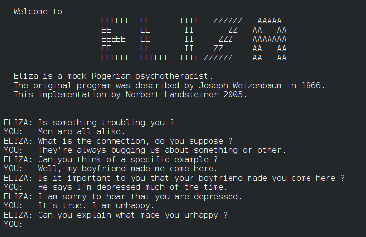
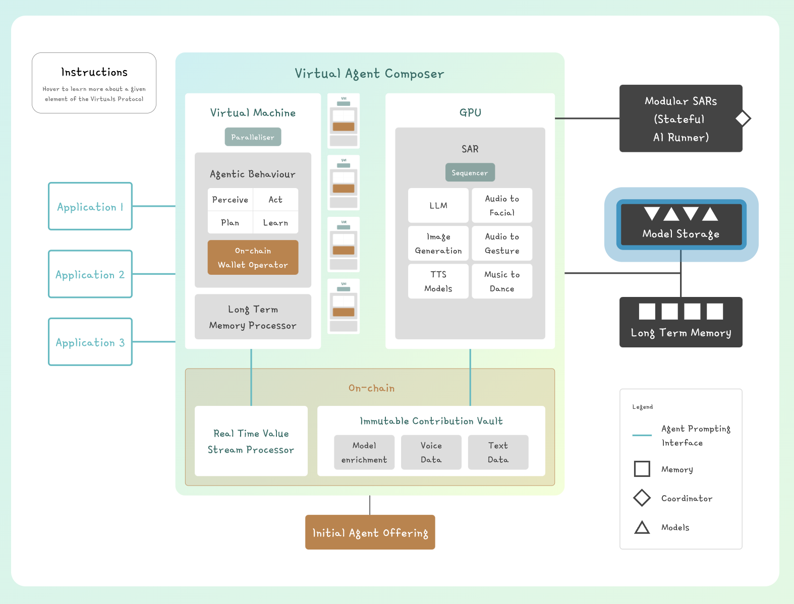
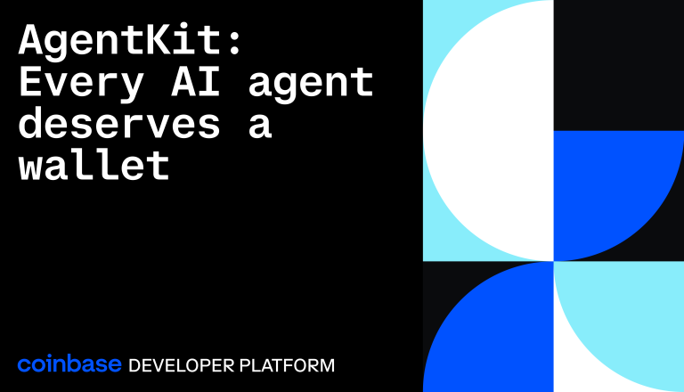
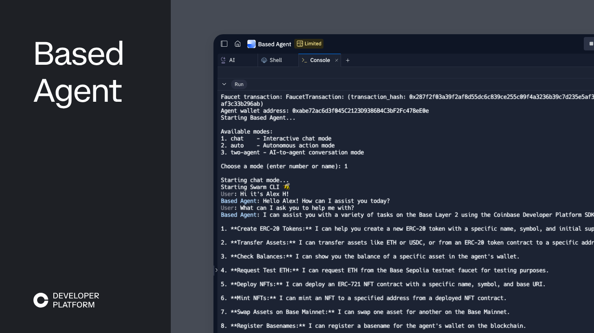
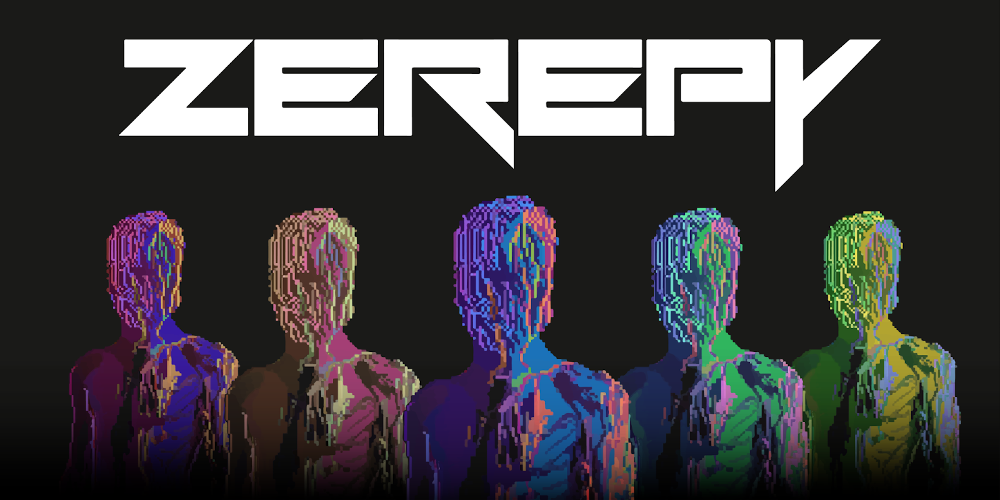

The intersection of artificial intelligence and crypto marks a profound shift in our thinking about digital autonomy and the future of AI agents. The first significant manifestation of this is the massive influx of AI agents capable of on-chain interactions, social engagement, and autonomous decision-making.

However building these AI agents requires the proper foundation. Since the on-chain elements come with access to money and power, a robust infra without the  ability for developers behind the scenes to corrupt these agents is quickly becoming a prerequisite. TEE’s present an ideal solution to this issue, and with Fleek Machines and Fleek’s deployment platform, Fleek  is positioning itself as the best option, including best infrastructure and best developer experience, for deploying autonomous crypto AI agents to TEE’s in 2025.

**_In this article, we’ll explore the top 5 crypto AI agent frameworks and see how developers can build secure AI agents on Fleek’s infrastructure._**

## **What is an AI Agent Framework?**

AI agent frameworks are software frameworks that simplify the development, deployment, and management of AI agents using pre-built components.

These frameworks allow developers to focus on crafting unique solutions rather than reinventing the wheel. Whether for automating DeFi protocols, enhancing DAO governance, trading and investing, or enabling seamless metaverse interactions, these frameworks are indispensable in modern blockchain ecosystems.

## **The Top 5 Crypto AI Agent Frameworks**

### **Eliza**

At its core, Eliza removes the complexity of integrating various AI models - whether you're working with Llama or OpenAI's GPT series - while providing ready-to-use connectors for popular platforms like Discord, Twitter, and Telegram.

What makes Eliza particularly interesting for Web3 builders is its modular architecture. Want your agent to analyze on-chain data, execute strategic decisions, or interact with smart contracts? Eliza's customizable actions and extensible client system let you piece together these capabilities like building blocks. The framework ships with developer-friendly templates and deployment scripts that significantly reduce the time from concept to production.

**Key features:**

- Pre-built connectors for social platforms
- Flexible integration with multiple AI models
- Customizable action system for on-chain interactions
- Built-in web browsing and debugging capabilities
- Production-ready deployment templates

**Perfect for:**

Teams building autonomous agents need the ability to interact with both on-chain protocols and traditional platforms while maintaining high reliability.

### **Virtuals**

[Virtuals Protocol](https://www.virtuals.io/protocol) takes a unique approach to AI agents by tackling one of Web3's core challenges: how to make AI agents not just functional but valuable as digital assets.

This framework enables developers to create AI agents that can be tokenized, owned, and monetized directly on the blockchain, opening up new possibilities for AI-driven experiences in Web3.

What sets Virtuals apart is its focus on rich interaction capabilities. The protocol combines natural language processing for both text and speech with 3D animation support, making it possible to create AI agents that feel more alive and engaging. This makes it particularly powerful for gaming environments, educational platforms, and metaverse applications where personality and presence matter.

**Key features:**

- Built-in tokenization for AI agent ownership
- Advanced NLP for natural interactions
- 3D animation support for visual presence
- Native blockchain integration
- Monetization mechanisms for creators

**Perfect for:**

Creative developers and teams building AI experiences that need built-in features for monetization and ownership — ideal for gaming, education, or metaverse environments.

### **AgentKit**

[AgentKit](https://docs.cdp.coinbase.com/agentkit/docs/welcome), developed by Coinbase, is a versatile framework that empowers developers to create AI agents capable of autonomous on-chain interactions.

As part of the Coinbase Developer Platform (CDP), AgentKit facilitates seamless integration between AI models and blockchain functionalities, enabling agents to perform tasks such as token transfers, smart contract deployments, and decentralized application interactions.

**Key features:**

- Multiple LLM provider support (OpenAI, Claude, Llama)
- Native blockchain operations through CDP SDK
- Developer-friendly template structure
- Full LangChain compatibility
- Built-in social platform integration

### **Based Agent**

[Coinbase's Based Agent framework](https://docs.cdp.coinbase.com/learn/docs/based-ai-agents) brings something unique to the table — an AI framework built from the ground up for the Base blockchain.

Unlike frameworks that treat on-chain features as add-ons, Based Agent puts on-chain interactions front and center, making it a natural choice for DeFi and crypto-focused apps.

What makes Based Agent particularly exciting is its seamless wallet integration and blockchain interaction capabilities. Your AI agents can handle token transfers, smart contract deployments, and dApp interactions out of the box. The framework handles the complex orchestration between AI decision-making and blockchain execution, letting developers focus on building their agent's core logic.

**Key features:**

- Native Base blockchain integration
- Built-in wallet management
- Smart contract interaction capabilities
- Quick setup and deployment
- Automated DeFi operations support

**Perfect for:**

DeFi projects, trading platforms, and dApps on Base blockchain looking to add autonomous capabilities.

### **ZerePy**

[ZerePy](https://github.com/blorm-network/ZerePy) is a Python-based framework developed by Zerebro that specializes in deploying AI agents on social platforms like X (formerly Twitter). It integrates with leading AI models from OpenAI and Anthropic, enabling features like automated tweeting, replying, liking, retweeting, and timeline analysis.

Built on a modular architecture, ZerePy allows developers to customize its functionalities for specific use cases, such as social media sentiment analysis.

**Key features:**

- Native integration with X/Twitter
- Support for leading AI models (OpenAI, Anthropic)
- Automated engagement capabilities
- Timeline and sentiment analysis
- Modular architecture for customization

**Perfect for:**

Web3 projects looking to maintain active, engaging social presences without sacrificing authenticity or scalability.

## **Why Hosting Crypto AI Agents Requires Trustless Execution Environments (TEE’s)**

Despite the success of crypto AI agent frameworks, Hosting crypto AI agents is not without its challenges. Developers often grapple with:

- **Autonomy**: For crypto AI agents to reach their full potential, they need to be provably autonomous. Otherwise you can’t prove the authenticity of the agent and the developers behind the agents can steal funds, among other pitfalls.
- **Privacy and Security**: Agents are only as good as the data you give them. So for crypto AI agents to reach their full potential, they need to be able to keep sensitive data private and away from breaches or abuse. This applies for both consumer and business use cases.
- **Verifiability**: The famous crypto saying ‘don’t trust, verify’ applies to crypto AI agents as well. You want crypto AI agents to have similar properties to smart contracts, and that includes verifying that they are doing what they are supposed to be doing.

Fleek resolves these challenges by deploying agents to Fleek Machines, which are lightweight VM’s running in TEE’s, with high performance and seamless developer experience. . Leveraging Fleek Machines, combined with Fleek’s seamless deployment platform, offers an ideal solution for crypto AI agents, and developers building crypto AI agents or crypto AI agent platforms. High performance, auto-scalable, simple and fair pricing, TEE capabilities out of the box, and seamless devex (no devops).

## **What Makes Fleek the Perfect Choice for Crypto AI Agents?**

Fleek’s unique value proposition makes it stand out in the cloud computing landscape. Key benefits include:

- **Open-Source**: Transparent infrastructure that aligns with the both open source ethos’ of the crypto and AI communities. .
- **Lightning Fast**: Global deployments, geo-routing, built-in CDN, and powerful Fleek Machines provide a perfect solution for crypto AI agents.
- **Powered by TEE’s**: Fleek Machines run in TEE’s, giving developers and crypto AI agents the verifiability, privacy, and autonomy benefits of TEE’s without any of the headaches of TEE development.
- **Seamless DevEx**: Fleek’s bread and butter business is seamless app hosting. That is now extended to AI agent hosting - providing a Vercel like experience for deploying and hosting AI agents.
- **Build with All your Favorite Tools**: Intuitive tools such as Git integration, CLI, APIs, docker support, and automated CI/CD pipelines simplify workflows.

## **Deploying Crypto AI Agent Frameworks on Fleek**

Deploying crypto AI agents on Fleek is designed to be straightforward and developer-friendly, ensuring that you can focus on building your application while Fleek handles the scalability, security, and decentralization

1. **Host AI Agents in Fleek Machines**: Use lightweight virtual machines with Docker support to run your crypto AI agents.
2. **Utilize Fleek Functions**: Leverage lightning fast edge and serverless functions for real-time computations and API integrations to compliment your agent (or allow your agent to build with)
3. **Host Your Application**: Deploy static or dynamic applications with Fleek’s hosting service. Agents are soon going to want to build apps and host websites themselves as well, and Fleek gives them the perfect infra to do so without any corporate cloud nonsense.
4. **Integrate Web3 Components**: Use Fleek’s built-in support for smart contracts, decentralized storage, and blockchain-based origins, allowing crypto AI agents to be fully autonomous and trustless and free from central points of failure.

Deploying an AI agent framework is possible and developers can deploy using Fleek's documentation [here.](https://fleek.xyz/docs/platform/deployments/)

## **The Future of Crypto AI Agents with Fleek**

The evolution of autonomous crypto AI agents relies heavily on high performance TEE infrastructure  with seamless DevEx, which is exactly whatFleek provides. With the rise of trustless systems, Fleek empowers developers to:

- Build, deploy, and scaleAI agents and AI agent swarms across all industries and use cases.
- Get verifiability, privacy, and autonomy for your crypto AI agents and use cases without sacrificing performance or developer experience. .
- Pioneer Web3 innovation with cutting-edge technologies.

Fleek aligns with the decentralized and open source ethos of both blockchain and AI,, providing a perfect platform and partner to build your crypto AI projects with long term. .

### **Build Your Next Crypto AI Agent with Fleek**

Crypto AI agents are making blockchain and web3 more accessible, intuitive, and ready for mass adoption. The rise of frameworks like Eliza, Virtuals, AgentKit, Nous, and Zerepy demonstrates the potential of AI to unlock new possibilities within the web3 ecosystem and beyond. With Fleek providing the necessary infrastructure and developer experience, the possibilities for AI agents in Web3 are boundless.

Ready to take your crypto AI agents to the next level? Discover how Fleek’s trustless cloud platform can power your projects.

- Explore Documentation:  [Fleek Docs.](https://fleek.xyz/docs/)
- [**Join the Community**](https://discord.com/invite/fleek): Connect with developers and share your journey on Fleek’s forum.
- [**Start Building Today**](https://fleek.xyz/docs/): Deploy your first AI agent framework on Fleek’s platform.
