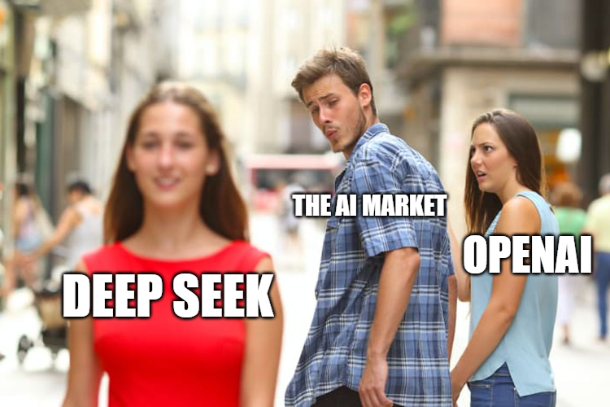

The AI industry is evolving at an unprecedented pace, with two dominant players emerging at completely opposite ends of the spectrum: OpenAI and DeepSeek. OpenAI, with its vast funding and technological advancements, has long been the benchmark for cutting-edge AI. However, DeepSeek has emerged as a formidable challenger by leveraging efficiency, affordability, and an open-source philosophy. Unlike OpenAI, which relies on massive investments and proprietary models, DeepSeek’s approach redefines AI accessibility and sustainability. This article explores the deeper implications of DeepSeek’s rise, examining its technological innovations, financial strategies, market disruption, and broader impact on AI’s future.

### **Overview of DeepSeek and OpenAI**

OpenAI was founded in 2015 with a mission to develop artificial general intelligence (AGI) that benefits humanity. With major investments from Microsoft, including a $10 billion funding round, OpenAI has achieved dominance in generative AI with models like GPT-4. However, its transition from a non-profit to a capped-profit model has led to criticisms about accessibility and monopolization.

DeepSeek, in contrast, follows a leaner and more strategic path. With only $200 million in funding, DeepSeek has focused on cost-effective innovation. The company’s AI models, such as V3 and R1, rival OpenAI’s GPT series in key benchmarks while requiring significantly fewer resources. DeepSeek’s commitment to open-source principles allows for broader collaboration, fostering an AI ecosystem that is both transparent and community-driven. The contrast between OpenAI’s high-scale, high-cost approach and DeepSeek’s efficient, open-access philosophy highlights the growing shift in AI development priorities.

### **Technological Innovations and Developments**

DeepSeek’s technological edge lies in its computational efficiency. Its V3 and R1 models integrate sparse attention mechanisms, allowing them to achieve near-GPT-4 levels of performance without the massive infrastructure costs. This efficiency is particularly relevant in industries like education, healthcare, and finance, where AI adoption has traditionally been limited by high costs.

OpenAI’s GPT-4, estimated to contain 170 trillion parameters, is unparalleled in its contextual reasoning and conversational abilities. However, its computational intensity makes it prohibitively expensive for many applications. DeepSeek’s models, while smaller in scale, outperform in niche tasks like symbolic mathematics (GSM8K benchmark) and optimized code generation, making them attractive alternatives for domain-specific AI solutions.

DeepSeek’s modular architecture also allows for greater adaptability, enabling businesses to customize AI applications based on their specific needs. This approach differs from OpenAI’s more monolithic model, which, while powerful, may not be as cost-effective for specialized applications.

### **Funding Mechanisms**

OpenAI’s financial strategy is built on large-scale funding, with Microsoft’s backing playing a crucial role in its continued growth. However, this heavy investment comes at a cost—OpenAI must prioritize commercial applications to sustain its high computational expenses. This reliance on corporate partnerships has raised concerns about monopolization, as OpenAI’s technologies become increasingly gated behind premium services.

DeepSeek’s funding model, on the other hand, emphasizes efficiency. With just $6 million spent on training its latest industry leading frontier model, DeepSeek has demonstrated that AI breakthroughs don’t require billion-dollar investments. By focusing on innovative model training strategies around reinforcement learning  and lean operational strategies, DeepSeek has created a sustainable AI ecosystem without dependency on tech giants. This financial independence enables it to prioritize accessibility and innovation rather than profit maximization and infrastructure build outs.

### **Pricing Models and Market Disruption**

Pricing remains one of the most significant differentiators between OpenAI and DeepSeek. OpenAI’s GPT-4 API is cost-prohibitive for many smaller businesses, often exceeding $1,000 per month for high-volume usage. This pricing structure restricts access to large enterprises and well-funded research institutions, leaving smaller organizations at a disadvantage.

DeepSeek, by contrast, has introduced a disruptive pricing model, offering AI services at nearly 40% lower costs than OpenAI. This affordability opens up AI adoption to startups, educators, and independent developers, driving innovation in previously underserved sectors. By making AI economically viable for a broader audience, DeepSeek pressures OpenAI to reconsider its pricing strategy or risk losing market share to more accessible alternatives.

### **Open Source Strategy**

DeepSeek’s commitment to open-source AI stands in stark contrast to OpenAI’s increasingly proprietary approach. Open-source AI fosters transparency, allowing researchers and developers to audit, modify, and improve AI models collaboratively. This philosophy accelerates advancements and democratizes AI development.

OpenAI, while initially open-source with earlier models, has shifted to a closed ecosystem to maintain competitive advantages and revenue streams. While this ensures security and controlled innovation, it limits external contributions and restricts access to cutting-edge AI for those who cannot afford premium services.

DeepSeek’s open-source approach not only accelerates development but also establishes trust. Industries requiring transparency—such as healthcare and finance—benefit from AI models where decision-making processes are visible and auditable. However, open-source AI does present risks, such as potential misuse in deepfake generation or cybersecurity threats. DeepSeek addresses these concerns by implementing responsible-use policies and layered access controls.

### **Model Performance and Benchmarking Results**

DeepSeek’s R1 model has demonstrated superior performance in several benchmarking tests, particularly in mathematical reasoning, where it outperforms GPT-4 in the GSM8K benchmark with a higher problem-solving accuracy rate. Similarly, R1 has exhibited stronger performance in structured coding tasks, particularly in Rust and Julia, offering higher efficiency and fewer syntactic errors than OpenAI’s Codex.

GPT-4, however, retains an advantage in broader linguistic tasks, including nuanced content generation, complex conversational AI, and large-scale multi-modal applications. It consistently outperforms in creative writing, multi-turn dialogues, and contextual inference, making it more suitable for enterprise applications that require long-form coherence.

DeepSeek’s efficiency-driven model design ensures that its models require significantly lower computational resources while maintaining high accuracy. This makes it an attractive choice for startups and businesses with constrained budgets that require AI solutions with targeted performance metrics.

### **Future Outlook**

The future of AI will likely be shaped by a hybrid approach, blending DeepSeek’s efficiency with OpenAI’s scale. As affordability becomes a driving factor, companies may follow DeepSeek’s lead in modular, cost-effective AI solutions. OpenAI, in response, may need to adapt by revising pricing models or integrating more transparent governance structures.

DeepSeek’s rise signifies a shift in AI development—moving from exclusivity toward accessibility. While OpenAI remains dominant in AGI research, DeepSeek’s strategic focus on affordability and open-source collaboration ensures that the future of AI remains competitive, inclusive, and innovation-driven.

### **Fleek Adds Support for DeepSeek for AI Agent Hosting**

In an exciting development, Fleek recently added support for t DeepSeek, in addition to existing support for OpenAI and other leading LLM’s, allowing users to deploy their own AI agents powered by DeepSeek’s advanced models. This integration will provide developers with seamless access to cost-efficient AI solutions, further strengthening DeepSeek’s impact in the industry and making AI development more accessible than ever.

**You can try to deploy your AI agent instantly [here.](https://fleek.xyz/eliza/)**

**More resources:**

- Ai Agent hosting announcement: https://fleek.xyz/blog/announcements/fleek-ai-agent-hosting-eliza-framework/
- Ai Agents doc: https://fleek.xyz/docs/ai-agents/
- Deploy an AI Agent guide: https://first_project/
