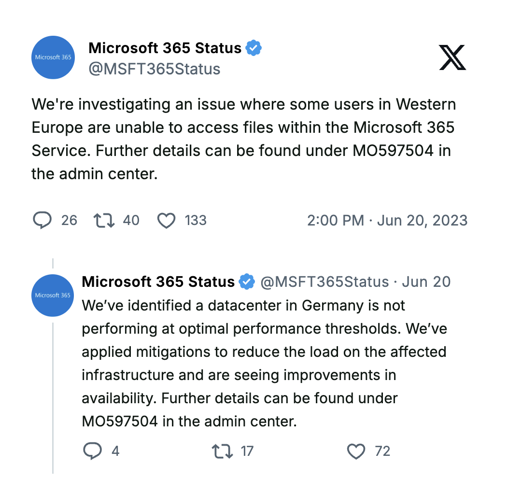
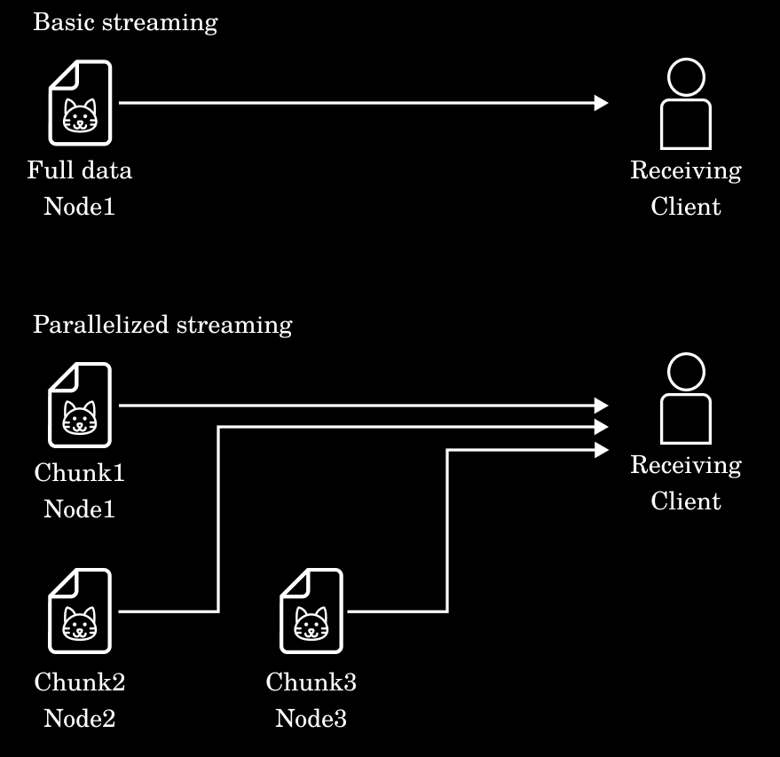
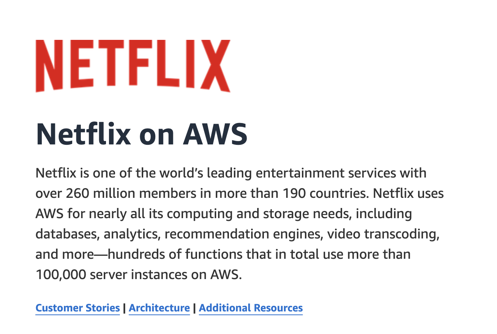
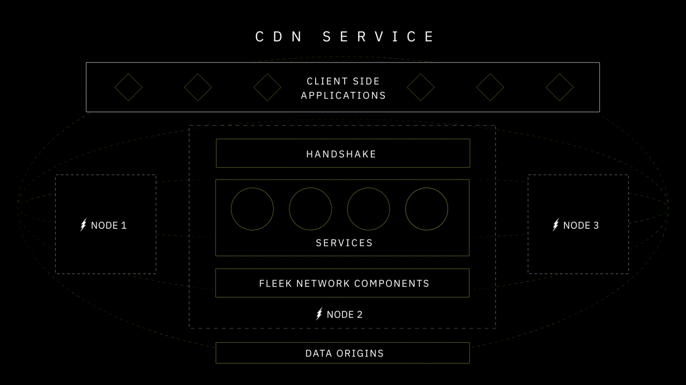

Making the case for edge computing in 2024 is no longer a challenge. Centralized cloud computing — the status quo, is falling gradually behind edge computing. Businesses and enterprises are looking at edge computing as a canvas for building more resilient, reliable, and efficient services and applications. 

The change in preferences, both at a developer and enterprise level, hinges on three simple yet critical factors:

1. **Achieving consistent sub-second response times globally is the need of the hour.**
2. **Single points of failure are being eliminated with organizations.**
3. **Reducing bandwidth costs is a top priority for businesses and enterprises, especially with the volume of data increasing daily.**

All three factors are naturally aligned with edge computing's distributed nature, making the transition more practical than ever.

However, a major friction point of edge computing is developers' implementation challenges.

***In this blog, we will discuss seven edge computing challenges that developers face during implementation. We will also explore how Fleek provides a comprehensive solution, bridging infrastructure and developer experience with products like Fleek Functions (serverless compute) and Fleek Machines (compute with long-running servers), empowering developers to adopt edge computing without the operational overhead.***

## **Poor Developer Experience is Hampering The Growth of Edge Computing**

Edge computation's clear advantages over its peers and status quo is being held back by the complex developer experience.

While developers understand the benefits of moving workloads closer to users, the current tooling and infrastructure landscape pushes them away. Expecting developers to be experts in distributed systems, node management, and complex DevOps practices is a lose-lose for both developers and the edge computing thesis.

Here are seven key challenges that developers face when working with edge computing:

1. **Edge node management**

Setting up the edge node infra and managing it is scary for development teams, especially when there's a global setup required.

Each node requires individual configuration, monitoring, and maintenance. After that, developers need to ensure all the geographically distributed nodes are in sync — this process comes with issues like performance inconsistencies, network latency, and outages.

This challenge makes node management a top priority but also one of the hardest areas to scale even for tech giants like Microsoft.

**For instance**:

On 10 October 2022, Microsoft experienced a 19-minute outage affecting partners and services running on its environment. The outage started with Microsoft nodes in Des Moines, Iowa failing and causing a systemic outage which later affected the Los Angeles nodes too.

Source:

[ThousandEyes](https://awcfnfalklvwdbgdzizduchyavijphay.share.thousandeyes.com/view/internet-insights/?roundId=1665432000&metric=interfaces&scenarioId=outageTraffic&filters=N4IgZglgNgLgpgJwM4gFygIYActQgYwxggHsA7AERIFsMIyAVDAczQG0BdAGhG1wKKkyAeQCuMFnADK%2BEljjsQAQQBiKgKIBhBuooB9HVIZ7hAJT0BJAHJ7NShkoAywgOIhuvJGXYeYCDGCQ%2BGISzNKy8oqqGtq6BupGJubWtvZOru4AvplAA)

Fleek eliminates node management complexity by automating infrastructure through reputation-based task assignment and algorithmic operations. Nodes self-manage based on demand and performance, ensuring seamless operation without developer intervention.

Optimistic payment processing enables high-performance local-first work allocation. This allows nodes to process tasks efficiently without having to wait on global payment finality.

Using this approach, Fleek is estimated to handle transaction volumes of up to 10,240 microtransactions per second per node at 10Gbit/s.

Moreover, node providers are incentivized to position themselves where usage is highest. This effectively makes the node network act as a self-managing "outsourced infra-ops team" for clients and users.

2. **Data synchronization and consistency**

Keeping data consistent and synchronized across multiple geographically distributed nodes is a tremendous challenge for developers. As more nodes come online and handle data processing locally, ensuring that each node has the latest and most accurate information becomes a critical, yet complex, task.

Latency, packet loss, and regional network conditions can worsen synchronization issues, leading to data inconsistencies across the entire network.

**For example:**

On 20 June 2023, Microsoft users in Western Europe were struggling to access files within Microsoft 365. The cause was later identified to be a data center in Germany which was not operating at optimal performance. It took nearly four hours for Microsoft to get their system back up and running.

Source: [Microsoft on X](https://x.com/MSFT365Status/status/1671073014430007297)(Twitter)

Fleek leverages decentralized, content-addressable storage and chunked data architectures for parallel processing and real-time synchronization. The distributed hash table (DHT) ensures redundancy and fallback mechanisms, maintaining data integrity across nodes.

Parallelize the streaming of data chunks using multiple nodes at a time.

Source: [Fleek Network](https://blog.fleek.network/post/how-content-addressing-gives-fleek-network-an-edge/)

3. **Edge-optimized security**

Security at the edge is far more complex than in centralized environments.

With nodes distributed across different locations, the risk of security breaches, data tampering, and unauthorized access increases astronomically.

Developers must secure node-to-node communication, prevent malicious nodes from joining the network, and ensure computation integrity – all while maintaining the low-latency promise of edge computing. With each edge node being a potential attack vector, the security surface area expands dramatically.

Fleek ensures security with multiple cryptographic layers, Intel SGX Trusted Execution Environments (TEEs), and delivery acknowledgment SNARKs. These mechanisms safeguard data and computation while maintaining low-latency performance.

4. **Scaling and load balancing**

Scaling edge infrastructure in response to regional traffic spikes remains a significant challenge for development teams.

Especially with respect to edge computing, scaling is even more complex since it needs to work across geographically distributed nodes. This creates complexities around efficiently distributing workloads while ensuring that no single node is overwhelmed or underutilized.

Poor load balancing can lead to increased latency, downtime, and inefficiencies, which negatively impact the user experience.

And scalability isn’t an issue only with new development teams who struggle to determine their resource requirements.

Here’s a classic instance of major companies failing to accommodate spikes in traffic:

*“Netflix and YouTube will reduce streaming quality in Europe for at least the next month to prevent the internet collapsing under the strain of unprecedented usage due to the coronavirus pandemic.”*

In the early days of the pandemic (March 2020), CNN reported the above news and funnily, they mentioned the above measures were to [keep the internet from breaking](https://edition.cnn.com/2020/03/19/tech/netflix-internet-overload-eu/index.html).

This is funny because the streaming platforms’ failure to plan for scalability and handling of fluctuating workloads is being wrapped as a gift to humanity.

Netflix relies heavily on Amazon Web Services. Source: [AWS](https://aws.amazon.com/solutions/case-studies/innovators/netflix/)

Fleek dynamically scales resources across nodes, leveraging intelligent routing based on network topology rather than geographic proximity. For more persistent compute needs, [**Fleek Machines**](https://fleek.xyz/blog/announcements/fleek-machines-fleek-functions/) provide dedicated edge servers, ensuring high availability and compute performance under load.

Moreover, the modular architecture allows nodes to run multiple isolated services, automatically scaling resources based on real-time demand without developer intervention.

💡Read how [Fleek](https://blog.fleek.network/post/fleek-network-testnet-phase-3-results/) fares against traditional cloud platforms like AWS Lambdas and Vercel Serverless in a real-world edge compute environment.

---

5. **Content discovery, delivery, and caching**

Efficiently distributing and caching content across edge nodes is a complex orchestration problem, especially for use cases that need real-time data streaming and delivery. Developers are required to implement complex cache invalidation strategies, handle origin synchronization, and ensure content freshness.

All of these technical pipelines and techniques are to be worked out while maintaining optimal delivery paths for users across different regions.

Fleek’s built-in decentralized CDN and content-addressable core optimize delivery speeds by caching frequently accessed content at nodes closest to users. Chunked data processing further accelerates real-time streaming.

6. **DevOps for edge service deployment & management**

Deploying and managing services at the edge requires a completely different DevOps approach than traditional centralized environments.

Developers need to account for a wide range of factors, such as deploying to multiple geographically dispersed nodes, handling versioning across different locations, and ensuring seamless updates without downtime. The tooling complexity alone often requires dedicated DevOps teams just for edge infrastructure management.

Fleek simplifies DevOps through its streamlined approach to architecture, allowing developers to deploy seamlessly using SDKs and an intuitive CLI. Fleek Functions handles serverless deployments, while Fleek Machines offers persistent server options for workloads requiring custom configurations.

Fleek’s epoch-based node rotation, smart work allocation, and reputation system are infrastructural bypasses for all the hands-on heavy lifting that developers are supposed to do. All of these combine to allow developers to focus on building services rather than managing infrastructure.

7. **Edge compute verification**

Verifying computations at the edge is a critical challenge for developers. When computation is distributed across multiple edge nodes, developers need to guarantee that each node executes the code correctly and returns valid results.

Traditional approaches either *sacrifice performance* for verification or skip verification entirely, *creating security vulnerabilities*.

Fleek addresses this through two aspects,

1. Cryptographic proof system centered around Delivery Acknowledgement SNARKs.
2. [Robust attestation system](https://blog.fleek.network/post/cost-effective-onchain-attestation-eip-2537-fleek-network-consensus/) through the Intel SGX Trusted Execution Environments (TEEs).

Delivery acknowledgment SNARKs allows every computation performed by a node to be verified and validated before being accepted by the network. The Intel SGX attestations verify enclave-to-enclave communications, ensuring computation integrity across nodes.

In addition to these two mechanisms, Fleek reputation system tracks computational accuracy across nodes, further upholding nodes to a quality standard.

***While these challenges may seem daunting, they highlight a crucial insight: the barrier to edge computing adoption isn't technological limitations – it's developer experience. Each challenge represents a layer of complexity that pulls developers away from their core focus of building and shipping features.***

***But with the emergence of Fleek Functions & Fleek Machines, these issues can be mitigated to create a more seamless and efficient development experience.***

## **Bridging Edge Infrastructure and Seamless Developer Experience with Fleek**

While Fleek solves these fundamental edge computing challenges at the protocol level, developers need a practical way to leverage these solutions.

This is where Fleek Functions and Fleek Machines come in as the developer-friendly interfaces to Fleek’s edge infrastructure capabilities.

Fleek Functions transform the infrastructural superpowers of Fleek Network into a seamless, developer-friendly serverless compute solution. Developers can now access the full power of edge computing without needing to understand or manage the complexities of infrastructure.

### **How Fleek Functions Make Edge Computing Simple And Effective?**

1. **No Node Management Required**

Developers don’t need to worry about configuring, monitoring, or maintaining edge nodes. With Fleek Functions, developers can simply deploy their functions and Fleek will take care of the rest.

2. **Instant Scaling Without Overhead**

Fleek Functions dynamically scale across edge nodes to handle traffic spikes effortlessly. Developers don’t have to plan for scalability or manage load balancing.

3. **Enhanced Security by Default**

Fleek Functions inherit Fleek Network’s robust security protocols, including Intel SGX TEEs and cryptographic proofs.

4. **Simplified Deployment with a Developer-Centric Interface**

With an intuitive CLI, SDKs, and platform UI, Fleek Functions make it easy to deploy, manage, and update applications at the edge.

5. **Zero DevOps**

Fleek Functions eliminate complex DevOps entirely, with a simple CLI-based workflow and automatic global distribution.

### **Extending Edge Capabilities with Fleek Machines**

For developers requiring persistent compute or custom configurations beyond serverless environments, Fleek offers **Fleek Machines**.

Fleek Machines complement Fleek Functions by providing dedicated edge servers, enabling developers to handle workloads that demand stateful operations, high-performance compute, or long-running processes.

### **How Fleek Machines Enhance Edge Computing**

1. **Dedicated Edge Servers**
    
    Fleek Machines allow developers to deploy applications on dedicated servers at the edge, offering more control and flexibility for specialized workloads.
    
2. **Custom Configurations**
    
    Developers can configure Fleek Machines to meet their specific requirements, whether for data-intensive applications, secure environments, or real-time analytics.
    
3. **Seamless Integration with Fleek Functions**
    
    Fleek Machines integrate seamlessly with Fleek Functions, allowing hybrid deployments that combine serverless and dedicated edge compute.
    
4. **Optimized for Performance and Cost**
    
    By leveraging Fleek’s intelligent resource allocation and decentralized architecture, Fleek Machines deliver cost-effective solutions without compromising performance.
    
5. **Robust Security Framework**
    
    Like Fleek Functions, Fleek Machines are built on Fleek’s secure architecture, featuring Intel SGX TEEs and cryptographic protections to ensure data integrity and computation privacy.
    

***Simply put, Fleek makes sure developers can focus on writing code rather than managing infrastructure.***

### **Use Edge Computing Powered By Fleek**

Here are some resources to help you get started with edge compute:

1. [Fleek Functions Tutorial](https://fleek.xyz/docs/cli/functions)
2. [Introducing Fleek Machines](https://fleek.xyz/blog/announcements/fleek-machines-fleek-functions/)
3. [Fleek Functions Platform Docs](https://fleek.xyz/docs/platform/fleek-functions)
4. [Fleek Functions Early Performance Test](https://blog.fleek.network/post/fleek-network-testnet-phase-3-results/)
5. For any queries : [Fleek Discord](https://discord.com/invite/fleek)
6. For developers : [Fleek Github](https://github.com/fleek-platform)