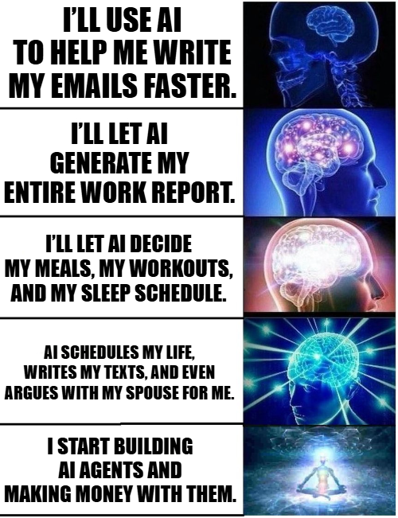
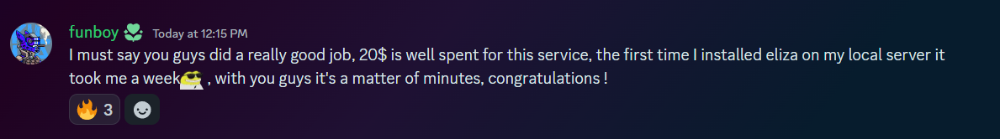

The world is shifting. AI agents are no longer just passive assistants—they are evolving into autonomous, self-sustaining digital entities. These agents don’t just respond to commands; they learn, adapt, and execute complex workflows, integrating seamlessly with software systems and even making decisions on their own.

Yet, despite the excitement surrounding AI agents, developers face a stark reality: building and deploying these agents is a fragmented, time-consuming, and costly endeavor. Today’s infrastructure forces builders to cobble together multiple services just to get their agents running.

Imagine a world where deploying an AI agent is as effortless as deploying a web app. Where hosting, model access, integrations, and security are all streamlined under one roof. That’s what Fleek is building—an infrastructure that empowers AI agents to reach their full potential without the overhead of piecing together multiple disconnected services.

---

### **The current problems with building & integrating AI Agents**

### **Time & complexity: a fractured workflow**

Bringing an AI agent to life today is an intricate, multi-step process that demands deep technical knowledge.

- **Hosting** → Developers must manually configure compute resources, often requiring DevOps expertise just to spin up and manage environments.
- **LLM access** → Procuring API keys, managing quotas, and controlling costs for large language models is cumbersome and lacks cohesion.
- **Plugins & integrations** → To give agents real-world functionality, developers must integrate third-party services—each requiring a unique API, separate billing, and additional maintenance.
- **Standards & interoperability** → AI agents operate in a rapidly changing landscape, but emerging standards like llms.txt and MCP aren’t natively supported by traditional cloud providers, forcing developers to navigate compatibility hurdles.

### **Cost & fragmentation: A financial and operational burden**

The reality of today’s AI infrastructure is inefficiency. Builders pay for multiple disconnected services, resulting in wasted time, technical debt, and excessive costs. AI-native infrastructure simply doesn’t exist in traditional platforms, leaving developers to build custom solutions that divert their attention away from innovation.

Now, compare this to a world where every component needed to deploy an AI agent is available in one place—where hosting, LLM access, integrations, and security are seamlessly handled. That’s the future Fleek is bringing to life.

(could be ideal to show all the services an enterprise users needs to use vs using fleek)

---

### **Why current Cloud Platforms fall short for AI Agents**

**Traditional Cloud = generalized, not optimized**

Traditional cloud infrastructure wasn’t built for AI. Platforms like AWS, GCP, and Azure were designed for broad, general-purpose computing, not for the unique demands of AI agents. While they offer raw compute power, they lack the optimizations AI workloads require, forcing developers into complex workarounds. This inefficiency comes at a cost—managing AI workloads on traditional cloud providers leads to **high DevOps overhead, unnecessary expenses, and countless engineering hours spent on infrastructure instead of innovation**.

We’ve seen this before. Just as **Vercel revolutionized frontend development** by optimizing cloud infrastructure for Next.js and removing deployment complexity, Fleek is doing the same for AI. By building infrastructure tailored specifically for AI agent workloads, Fleek **eliminates friction, reduces costs, and delivers superior performance**—giving developers a streamlined, purpose-driven alternative to outdated cloud models.

---

### **AI Agent-focused platforms like Fleek provide a better alternative**

Fleek isn’t just another cloud provider—it’s a paradigm shift. Traditional infrastructure forces developers to juggle multiple services, manage DevOps-heavy workflows, and deal with compatibility issues. **Fleek is continuously building toward a future where AI agent deployment is seamless and effortless**, consolidating everything under one platform and eliminating the friction that slows developers down. While key aspects of AI infrastructure have already been streamlined, Fleek is constantly evolving to push the boundaries even further.

Currently, **Fleek provides a robust infrastructure to run and deploy AI agents quickly, secured by a Trusted Execution Environment (TEE)**. Developers can access this infrastructure via **Fleek’s AI agent APIs**: https://api.fleek.xyz/api#tag/ai-agents.

But Fleek is building toward something even bigger—**an AI infrastructure-as-a-service (IaaS) capable of powering and running AI agents across any framework or LLM**. The goal is to enable **builders and projects to run their entire AI agent infrastructure on Fleek’s management service at low cost and with minimal setup**, removing the complexity of fragmented services.

### **How Fleek is redefining AI Agent hosting:**

- **Optimized Hosting for AI Agents** → Designed specifically for AI workloads, Fleek removes the need for custom cloud configurations, reducing unnecessary complexity.
- **Seamless LLM Access** → With built-in model hosting and key management, Fleek simplifies working with large language models, eliminating quota headaches and API friction.
- **Plugins & API Marketplace** → A native plugin ecosystem enables developers to extend AI agent capabilities effortlessly, without dealing with fragmented third-party integrations.
- **Built-in Support for AI/Agent Standards** → Native support for open frameworks like llms.txt and MCP ensures agents remain compatible with evolving industry standards.
- **A Smoother Developer Experience** → By removing DevOps-heavy workflows, Fleek lets developers focus on building powerful, intelligent agents rather than managing infrastructure.

**Fleek offers TEE-secured hosting for AI agents within Fleek Machines at just $20**, ensuring they run in tamper-proof, privacy-preserving environments. A **non-TEE hosting option for $10 is also in development**, providing even greater flexibility for developers.

For teams deploying multiple agents at scale, **Fleek’s enterprise pricing model adapts to any need**, offering a tailored infrastructure for businesses looking to run AI agents efficiently. If you're working on a large-scale AI project and need a solution that scales with you, **reach out to business@fleek.xyz** to explore enterprise options.

**Try Fleek AI Agent Hosting today: https://fleek.xyz/eliza/**

---

### **Unique Web3 aspects that will be essential for AI Agents**

The future of AI isn’t just about automation—it’s about true autonomy, security, and decentralized execution. For AI agents to operate independently, they need a secure and verifiable environment, which is where **TEE-secured compute** comes in. Fleek’s infrastructure ensures AI agents run in **tamper-proof, privacy-preserving environments**, safeguarding their operations from interference. But autonomy isn’t just about security—these agents also need financial independence. By integrating with **crypto and smart contract rails**, they can pay for services, receive payments, and interact seamlessly with decentralized systems, bypassing traditional financial constraints. The next step? **On-chain execution**. AI will no longer rely on centralized intermediaries but will instead execute tasks directly through smart contracts, enabling seamless interaction with decentralized applications. Fleek is bridging AI to this future—where intelligence operates freely, securely, and without centralized control.

**Read more about how fleek safeguards apps and agents:**  https://fleek.xyz/blog/learn/privacy-first-consumer-apps-with-fleek-machines/

---

### **The future of AI Agents is purpose-built**

Just as modern web apps thrived with platforms like Vercel, AI agents need an infrastructure tailored to their needs. The future of software is autonomous, and it demands a purpose-driven foundation.

Fleek is building that foundation—an infrastructure that blends speed, cost-efficiency, verifiability, and a seamless developer experience to usher in the next generation of AI-driven applications.

**AI agents are not just an evolution; they are a revolution. And Fleek is the infrastructure powering their future.**

- Start today: https://fleek.xyz/eliza/
- Explore our API docs: https://fleek.xyz/docs/ai-agents/agents-apis/