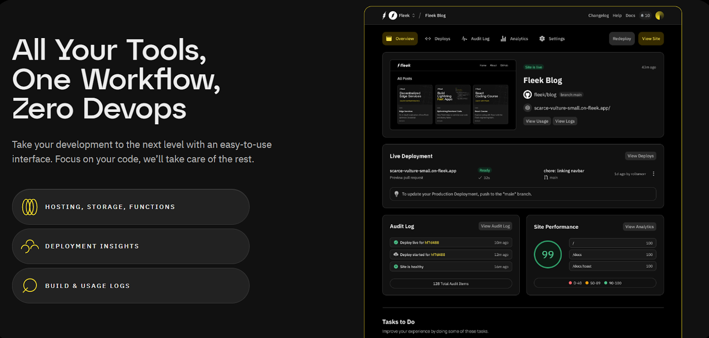

In the ever-evolving world of software development, **open-source** and **self-hosted applications** have become a preferred option for modern developers. Organizations and developers increasingly lean toward open-source solutions to enhance flexibility, reduce costs and vendor-lock in, and drive innovation. Meanwhile, self-hosted applications offer unparalleled control over infrastructure, data, and performance optimization. This trend is not just a technological shift—it’s a philosophical one that prioritizes transparency, community collaboration, and full control over one's software stack.

However, while the benefits of open-source and self-hosting are clear, navigating the complexities of deployment, scaling, and security can be challenging. That’s where platforms like **Fleek** come into play, redefining how developers manage and deploy self-hosted, open-source applications.

### **Why open-source and self-hosted applications?**

1. **Customization & flexibility**: Open-source software allows developers to modify the source code, making it highly adaptable to specific use cases. It allows complete customization, ensuring that your application behaves exactly as you need it to without the limitations imposed by proprietary software.
2. **Cost-effectiveness**: With open-source, there are no licensing fees, which can significantly reduce overhead for startups or independent developers. Self-hosting also offers cost savings by eliminating the need for third-party infrastructure management fees, although it does require more expertise to manage.
3. **Data control & security**: By hosting applications on your own infrastructure, you gain full control over your data—an invaluable advantage for industries with stringent regulatory requirements, such as healthcare or finance. You don’t need to rely on third-party providers who may have their own data access policies, adding an extra layer of security.
4. **Reduce vendor lock-in:** Open-source software mitigates the risk of vendor lock-in, allowing developers to retain control over their software and infrastructure choices. This flexibility enables them to switch vendors or alter their setup without being tied to proprietary technologies and terms set by a single provider.

### **The challenges of self-hosting**

While self-hosting brings substantial benefits, it also comes with challenges:

- **Infrastructure management**: Self-hosting demands an in-depth understanding of server management, database configuration, networking, and maintenance. Unlike cloud services that handle scaling and infrastructure, the responsibility falls on your team to ensure uptime, handle upgrades, and manage failures.
- **Security risks**: Managing security patches, updates, and potential vulnerabilities is an ongoing task. Open-source software is constantly evolving, and failing to stay updated can leave your infrastructure exposed to risks.
- **Scaling**: When an application grows, scaling manually on your own infrastructure can become complex, requiring skilled DevOps engineers and robust architecture to handle surges in traffic efficiently.
- **Time**: Setting up, monitoring, and maintaining infrastructure for self-hosting can be significantly time-consuming. Developers often find themselves spending valuable time on these operational tasks instead of focusing on their core development work. Scaling infrastructure as the application grows also adds complexity. Many developers prefer to use platforms like Fleek that handle these aspects, allowing them to dedicate more time to innovation and less to infrastructure management.

### **Where Fleek fits in**

**Fleek** merges the worlds of open source, self-hosting and cloud, providing the freedom and benefits of open-source and self-hosting with cloud-like performance and automation. It allows developers to manage their web applications on decentralized and permissionless cloud infrastructure that is lightning fast, low cost, highly reliable, and auto-scalable, and without any of the corporate nonsense you typically experience with corporate cloud platforms like price gouging, data abuse, account suspensions, etc. .

- **Autonomy without complexity**: Fleek simplifies the self-hosting process, eliminating much of the operational overhead while still granting full control over your deployments. Developers can focus on building their applications, while Fleek handles the nitty-gritty aspects of infrastructure.
- **Lightning-fast performance**: Fleek integrates **edge optimization** to deliver fast, global performance for web applications. By utilizing decentralized infrastructure, applications benefit from **auto-scalability**, ensuring that no matter how much traffic comes your way, your application maintains peak performance.
  **Low costs & transparent pricing:** Fleek offers a straightforward and transparent pricing model, ensuring that developers can scale their applications without unexpected costs. By minimizing overhead and focusing on efficiency, Fleek provides a cost-effective solution that supports both small startups and large enterprises.
- **Seamless developer experience (DevEx)**: Fleek’s platform is designed with the developer in mind, offering tools that integrate easily into existing workflows. The platform’s intuitive interface and automation tools streamline the deployment process, making it easier and quicker to get applications up and running and reducing the need for extensive devops.
- **No corporate nonsense**: Fleek offers a straightforward, transparent approach to hosting, eliminating the often cumbersome corporate barriers and complex pricing structures that plague traditional cloud services. This allows developers to focus on innovation without bureaucratic overhead.
- **Open-source commitment**: One of Fleek’s most exciting initiatives is its commitment to open-source. Fleek is actively working to open-source its platform, which will allow developers not only to contribute to the development of the platform itself but also to inspect, modify, and self-host it entirely in the near future. This level of transparency is critical for developers who value independence and long-term control over their hosting environment.
- **Self-hosting with cloud benefits**: With Fleek, you don’t have to choose between full self-hosting and cloud services. Fleek gives you the best of both worlds—total control over your application while leveraging the auto-scaling, edge optimization, and reliability typically only available in cloud services. The upcoming option to fully self-host your Fleek instance takes this even further, allowing for an unparalleled level of autonomy.

### **Preparing for the future: Fleek’s roadmap**

Looking ahead, Fleek’s **open-source** transition will empower developers who don’t want to use Fleek’s managed services to fully self-host their applications, with Fleek simply acting as a seamless interface for developers to build and deploy applications and seamlessly leverage and interact with Fleek Network’s edge-optimized cloud infrastructure as well as their own infrastructure.  As the platform continues to evolve, developers will have access to a more transparent, collaborative system that stays true to the core values of open-source development, and without needing to sacrifice on performance, cost, reliability, or developer experience.

This approach to hosting is ideal for developers who prioritize control, performance, and security but want to avoid the operational complexity typically associated with managing their own infrastructure. By allowing developers to self-host on their own terms while providing cloud-like performance enhancements, Fleek is setting a new standard for how modern web applications are deployed.

### **Final thoughts**

As open-source software and self-hosted applications become increasingly mainstream, developers and organizations must consider how they can balance the benefits of these technologies with the operational overhead they introduce. Platforms like Fleek are making it easier to adopt open-source and self-hosting principles without sacrificing performance, scalability, or ease of use.

Fleek’s commitment to open-source is more than just a trend—it’s a roadmap for the future of web development, where developers have full control over their infrastructure, deployments, and data, while still benefiting from the latest advancements in cloud technology. As Fleek continues to open up its platform, developers will find even greater flexibility, transparency, and collaboration in their projects.

### Relevant Articles:

Deploy your blog: https://fleek.xyz/guides/vitalik-blogmaker-on-fleek/

Deploy a react app: https://fleek.xyz/guides/fleek-react-guide/

Deploy an Astro app: https://fleek.xyz/guides/fleek-astro-guide/
