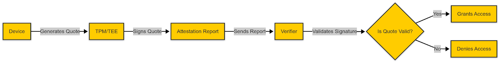
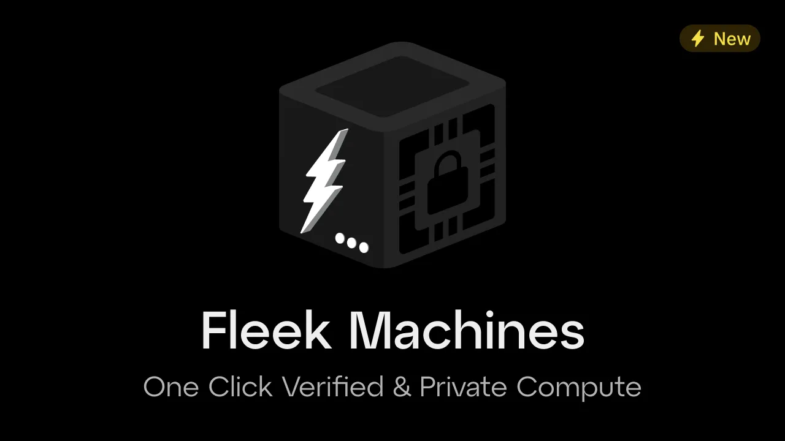

Ensuring software and hardware integrity is fundamental to digital security. Trusted Execution Environments (TEEs) and remote attestation provide a powerful combination to safeguard sensitive computations and verify system integrity. TEEs create isolated, secure environments, **while remote attestation continuously verifies that these environments remain uncompromised.** This approach is essential for securing digital transactions, IoT devices, cloud infrastructure, and AI-powered systems against evolving cyber threats.

In this guide, we’ll explore **why remote attestation matters**, how it enhances security across various industries, and how **Fleek leverages Fleek Machines** to implement trusted, verifiable computing environments. Whether you're securing AI workloads, blockchain operations, or privacy-sensitive applications, understanding remote attestation is key to building a **more resilient and tamper-proof digital ecosystem**.

### **What is Remote Attestation?**

Remote attestation is a security protocol that allows systems to verify the integrity and authenticity of other systems remotely. It’s a fundamental output of the TEEs because it enables its authenticity. Unlike static security defenses, it provides real-time verification, ensuring that devices and applications remain secure throughout their lifecycle. This continuous validation is critical in environments like cloud computing, AI deployments, and enterprise IT, where security threats evolve rapidly.

### **Why Remote Attestation is Essential**

### **1. Building Trust in Digital Systems**

Remote attestation ensures that hardware and software operate as intended, free from unauthorized modifications or tampering. This builds trust across digital ecosystems, including financial transactions, government networks, and IoT infrastructures.

### **2. Continuous Security Monitoring**

Unlike traditional security measures that rely on periodic checks, remote attestation **continuously verifies system integrity**, detecting anomalies before they escalate into security breaches.

### **3. Protection Against Advanced Cyber Threats**

Remote attestation proactively mitigates security risks such as firmware tampering, supply chain attacks, and insider threats, safeguarding enterprise security, IoT networks, and government systems.

### **4. Securing IoT and Edge Computing Devices**

With the proliferation of IoT and edge devices, remote attestation ensures that these systems operate securely, preventing cybercriminal exploitation. It plays a critical role in smart cities, healthcare, and industrial automation.

### **5. Regulatory Compliance and Data Integrity**

With increasing cybersecurity regulations, particularly in finance, healthcare, and cloud computing, remote attestation provides **an auditable, verifiable security framework**, helping organizations comply with industry standards.

### **Fleek’s Adoption of Remote Attestation: Enhancing Security Across Workloads**

Fleek is adopting **remote attestation and TEEs** to strengthen the security and verifiability of diverse workloads. This technology ensures that applications running within **Fleek Machines**—lightweight, TEE-enabled virtual machines—are **protected from tampering and can prove their execution integrity**.

### **How Fleek Machines Leverage Remote Attestation:**

Fleek Machines are designed to provide developers with a **secure, verifiable execution environment for various workloads, including AI agents, privacy-focused applications, fintech compliance, and blockchain infrastructure**. By integrating **remote attestation**, Fleek Machines allow users to:

- **Ensure Trusted AI Deployments** – AI agents and applications are cryptographically verifiable, ensuring their integrity remains intact throughout execution.
- **Run Secure and Confidential Workloads** – With built-in Docker support, developers can deploy applications without concerns about security breaches.
- **Eliminate Infrastructure Complexity** – No need to set up dedicated TEE hardware; Fleek Machines handle all aspects of secure computing.
- **Optimize Blockchain and Web3 Operations** – Fleek Machines enable trusted computation for rollups, oracles, sequencing, and MEV-resistant systems.
- **Meet Privacy and Compliance Standards** – Supporting industries with strict security requirements, such as finance, healthcare, and regulatory-driven markets.

With **one-click deployment**, Fleek Machines make remote attestation **accessible** for a range of use cases, reducing the complexity of secure infrastructure while ensuring **real-time verification** of running processes.

💡Fleek Machines will publicly launch in early March, unlocking secure and verifiable compute for everyone. Builders can still [sign up for early access,](https://fleek.typeform.com/machinesaccess)

---

### **The Future of Remote Attestation in Digital Security**

As **blockchain, cloud computing, IoT, and decentralized systems** continue to expand, remote attestation is becoming a **cornerstone of digital security**.

### **Key trends driving adoption:**

- **Zero Trust Architecture (ZTA):** Continuous verification is crucial for securing devices, cloud infrastructures, and enterprise IT systems.
- **5G and Edge Computing:** The rise of **distributed networks** increases the need for real-time security validation.
- **Autonomous Threat Detection:** Remote attestation enables AI-driven cybersecurity solutions to **detect and neutralize threats proactively**.

### **A Security Imperative for Digital Infrastructure**

Remote attestation is no longer optional—it’s a necessity for securing cloud environments, blockchain infrastructure, fintech applications, and IoT ecosystems. Fleek’s **remote attestation capabilities** ensure that developers can deploy trusted workloads **with confidence**, knowing they are protected against cyber threats.

Leverage Fleek’s remote attestation technology to enhance security across your digital ecosystem.

📖 Read the docs: https://fleek.xyz/docs/ai-agents/remote_attestation/
🚀 Deploy an AI agent or secure your workloads: https://fleek.xyz/eliza/
🔒 [Sign up for Fleek Machines early access](https://fleek.typeform.com/machinesaccess)
