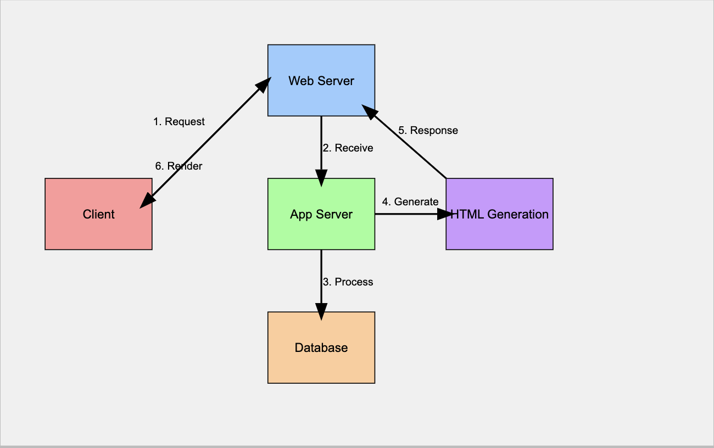

A faster and more reliable digital experience is a must for any business in 2024, even if it's a simple landing page that mentions one product and its price.

Server-side rendering (SSR) helps achieve a smoother user experience by maximizing web performance and accessibility. Be it a landing page or a full-fledged e-commerce website, SSR delivers web apps and content quickly and more consistently in a way that search engines can easily crawl and index pages.

***In this blog, we will explain all you need to know about server-side rendering, how it works, its benefits, and how Fleek can further enhance SSR development.***

---

## **What is Server-Side Rendering (SSR)?**

**Server-side rendering (SSR) means the server renders a complete HTML web page with all its content before sending it to the user's browser.**  A fully-rendered and populated page allows the user to see the content immediately without needing to wait for client-side JavaScript to construct the page.

When the server sends a fully-rendered page to the user's browser, it ensures:

1. Quicker load times
2. Dynamic & engaging apps/experiences
3. Augmented for SEO (correctly indexed due to return of HTML page, no hydration)

The closest alternative to this is client-side rendering, in which a bare-bone HTML file is sent to the user’s browser, and JavaScript renders the content.

***Before we dive deeper into server-side rendering, here’s a quick overview of how the two alternative approaches compare to each other.***

---

### **Server-Side Rendering vs Client-Side Rendering: A Quick Comparison**

Here are five key differences between web development using server-side rendering versus client-side rendering:

| **Factors** | **Server-Side Rendering** | **Client-Side Rendering** |
| --- | --- | --- |
| **User Experience** | Faster initial load and easier to discover using search engines | Comparatively slower initial load but better for single-page apps with rich interactivity |
| **SEO Friendliness** | SEO-friendly because the content is available immediately for search engine crawlers | Less SEO-friendly as content is rendered after JavaScript execution, making it harder for search engines to index |
| **Server Load** | Higher server load, as the server must render each page request and deliver the content | Lower server load, as rendering happens in the browser (no server requirement with traditional CSR, just static files.) |
| **Developer Complexities** | More complex setup involving server environments and double focus areas of client and server-sides | Comparatively easier development because the focus is confined to client-side |
| **Accessibility** | Generally performs better on low-powered devices. Can see mitigated performance from poor network connection. | Enables offline-first PWAs and loading state renders. May struggle on devices with limited processing power since it needs JS for execution. |

If you keenly observe the differences, there’s a pattern:

Of the two approaches, ***server-side rendering can often be more performant and user-friendly but requires more effort and resources.***

In the next two sections, we will explain how server-side rendering works to help you understand why it is resource-intensive for developers.

---

### **A Primer on How Server-Side Rendering Works**

The process of server-side rendering can be broken down to understand how a web page is constructed on the server and then served to the browser:

1. **The browser sends a request**: When a user visits a website, the browser sends a request to the server, asking for the HTML of the web page.
2. **The server receives the request**: The web server (e.g., Nginx, Apache) receives the incoming HTTP request and determines what resource is needed to process it.
3. **Server fetches data**: After the web server determines what's required, the application server (e.g., Node.js, Django) fetches the necessary data from APIs, databases, or other sources.
4. **Page rendering on the server**: The server embeds the fetched data with the pre-defined HTML template. At this stage, the server also prepares any necessary CSS or JavaScript references to be included in the page.
5. **HTML delivered to the browser**: The server sends the fully-rendered HTML page to the user’s browser. The browser displays the content almost immediately (after the request returns), resulting in a faster page load time for the user.
6. **Client-side hydration**: After the HTML is displayed, the browser begins downloading and executing the JavaScript files, enabling interactive elements like buttons, forms, or dynamic features.
7. **Subsequent interactions**: After the initial page load, the app behaves like a single-page application (SPA), with JavaScript loading up to add interactivity to the page. *Note: a user can also return html for each "subpage" without dealing with any framework on the client-side*.

In this workflow, the reliance on the server side to do most of the heavy lifting poses challenges like ***higher server load, complex caching, and real-time data fetching.***

Here's where [Fleek](https://fleek.xyz/) steps in and makes SSR setups faster, more efficient, and scalable with its modular and extensible platform for web development. It brings together a suite of decentralized and permissionless cloud infrastructure that is lightning-fast, low-cost, highly reliable, and auto-scalable.

[Fleek](http://fleek.xyz/) is a web and app development platform, built on the rails of [Fleek Network](http://fleek.network/), an edge-optimized computing infra. And Fleek promises to improve SSR development with its lightweight edge nodes, low latency, and censorship-resistant setup.

With Fleek, developers can:

1. Deploy SSR-based apps in under a minute using a simple Git repository or template.
2. Use Fleek Edge to run your application from 1,000+ locations globally, ensuring content is served with low latency.

***Now, we understand what server-side rendering is and how it works. Let’s get into the practical side of things and learn why it’s so valuable for the modern web. Alongside, let’s also see how Fleek can improve the SSR development process.***

## **Importance of Server-Side Rendering in Modern Web Development**

In modern web development, delivering **fast, accessible, and SEO-friendly experiences** is crucial for any website or application. Server-side rendering (SSR) is tailor-made to achieve these goals, particularly for performance and search engine visibility.

Here are five key reasons why SSR is essential for the modern web:

1. **Improves SEO performance**

Search engines prefer fast, content-rich pages for easier indexing. SSR's quicker load times, courtesy of pre-rendering, help websites be more visible to organic searches.

Fleek can take this a step further using decentralized edge delivery to ensure that server-rendered content reaches users faster by serving it from the nearest edge node.

1. **Smoother user experience**

SSR enhances the users' web experience by delivering content on initial load as quickly as possible without any delay or blank screen. However, maintaining fast page load times across the globe can be challenging. Fleek’s decentralized edge network addresses this by distributing server-rendered pages across multiple nodes.

This distributed computation and delivery of content automatically minimizes latency and optimizes load times for users across different geographies.

2. **Accessibility**

Users across the globe, even with low-powered devices or slow internet connections, can interact with SSR sites. However, for feature-rich and interactive sites to render to remote areas and countries, Fleek’s edge-optimized infrastructure helps since it serves the pages from strategic edge locations closer to the source.

3. **Consistent performance**

SSR helps maintain consistent performance across various devices and network conditions. With traditional SSR setups, scaling to meet high traffic demands can strain centralized servers. Fleek Functions enables auto-scaling and distributed load handling, ensuring performance consistency without overwhelming your servers.

4. **Robust development**

SSR reduces the need for heavy client-side JavaScript execution, which can often be a bottleneck for performance. Furthermore, developers can enjoy the benefits of SSR without worrying about server bottlenecks, high traffic spikes, or complex caching mechanisms, all of which can be easily bypassed by Fleek's edge services.

***Server-side rendering offers many benefits to enterprises, developers, and users alike. However, its scalability remains a question mark. In the next section, we will explore the pain points related to SSR development.***

---

## **Challenges of Server-Side Rendering (SSR) Development**

While server-side rendering is very beneficial in modern app and web development, it is very resource-intensive. More specifically, SSR is very demanding on the server and often runs on a higher server load given it requires the server to handle a request each time someone visits the page.

The increased reliance on server resources can lead to potential bottlenecks if not managed properly. In high-traffic scenarios, this can result in:

1. Increase in response times
2. Scalability concerns
3. Poor user experience
4. Frequent downtimes

All of these outcomes also take a toll on the developer and the development process making it more complex and costly.

---

## **Fleek Network's Approach to Server-Side Rendering**

Recognizing these challenges, Fleek Network has developed an innovative approach to make SSR more efficient and accessible for developers. At the core of Fleek Network's SSR strategy is their adaptation of Open-Next, an open-source tool designed to make Next.js applications deployable to serverless environments.

Here's how Fleek Network enhances the SSR experience:

1. **Serverless optimization**

By leveraging a modified version of Open-Next, Fleek enables developers to deploy Next.js applications in a serverless environment. This approach ***reduces the overhead of managing dedicated servers*** while maintaining the benefits of SSR.

2. **Custom runtime for better performance**

Fleek goes beyond traditional Node.js setups by adapting Open-Next to work with a custom runtime optimized for their decentralized infrastructure. This adaptation leads to ***faster load times, improved user experience***, and seamless integration with Fleek’s permissionless development framework.

3. **Efficient resource management**

Fleek’s on-demand resource allocation reduces the overhead typically associated with SSR. Instead of wasting resources on idle servers, Fleek ***optimizes cost and performance by dynamically scaling*** based on traffic.

4. **Streamlined SSR deployment**

Fleek’s developer-first platform streamlines the deployment process, enabling developers to deploy Next.js applications in minutes. With Fleek managing the complexities of serverless SSR, developers can focus on ***improving UI/UX without worrying about infrastructure scaling or optimization***.

5. **Scalability and censorship resistance**

Fleek’s serverless architecture supports automatic scaling, allowing your SSR application to ***handle traffic surges without manual intervention.*** Additionally, Fleek’s decentralized infrastructure ***ensures censorship resistance***, offering developers a secure, permissionless way to build.

***Now, let’s explore how to get started with SSR development and whether it’s the right choice for you.***

## **Getting Started With Server-Side Rendering**

In this section, we will cover two specific areas: *ideal use cases for using SSR development and the first few actionable steps for developers.*

1. **When To Use Server-Side Rendering**

**Server-side rendering (SSR) is ideal when your project demands better SEO, faster initial load times, and enhanced accessibility.** At a macro level, if you’re building a content-heavy website like a blog, an e-commerce platform, or any site that needs to rank well on search engines, SSR is a great option.

Apart from that, consider using SSR when,

- A faster initial page load is a top priority
- Your target audience includes users with slower internet connections or less powerful devices
- Your site has a lot of static content that doesn't change frequently

2. **Start SSR Development With Fleek**

Here are a couple of resources to help you get started:

1. Read how Fleek made [server-side rendering](https://fleek.xyz/blog/announcements/server-side-nextjs-on-fleek/) with Next.js possible.
2. Fleek’s [Github documentation](https://github.com/fleek-platform/fleek-next) of the Fleek Next adapter.
3. How you can use [Fleek functions](https://fleek.xyz/blog/announcements/introducing-fleek-functions/) — code snippets executed server-side — in your next project.
4. Stay updated with the latest SSR trends, and Fleek features on our [blog](http://blog.fleek.xyz/)