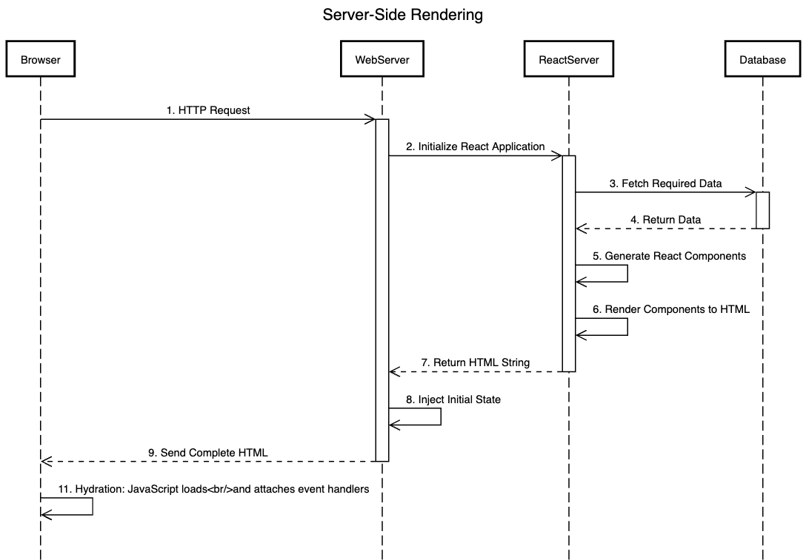
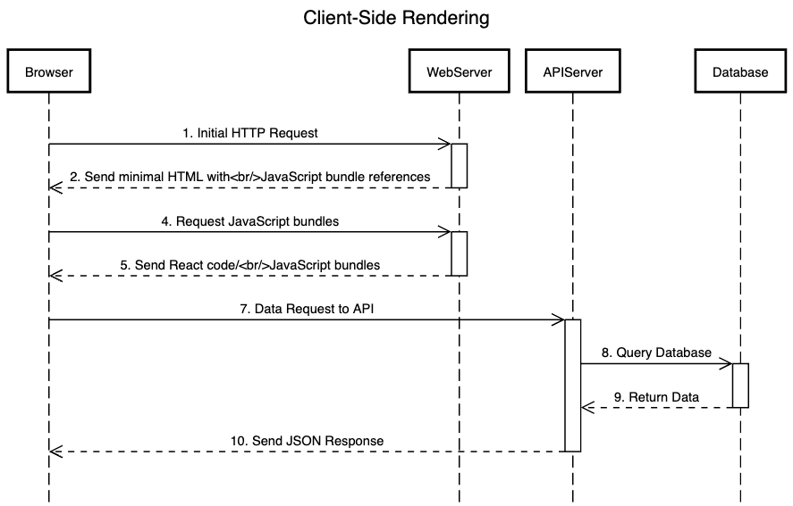

In modern web development, the way web pages are rendered plays a crucial role in determining the overall performance, user experience, and search engine optimization (SEO) of a website. There are two popular approaches: **Server-side rendering (SSR) and Client-side rendering (CSR)**.

**_This blog will help you understand server-side and client-side rendering, explore their advantages and limitations, and provide examples of when and where each method shines, with insights on how Fleek enhances performance and scalability in both approaches_**

## **What is Server-Side Rendering?**

[Server-side rendering](https://fleek.xyz/blog/learn/server-side-rendering-explained/) is a technique where the server processes and generates the full HTML content of a web page in response to a user's request. The server sends a fully rendered page to the client's browser, which can then display it immediately.

### **How Server-Side Rendering Works?**

Server-Side Rendering (SSR) is a web development technique where the server generates the HTML content of a web page and sends it directly to the client’s browser.

Unlike Client-Side Rendering (CSR), where the browser is responsible for rendering the page by executing JavaScript, SSR processes and assembles the web page on the server before delivering it to the client. This results in fully rendered HTML content being available almost instantly when the user loads the page.

Here's a concise explanation of how it works:

1. **Request:** When a user navigates to a URL, the browser sends a request to the server.
2. **Server processing:** The server receives the request and runs the necessary code to generate the HTML content.
3. **Data fetching:** If needed, the server retrieves data from databases or APIs.
4. **HTML generation:** The server uses the data to render the full HTML page, including the initial content.
5. **Response:** The server sends the complete HTML back to the browser.
6. **Browser rendering:** The browser displays the received HTML, resulting in a fully rendered page.

SSR can improve initial page load times and search engine optimization (SEO) compared to client-side rendering.

### **Benefits of Server-Side Rendering**

In this section, we will take an in-depth look at the key benefits of server-side rendering (SSR). Server-side rendering offers several advantages, especially in terms of performance, SEO, and overall user experience.

1. **Faster initial page load:** The First Contentful Paint (FCP) is the moment when a browser displays the first piece of content from a webpage after navigation begins – this could be text, an image, or any other visual element, since the server sends a fully rendered page, users see content more quickly, improving the perceived load time. It is an important metric as it shows how faster a user receives a page.
2. **Better SEO performance:** Search engine crawlers can easily read and index the content, as it's already present in the initial HTML response.
3. **Improved performance on low-powered devices:** Server-side rendering delivers pre-rendered HTML, requiring less client processing. Unlike client-side rendering which needs to download and process large JavaScript bundles before showing any content, making it slower on less powerful devices and poor connections.
4. **Consistent performance across devices:** The server does most of the heavy lifting, ensuring more consistent performance across various client devices.
5. **Improved caching:** Fully rendered pages can be easily cached at the server or CDN level, further improving performance for subsequent requests.

### **Common Use Cases for Server-Side Rendering**

Server-Side Rendering (SSR) has been a traditional approach to web development, but it remains highly relevant, especially in scenarios where SEO, performance, and user experience are critical.

Here are some common use cases where SSR is an ideal approach:

1. **Content-heavy websites:** News sites, blogs, and e-commerce product pages benefit from SSR's quick initial load and SEO advantages.
2. **SEO-critical applications:** Websites that rely heavily on organic search traffic need the SEO benefits of SSR.
3. **Static websites:** Sites with predominantly static content are best served using server-side rendering through static-site generation (SSG), where pages are pre-rendered during build time. This approach eliminates server processing on each request since pages are generated ahead of time.

## **What is Client-Side Rendering (CSR)?**

Client-side rendering (CSR) is a modern approach to web development in which the browser initially downloads a minimal HTML page, typically containing little more than the basic structure of the site. Once this initial HTML is loaded, JavaScript is used to dynamically fetch and render the content that will be displayed to the user.

### **How Client-Side Rendering Works?**

**Client-Side Rendering (CSR)** is a technique in web development where the browser is responsible for generating and rendering the content of a web page dynamically using JavaScript, rather than receiving fully rendered HTML from the server.

This approach is common in modern web applications, especially **Single-Page Applications (SPAs)**, and provides a highly interactive and responsive user experience.

Here is a quick breakdown of how CSR works, step by step:

1. User requests a page from the server.
2. Server sends a minimal HTML page with <script> tags that link to JavaScript files, which tells the browser which JavaScript bundles to download and execute..
3. Browser downloads and executes the JavaScript, typically showing a loading state. During this time, it fetches the necessary data, and the page is dynamically updated as the JavaScript code processes and renders the content.
4. JavaScript makes API calls to fetch data.
5. JavaScript renders the page content dynamically.

### **Benefits of Client-Side Rendering**

Client-Side Rendering (CSR) has become increasingly popular in modern web development, especially for creating highly dynamic and interactive user experiences.

Below, we’ll explore the major advantages of client-side rendering in detail:

1. **Rich interactivity:** Client-side rendering excels at interfaces requiring instant UI updates without server requests - like form validations, animations, drag-and-drop features, and local data filtering.
2. **Reduced server load:** After the initial page load, most of the processing happens on the client-side, reducing the load on the server.
3. **Fast subsequent page loads:** Once the initial JavaScript is loaded, navigating between pages can be very quick as only data needs to be fetched.
4. **Offline capabilities:** CSR applications can more easily implement offline functionality.
5. **Separation of concerns:** Clear separation between front-end and back-end, allowing for more specialized development teams.

### **Common Use Cases for Client Side Rendering**

Client-side rendering (CSR) is widely adopted in modern web development, particularly in scenarios that require high interactivity, dynamic content updates, and seamless user experiences.

Below are some of the most common use cases for client-side rendering:

1. **Web applications:** Complex, interactive applications like project management tools or online editors.
2. **Social media platforms:** Platforms requiring real-time updates and high interactivity.
3. **Single-page applications (SPAs):** Applications that update content dynamically without full page reloads.

## **Key Differences Between Server-Side Rendering and Client-Side Rendering**

| **Aspect**                            | **Server-Side Rendering (SSR)**                                                                 | **Client-Side Rendering (CSR)**                                                                              |
| ------------------------------------- | ----------------------------------------------------------------------------------------------- | ------------------------------------------------------------------------------------------------------------ |
| **Initial Page Load Time**            | Typically offers quicker First Contentful Paint (FCP)                                           | Longer initial load, but faster subsequent navigation                                                        |
| **SEO-Friendliness**                  | More SEO-friendly out of the box                                                                | Requires additional considerations for SEO                                                                   |
| **Server Load**                       | Puts more load on the server                                                                    | Shifts more of the workload to the client                                                                    |
| **User Experience and Interactivity** | Feels more like traditional web browsing                                                        | Provides a more app-like, interactive experience                                                             |
| **Maintenance and Scalability**       | Can be challenging to scale as server resources must handle rendering for each incoming request | Easy to deploy and scale with static files, but more complex to maintain due to client-side state management |

## **Choosing Between SSR and CSR: 3 Factors to Consider**

The choice between SSR and CSR depends on various factors. Let’s explore some key points and find which one is ideal for you:

1. **SEO Requirements**

If your site relies heavily on organic search traffic, SSR has an advantage because it makes content immediately available to search engine crawlers.

CSR can present challenges for SEO as not all search engines process JavaScript the same way, which can affect how the content is indexed and ranked.

1. **Target Audience**

Consider the devices and network conditions of your users. If many of your users are on mobile devices or slower networks, SSR might be preferable as it sends a fully rendered page.

1. **Performance Priorities**

Decide whether initial load time or subsequent interaction speed is more important.

SSR typically offers faster initial page loads, while CSR may have a longer initial load but faster subsequent navigation and updates.

Simply put, static and content-heavy sites (like blogs or news sites) often benefit more from SSR because it delivers the content faster on initial load. Highly interactive applications (like social media platforms or complex web apps) tend to favor CSR for its dynamic capabilities.

**_While each approach has its strengths and trade-offs, Fleek Functions bridges the gap between them by offering a unified, edge-optimized solution that enhances the performance and scalability of both. The next section dives into how Fleek Functions improves SSR and CSR capabilities._**

## **Fleek Functions: Transforming Server-Side and Client-Side Rendering**

Before diving into specific improvements for SSR and CSR, let's understand what Fleek Functions are.

### **Understanding Fleek Functions**

[Fleek Functions](https://fleek.xyz/blog/announcements/introducing-fleek-functions/) are edge-optimized, auto-scaling, serverless functions that improve the way web applications handle server-side and client-side rendering. Built on top of Fleek Network's unstoppable infra, these functions provide developers with a highly performant, cost-efficient, and scalable solution for executing server-side code.

### **How Fleek Functions Improves Server-Side Rendering?**

Built on top of [Fleek Network](http://fleek.network/)'s unstoppable infra, Fleek [Functions](https://fleek.xyz/blog/announcements/introducing-fleek-functions/) provide a high performant and scalable solution for executing code server-side code.

Here are three reasons why Fleek offers more capable SSR than its peers:

1. **Edge-Optimized Processing**

Fleek Functions execute SSR workloads at globally distributed edge nodes, ensuring minimal latency and faster page loads. This approach brings rendering close to users, improving user experience for dynamic and SEO-critical pages.

1. **Consistent Performance with Scalability**

Fleek Functions are designed to minimize cold starts through Fleek Network's architecture, helping maintain consistent server-side response times. Auto-scaling dynamically handles traffic spikes, making it ideal for high-demand use cases like e-commerce and media platforms.

1. **Seamless Framework Integration**

Full compatibility with [Next.js](https://fleek.xyz/blog/announcements/nextjs-support-release/) enables features like dynamic routing, server-side middleware, and incremental static generation. Developers can deliver scalable SSR applications with minimal complexity.

### **How Fleek Functions Improve Client-Side Rendering?**

[Fleek Functions](https://fleek.xyz/docs/platform/fleek-functions/) simplify backend management by providing fast, secure, and scalable API handling. Whether enabling real-time updates for dashboards or processing data for single-page applications, Fleek Functions deliver the reliability and performance required for interactive client-side experiences.

Let’s examine three key features of Fleek’s CSR capabilities:

1. **Efficient Backend Support**

Fleek Functions simplify API handling, routing requests, and performing server-side computations for CSR applications. By running on the edge, they reduce round-trip times, ensuring responsive and lightweight client experiences.

1. **Built-In Security and Privacy**

With Intel SGX-powered [Trusted Execution Environments (TEEs)](https://blog.fleek.network/post/fleek-network-intel-sgx-integration/), Fleek ensures sensitive data remains encrypted and confidential during edge processing. This makes it an excellent choice for applications requiring private data handling.

1. **Scalable and Reliable Infrastructure**

Automatic scaling and a globally distributed network provide high availability and fault tolerance, while usage-based pricing optimizes costs for developers.

### **Future-Ready Development**

Fleek continues to innovate with upcoming features tailored for rendering workflows:

- Incremental Static Regeneration (ISR) for combining static pre-rendering with real-time updates.
- Enhanced image optimization for faster media delivery.
- Streaming support to enable interactive content generation.
- Advanced caching strategies to maximize performance for both SSR and CSR use cases.

### **Start SSR Development With Fleek**

Here are a couple of resources to help you get started:

1. [Fleek Functions Tutorial](https://fleek.xyz/docs/cli/functions)
2. [Fleek Functions Platform Docs](https://fleek.xyz/docs/platform/fleek-functions)
3. [Fleek Functions Early Performance Test](https://blog.fleek.network/post/fleek-network-testnet-phase-3-results/)
4. Read how Fleek made [server-side rendering](https://fleek.xyz/blog/announcements/server-side-nextjs-on-fleek/) with Next.js possible
5. Fleek’s [Github documentation](https://github.com/fleek-platform/fleek-next) of the Fleek Next adapter

Stay updated with the latest SSR trends and Fleek features on our [blog](http://fleek.xyz/blog/).
