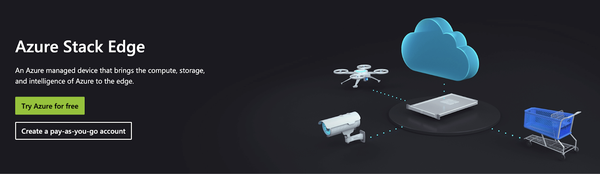
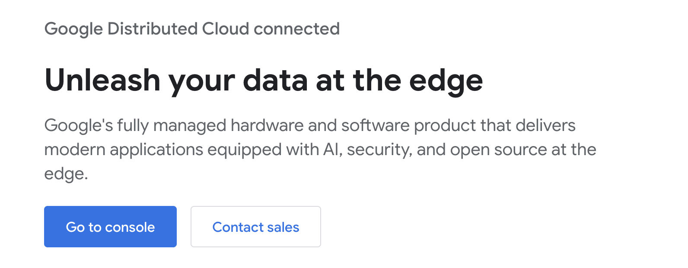
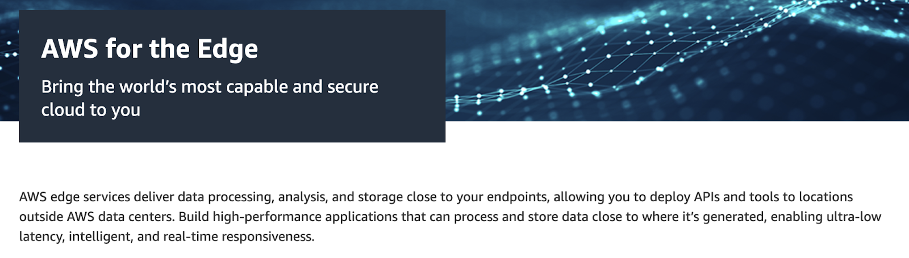
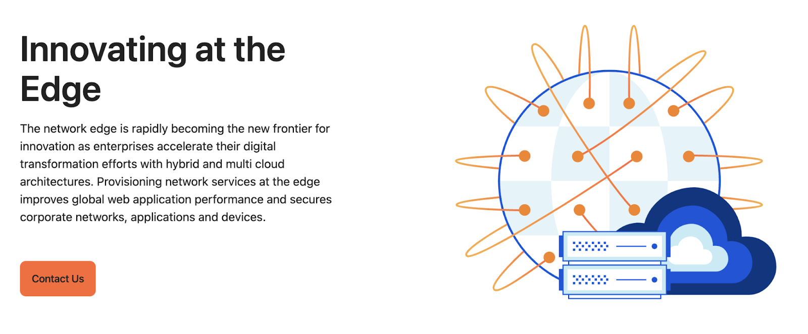

Edge computing is a fundamental evolution in building the next generation of digital infrastructure. The undeniable benefits of reduced latency and improved user experience have attracted businesses, enterprises, and even indie developers to use edge computing in their web development efforts

As demand and adoption grow, various edge computing providers are emerging to simplify the process of building and deploying applications on the edge.

**_In this article, we'll examine five leading edge computing platforms in 2024, explore their key features and also suggest factors to look out for to help you choose the right edge computing platform for your needs._**

## **Fleek**

**Fleek: The Edge Computing Platform for Developers**

Fleek offers an open-source, self-serve platform for edge computing, enabling developers to build and scale applications without the complexity of traditional infrastructure. With two cutting-edge options—**Fleek Functions** and the new **Fleek Machines**—Fleek is redefining the boundaries of serverless and confidential computing.

### **Fleek Functions: Best-in-class Serverless Compute**

Fleek Functions empower developers to deploy and run code globally with high performance, enhanced security, and minimal overhead. Key features include:

- **High Performance**: A globally distributed edge network ensures low latency, high availability, and auto-scaling without cold starts.
- **Security and Privacy**: Leveraging Intel SGX for confidential computing, cryptographic proofs, and remote attestation guarantees secure and verifiable execution.
- **Developer Experience**: Flexible deployment via CLI, API, or UI, with native JavaScript and Next.js support for rapid development.
- **Transparent Pricing**: Usage-based pricing eliminates hidden fees and minimizes DevOps costs.
- **Infra Independence**: Decentralized, censorship-resistant infrastructure gives developers complete control.

Ideal for replacing traditional serverless and cloud functions, Fleek Functions are the go-to choice for developers seeking unmatched performance and flexibility.

---

### **Fleek Machines: One-Click Verified and Private Compute**

Building on Fleek’s trusted execution environment (TEE) expertise, Fleek Machines offer a revolutionary way to perform **long-running, verifiable, and confidential computing** tasks. Currently in [early access](https://dub.sh/machinesearlyaccess), Fleek Machines deliver:

- **One-Click Simplicity**: Deploy Docker images effortlessly and let Fleek Machines handle the setup.
- **Seamless Docker Integration**: Run any workload compatible with Docker in a secure TEE environment.
- **No DevOps Hassles**: Eliminate operational overhead and focus solely on building.
- **Framework & Chain Agnosticism**: Compatible with Web2 and Web3 frameworks, languages, and protocols.
- **Remote Attestation**: Leverage cryptographic proofs and reproducible builds for verifiable execution.
- **Cost & Time Efficiency**: Faster, more affordable than traditional TEE infrastructure.

### **Real-World Applications:**

1. **AI Agent Hosting & Orchestration**: Power chatbots, recommendation systems, and automation tools with secure and performant infrastructure.
2. **Privacy-Focused Consumer Experiences**: Build interactive applications with user trust at the forefront.
3. **On-Chain Co-Processing**: Perform heavy computations (e.g., MEV, oracles) and submit proofs on-chain.
4. **Compliance for Regulated Industries**: Simplify private computations for GDPR and other regulatory requirements.

### **Future-Proofing with Fleek Machines**

Fleek Machines are designed for a decentralized future, with planned integrations into the Fleek Network to enhance global edge deployments, geo-routing, and censorship resistance.

---

**Why Choose Fleek?**

By combining the immediacy of Fleek Functions with the robust capabilities of Fleek Machines, developers can choose the perfect solution for their edge computing needs. Whether you’re building fast, serverless applications or tackling complex verifiable computations, Fleek provides the tools to succeed.

- Read Fleek's official documentation of [Fleek Functions]("https://fleek.xyz/docs/platform/fleek-functions/)
- Sign up for Fleek Machines [early access](https://fleek.typeform.com/machinesaccess)

---

## **Microsoft Azure Edge Services**

[Microsoft Azure Edge services](https://azure.microsoft.com/en-us/products/azure-stack/edge) extend Azure's powerful cloud capabilities to edge locations, delivering low-latency performance in remote areas.

### **Why Should Developers Consider Azure’s Edge Services?**

- **Seamless DevOps Integration:** Azure DevOps and VS Code workflows extend directly to edge environments, enabling automated deployments and monitoring.
- **Native AI Capabilities:** Train AI models in Azure cloud and deploy to edge devices using the same tools and workflows.
- **Container Orchestration:** Built-in Docker and Kubernetes support simplifies deploying and managing containerized applications at the edge.

### **Limitations of Azure Edge Services**

- **Vendor lock-in risk:** Azure’s edge solutions often require tight integration with the Azure ecosystem, creating challenges for businesses using multi-cloud strategies or planning migrations.
- **Limited connectivity:** While designed for offline operation, full functionality requires periodic Azure cloud connectivity for updates and management.

## **Google Distributed Cloud Connected**

[Google Distributed Cloud Connected](https://cloud.google.com/distributed-cloud-connected) extends Google's cloud infrastructure to edge locations, enabling local data processing and workload management through [GKE](https://cloud.google.com/kubernetes-engine) integration.

### **Why Should Developers Use Google Distributed Cloud Connected?**

- **Native Kubernetes Support:** Built on GKE, offering familiar container orchestration tools and consistent management across cloud and edge.
- **AI/ML Edge Processing:** Deploy TensorFlow models to edge locations with TPU support for low-latency machine learning applications.
- **Seamless Cloud Integration:** Direct connection to Google Cloud services like BigQuery and Cloud Storage for hybrid workloads.

### **Limitations of Google Distributed Cloud Connected**

- **Dependency on Google Ecosystem: Heavy reliance on Google services may lead to vendor lock-in, complicating transitions to other platforms or multi-cloud strategies.**
- **Complex Pricing: Multi-layered cost structure combining edge computing, networking, and cloud service fees can be difficult to predict.**
- **High Learning Curve: Requires deep knowledge of both GKE and Google Cloud services for effective implementation.**

## **AWS Edge Services**

[AWS Edge Services](https://aws.amazon.com/edge/services/) extends AWS cloud capabilities to edge locations through Lambda@Edge and CloudFront, enabling local processing and content delivery.

### **Why Should Developers Consider AWS Edge Services?**

- **Serverless Function Execution: Lambda@Edge allows dynamic content handling and serverless functions at the edge, reducing latency.**
- **Offline Computing Support: Snowball Edge enables EC2 and Lambda functions in disconnected environments without cloud dependencies.**

### **Limitations of AWS Edge Services**

- **Complex Service Interactions:** Multiple edge services with overlapping capabilities create confusion in architecture decisions.
- **Vendor Lock-In:** Dependence on AWS's ecosystem can create challenges for businesses needing flexibility or planning multi-cloud strategies.
- **Complex Pricing Structure:** AWS's pricing model can be challenging to predict, especially for edge services that combine data transfer, compute, and storage costs.
- **Learning Curve for New Developers:** The extensive AWS toolset and configurations may pose a steep learning curve for developers unfamiliar with the ecosystem.
- **Regional Restrictions:** Some edge services are not available in all AWS regions, limiting global deployment options.

## **Cloudflare Edge Network**

[Cloudflare Edge Services](https://www.cloudflare.com/en-in/network-edge/) provides global content delivery and edge computing capabilities through Workers, enabling developers to run code across their worldwide network.

### **Why Should Developers Consider Cloudflare Edge Network?**

- **Flexible Programming Support: Cloudflare Workers support JavaScript, Rust, C, and C++, enabling serverless function execution in multiple languages.**
- **Built-In Edge Storage: Workers KV delivers low-latency, globally distributed storage and retrieval for static assets.**
- **Developer-Friendly Pricing: Offers generous free tier with 100,000 daily requests, making it accessible for small projects.**

### **Limitations of Cloudflare Edge Network**

1. **Resource Constraints: Workers have strict CPU and memory limits, restricting complex application capabilities.**
2. **Limited Ecosystem: Cloudflare lacks deep integrations with a broader set of cloud-native services, limiting its use in complex hybrid environments.**
3. **Vendor Reliance: Requires using Cloudflare's DNS and CDN services, limiting infrastructure flexibility.**

So far, we’ve explored five prominent edge computing platforms — Fleek, AWS, Azure, Google Distributed Cloud, and Cloudflare — each offering unique capabilities.

## **Key Considerations for Choosing an Edge Computing Platform**

Here are key factors to consider when evaluating edge computing platforms for your business needs:

1. **Performance**

The ability to deliver fast, consistent performance globally is a must-have for any edge compute platform.

**What should developers look for?**

- Geographical distribution of edge nodes
- Cold start elimination strategies
- Auto-scaling capabilities
- Network routing optimization
- Content caching
- Fault tolerance mechanisms

2. **Transparency in Pricing and Policies**

Cost efficiency is critical, and the platform should offer clear and predictable pricing. Avoid platforms with hidden fees or complicated cost structures.

Key aspects to evaluate include:

- **Usage-Based Pricing: Pay only for what you use, avoiding flat fees or inflated costs.**
- **No Hidden Costs: Ensure clarity on charges for bandwidth, compute, and data storage.**
- **No Vendor Lock-In: Platforms should provide flexibility to switch or migrate as business needs evolve.**

3. **Security and Privacy Architecture**

Modern edge platforms must go beyond basic security to ensure complete data protection and execution integrity.

Critical security features to consider:

- End-to-end encryption
- Confidential computing capabilities
- Remote attestation and verification
- Cryptographic proofs for execution
- Access control granularity

4. **Developer Experience**

The platform should streamline development workflows, allowing you to focus on building rather than infrastructure management.

Key features that matter:

- Multiple deployment options (CLI/API/UI)
- Native CI/CD integration
- Comprehensive monitoring tools
- Language and framework support
- Debugging capabilities

**_These factors represent the core requirements for an edge computing platform. A truly effective platform needs to deliver across all these dimensions._**

## **Edge Computing Made Simple Using Fleek**

**Edge Computing Made Simple Using Fleek**

Factoring in all the considerations, Fleek as an edge compute platform with its core offerings—**Fleek Functions** and **Fleek Machines**—is an ideal solution.

**Why?**

- **Open-source, permissionless architecture** ensures complete control over your code and data.
- **Simple, usage-based pricing** with no hidden fees or complex terms.
- **Built with Intel SGX** for confidential computing, end-to-end encryption, and cryptographic verification.
- **Fleek Machines** enable long-running workloads with trusted execution environments, offering one-click deployment for private and verifiable compute.

Whether you need serverless edge functions or verified, secure compute with Docker support, Fleek has you covered.

### **Leverage Edge Computing Powered By Fleek**

Here are several resources to help you get started:

1. [Fleek Functions Tutorial](https://fleek.xyz/docs/cli/functions)
2. [Fleek Functions Platform Docs](https://fleek.xyz/docs/platform/fleek-functions)
3. [Fleek Functions Early Performance Test](https://blog.fleek.network/post/fleek-network-testnet-phase-3-results/)
4. [Fleek Machines Early Access](https://fleek.typeform.com/machinesaccess)
5. For any queries : [Fleek Discord](https://discord.com/invite/fleek)

For developers :

[Fleek Github](https://github.com/fleek-platform)
