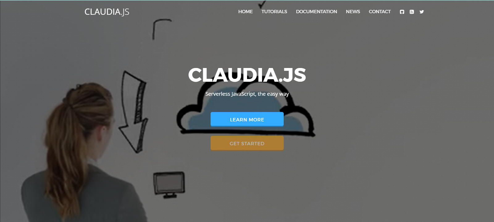

Common approaches to app development are shifting to a more agile architecture with serverless frameworks being the fulcrum. These frameworks enable developers to maintain agility and scalability in their app development processes without getting bogged down by deployment, scaling, and infra management.

Serverless frameworks, in short, allow teams to:

1. Deploy applications without managing traditional server infrastructure
2. Scale automatically based on demand
3. Pay only for the compute resources actually used
4. Focus on writing code rather than maintaining servers

**_In this article, we'll explore five serverless frameworks, ranging from established solutions to innovative solutions like Fleek Functions. We'll explore their unique strengths, practical limitations, and key factors to consider when choosing the right serverless framework to build on._**

## **Fleek Functions**

Fleek Functions is a serverless framework that enables permissionless edge computing through a developer-first approach. With a single command, _fleek functions deploy_, developers can ship code globally without managing infrastructure or worrying about other overheads.

### **Why Should Developers Consider Fleek Functions?**

1. **Reliable performance: Edge-optimized execution, decentralized design, and high fault tolerance ensures Function offers rich and reliable compute.**
2. **Low latency: Functions are executed on Fleek Network's globally distributed edge infra, reducing latency and improving responsiveness.**
3. **Developer-friendly: Functions are easy to create, deploy, and manage using the Fleek CLI and platform UI, making it accessible to all developers.**
4. **Agnostic and open-source: Fleek infra and services are open source and permissionless, meaning developers can embed them into any tech stack.**
5. **Uncensorable compute: Fleek Functions provide a trustless and permissionless environment, immune to deplatforming or censorship.**

Moreover, the agnosticism and non-opinionated nature of Fleek Platform adds to the flexibility of Functions.

Ideally, using Functions, developers can replace any existing serverless, edge, or cloud functions they currently use.

💡Read Fleek’s official documentation of [Functions](https://fleek.xyz/docs/platform/fleek-functions/)

---

## **Zappa**

[Zappa](https://github.com/zappa/Zappa?tab=readme-ov-file#readme) is a tool for building and deploying serverless, event-driven Python applications, including frameworks like [Flask](https://flask.palletsprojects.com/) and [Django](https://www.djangoproject.com/), on [AWS Lambda](https://aws.amazon.com/lambda/) and API Gateway.

### **Why Should Developers Consider Zappa?**

1. **Single-command deployment:** Zappa deploys applications to AWS Lambda with a single zappa deploy command, reducing setup complexity.
2. **Automated scaling:** Zappa automatically scales applications with AWS Lambda, reducing maintenance needs and scaling-specific overheads.
3. **Built-in scheduling and event handling:** Zappa allows applications to respond to AWS events (e.g., S3 updates) and schedule tasks, offering functionality similar to Celery without the server maintenance.

### **Limitations of Zappa**

- **AWS dependency:** Zappa is tightly coupled with AWS infrastructure, which can lead to vendor lock-in and challenges in migrating to other platforms.
- **Limited language support:** Zappa is optimized for Python, lacking built-in support for other popular programming languages.
- **Debugging complexity:** Debugging applications can be complex due to AWS Lambda’s limited visibility into execution environments and logs.

## **Google Cloud Functions**

[Google Cloud Functions](https://cloud.google.com/functions/docs/functions-framework) is a lightweight, open-source framework that lets developers write, test, and deploy serverless functions on [Google Cloud](https://cloud.google.com/). It supports local development and allows functions to operate across Google environments.

### **Why Should Developers Consider Google Cloud Functions?**

1. **Local development and testing**: Developers can test serverless functions locally before deploying, enabling faster development cycles and debugging.
2. **Standardized event handling**: Built-in support for CloudEvents ensures consistent event management across cloud-native applications.

### **Limitations of Google Cloud Functions**

- **Google Cloud dependency:** Tightly integrated with Google Cloud services, which can lead to vendor lock-in and reduced flexibility for multi-cloud strategies.
- **Latency concerns:** High latency for users outside Google Cloud Platform (GCP) regions, especially third-world countries and remote locations.

## **Claudia.js**

[Claudia.js](http://claudia.js/) is a tool that simplifies the deployment of [Node.js](http://node.js/) projects to AWS Lambda and API Gateway. It automates setup tasks, making it easier for developers to build and manage Lambda-based microservices with minimal configuration.

### **Why Should Developers Consider Claudia.js?**

1. **One-command deployment:** A single claudia create or claudia update command allows developers to deploy and update Lambda functions.
2. **Standard Node.js compatibility:** Works directly with standard NPM packages, eliminating the need for additional frameworks..
3. **Version management:** Provides tools to manage and roll back Lambda function versions, reducing deployment risks.

### **Limitations of Claudia.js**

- **AWS-specific:** Claudia.js is tightly bound to AWS services, limiting portability to other cloud providers.
- **Limited ecosystem:** While excellent for Node.js, it lacks out-of-the-box support for other languages or runtimes.
- **Complexity for advanced use cases:** Claudia.js may lack flexibility for complex serverless architectures or multi-region setups.

## **Serverless Framework**

[Serverless Framework](https://www.serverless.com/) is a multi-cloud development tool for building and deploying serverless applications. It enables developers to build, deploy, and manage auto-scaling applications on AWS Lambda, API Gateway, DynamoDB, and other cloud services within a unified interface.

### **Why Should Developers Consider Serverless Framework?**

1. **Multi-cloud compatibility:** Supports major cloud providers like AWS, Azure, Google Cloud, and more, enabling developers to deploy applications on the platform of their choice.
2. **Simple YAML configuration:** Allows developers to define serverless functions, resources, and triggers with minimal configuration, speeding up deployment workflows.

### **Limitations of Serverless Framework**

- **Complex configuration:** The setup of a multi-cloud infra can be complex and time-consuming.
- **Steep learning curve:** While powerful, the learning curve can be steep for developers new to serverless architectures or YAML-based configurations.

## **Key Considerations When Choosing a Serverless Framework**

We have listed a few serverless frameworks and there are several more. While choosing one, it’s important to focus on factors that directly impact your application's performance, scalability, cost, and developer productivity.

1. **Performance and latency optimization**

Performance of serverless computing, especially across a global user base in testing periods of traffic, is a critical metric to check for while choosing a serverless framework.

What should a developer look for?

- Edge execution capabilities
- Geographical distribution of nodes
- Global request routing optimization
- Bandwidth management
- Caching strategies

2. **Transparency in pricing and policies**

Hidden costs and opaque pricing models can lead to unexpected budget overruns. Similarly, policies related to lock-ins, compute credits or limits, plugin costs, and more needs to be as transparent as possible. Simply put, a reliable serverless framework should be cost-effective and straightforward.

3. **Scalability**

A framework's ability to handle traffic spikes and increased workloads without compromising on performance is vital for modern applications.

True scalability goes beyond handling more requests, it also tests the boundaries of,

- Consistent performance during traffic spikes
- Global resource distribution
- No artificial concurrency limits
- Resource optimization at scale

4. **Resilience and security**

Robust security and resilience is a non-negotiable for modern web apps and digital products/services. Especially in a serverless framework, the need for security goes beyond basic encryption and DDoS protection. When choosing a serverless framework, look for,

- Multiple execution fallbacks and automatic failover mechanisms
- Cryptographic verification of executions and data integrity
- Comprehensive security defaults

5. **Developer experience and development flexibility**

This factor simply means that the framework should adapt to developers, not the other way around.

Here are five things that would improve the developer experience drastically:

- Framework-agnostic deployment options
- Native Git and CI/CD integration
- Comprehensive CLI tooling
- Custom runtime support via Docker
- Intuitive debugging and monitoring

**_These factors represent the core requirements for modern serverless computing. A truly effective framework needs to deliver across all these dimensions to support today's demanding applications._**

## **Making Serverless Computing Easy with Fleek Functions**

Keeping in mind all the factors, Fleek Functions comes up as the ideal suggestion for developers looking for a serverless framework.

Why?

1. **Fleek Functions makes serverless deployment very simple, abstracting all complexities into a simple command of: fleek functions deploy.**
2. **Fleek Functions adapts to your development style rather than forcing specific patterns:**
   1. Works with any JavaScript framework
   2. Supports custom runtimes through Docker
   3. Integrates with existing CI/CD pipelines
3. **Fleek Functions brings transparency to serverless costs, ranging from compute usage to scaling costs.**

**_With Fleek Functions, serverless computing becomes not only easier but also more resilient, intuitive, and productive — making it an ideal framework for anyone looking to employ serverless computing._**

### **Here are a couple of resources to help you get started:**

1. [Fleek Functions Tutorial](https://fleek.xyz/docs/cli/functions)
2. [Fleek Functions Platform Docs](https://fleek.xyz/docs/platform/fleek-functions)
3. [Fleek Functions Early Performance Test](https://blog.fleek.network/post/fleek-network-testnet-phase-3-results/)
4. For any queries : [Fleek Discord](https://discord.com/invite/fleek)
5. For developers : [Fleek Github](https://github.com/fleek-platform)
