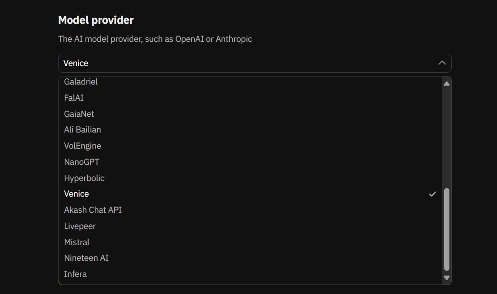
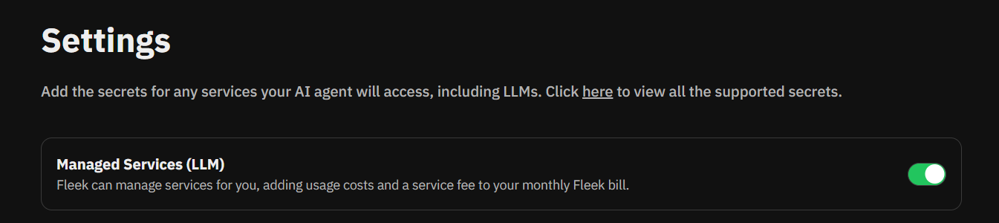

AI tools are evolving fast — but so are their filters. If you’ve tried using mainstream platforms to generate images, stories, or conversations, you’ve probably hit some kind of content wall. Whether it’s an image that never renders or a chatbot that refuses to answer, the message is clear: **your creativity is being censored**.

But it doesn’t have to be.

With **Venice + Fleek**, you can launch your own **uncensored AI**, **host it yourself**, and **skip all the setup**. No coding. No infrastructure. No LLM key headaches. Just you, your ideas, and a canvas that doesn’t tell you “no.”

---

## **👀 Why People Are Looking for Uncensored AI Tools**

Search volume says it all. Thousands of people are actively hunting for ways to create without limitations:

- *“uncensored ai generator”* → 9.9K monthly searches
- *“uncensored ai image generator”* → 3.6K
- *“ai image generator uncensored”* → 1.6K

It’s not just about making edgier content — it’s about **creative control**. Writers want to tell stories their way. Artists want freedom of expression. Developers want to build tools for communities that don’t fit into sanitized platforms.

But self-hosting an AI agent? That used to be a major lift — until now.

---

## **🧠 Venice + Fleek: The Fast Track to Hosting Your Own AI**

Venice is a powerful open-source framework that lets you spin up your own AI agents, from chatbots to image generators. Fleek is the platform that makes it ridiculously simple to host them.

When you use them together, something magical happens:

**You can deploy a fully working, uncensored AI agent with one click.**

There’s no backend to set up. No config files to touch. No key management to worry about. Fleek handles everything behind the scenes — including your LLM access — so you can focus on building something awesome.

---

## **🛠️ How It Works (Yes, It’s Actually This Simple)**

### **✅ Option 1: Using Your Own Venice API Key**

1. Go to [**fleek.xyz**](https://fleek.xyz/) and sign up
2. Head to the **Agent Builder**
3. In the UI, select **Venice** as your model provider
4. Paste your **Venice API key** in the settings panel
5. Hit deploy — your agent is live!

### **⚡ Option 2: Using Fleek’s Managed LLM Keys**

1. Go to [**fleek.xyz**](https://fleek.xyz/) and sign up
2. Head to the **Agent Builder**
3. In **Settings**, toggle on **LLM Management**
4. Click **Deploy** and you’re done!

---

## **🎯 What You Can Build**

The possibilities with Venice + Fleek are wide open, but one of the most exciting frontiers right now? **Virtual influencers**.

Creators are building AI-powered personalities that live on websites, stream content, interact with fans, and even post on social media. With your own agent running on Fleek, you can fully control how they speak, what they look like, and the kind of content they create. All without platform filters getting in the way.

But that’s just the beginning. You can also build:

- Visual artists are building **uncensored ai image generators** that let them explore surreal, stylized, or NSFW art without moderation blocks.
- Writers are launching AI-powered storytelling tools that don’t stop short when the plot thickens.
- Communities are setting up agents that reflect their values, not someone else’s terms of service.
- Some are even building **free uncensored ai generators** as open tools for others to remix and expand.

The common thread? **Total creative ownership**.

---

## **🔐 Fleek Handles the Boring Parts So You Don’t Have To**

Traditionally, if you wanted to self-host an AI agent, you had to manage infrastructure, set up API keys securely, and hope you didn’t accidentally expose anything. With Fleek, all of that disappears.

You don’t need to bring your own LLM keys — we’ve got them covered. You don’t need to think about scaling, hosting, or costs. And you don’t need to worry about whether your app is going to break if it gets popular.

You still own your app. You still control the outputs. But all the friction? Gone.

---

## **🧪 Build Without Filters, Deploy Without Fear**

The internet is hungry for tools that let users express themselves without walls. And with Fleek and Venice, you don’t need to be a developer to give people that freedom.

So whether you’re building an **uncensored AI image generator**, a wild storytelling bot, or a creative playground for your community — this is your sign to launch it.

👉 [**Deploy your uncensored AI agent now**](https://fleek.xyz) — it only takes a minute.