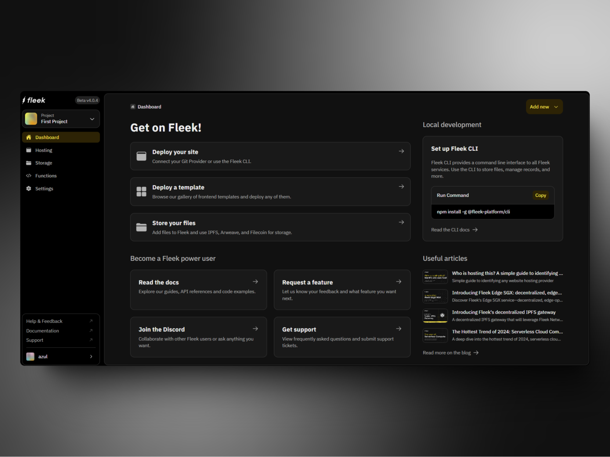
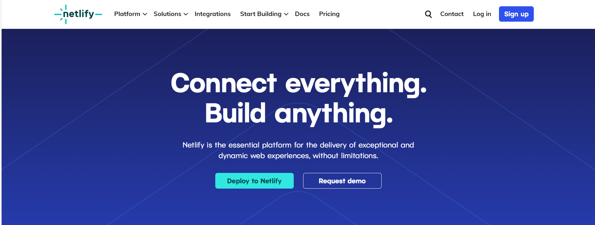
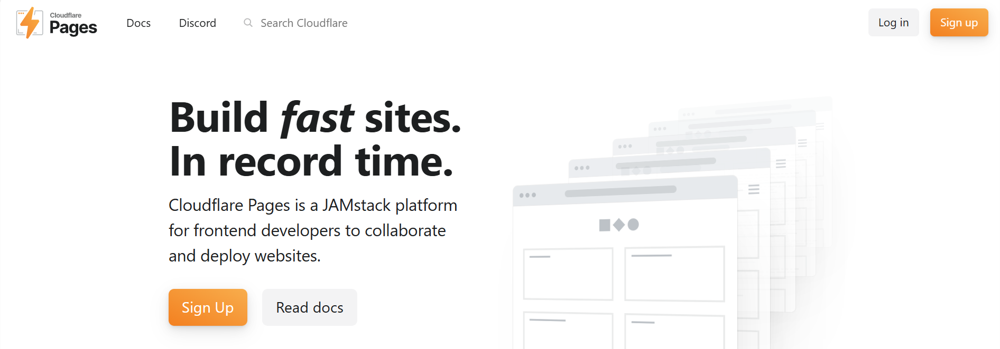
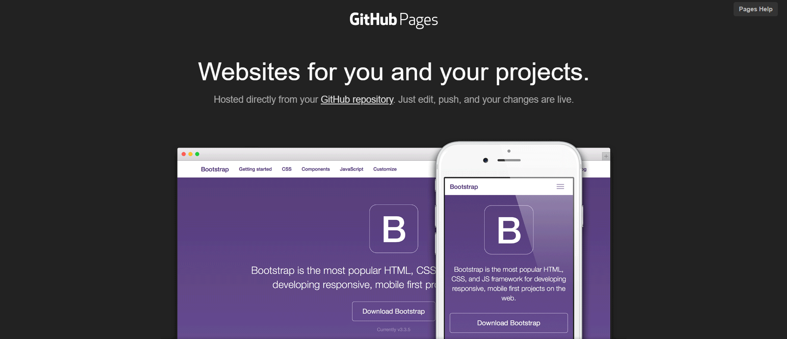
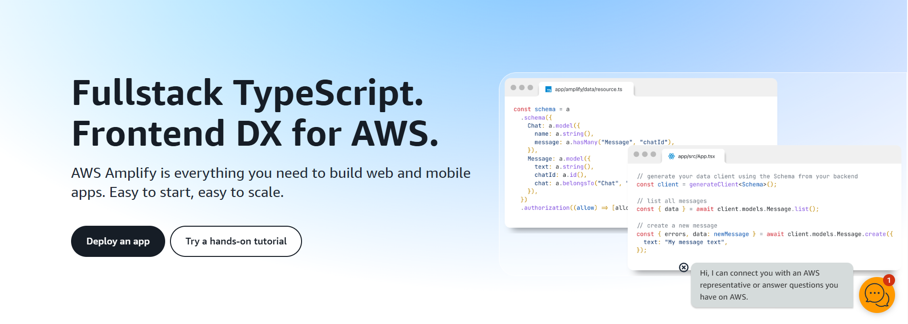

# **Why consider alternatives to Vercel for your next web project?**

In recent years, Vercel has emerged as a leading platform for deploying modern web applications, especially those built with frameworks like Next.js. Its seamless integration with Git, automatic deployments, and serverless functions have made it a go-to choice for many developers. However, Vercel can be quite expensive, especially for projects that scale, making it important to explore alternatives to Vercel that might offer better pricing, more control over infrastructure, or specific features tailored to your needs.

Whether you're looking for cost-effective solutions, more customization options, or decentralized hosting, several **Vercel alternatives** are worth considering. In this blog post, we'll dive deep into some of the most compelling options, including Fleek, and explore their features, advantages, and potential use cases. By the end, you'll have a clearer understanding of which platform might be the best fit for your next project.

---

## **1. Fleek: Performant, low-cost, open-source Next.js hosting**

### **Overview**

Fleek is positioning itself as a top-tier **Vercel alternative** by offering a performant, cost-effective, and open-source solution for hosting Next.js applications. With static Next.js support already, and full Next.js support being added at the end of September, Fleek will provide an ideal environment for developers looking to deploy their applications with minimal overhead and without breaking the bank.

### **Key features**

- **Minimal DevOps overhead**: Fleek is designed to simplify the deployment of full-stack Next.js applications, reducing the need for extensive DevOps management. This makes it easy for developers to focus on building rather than maintaining infrastructure.
- **Server-Side Rendering (SSR) at the edge**: [Fleek’s network](https://fleek.network/) edge capabilities enable seamless support for server-side rendering, allowing your Next.js app to scale effortlessly. This ensures quick, responsive experiences for users, no matter where they are located.
- **Intelligent caching**: To optimize performance and prevent server overload, Fleek implements advanced caching strategies. This ensures that your site remains fast and responsive, even under heavy traffic.
- **Optimized asset delivery**: Fleek optimizes asset delivery to enhance web application performance. Additionally, developers can still apply traditional performance optimization techniques on top of the built-in enhancements Fleek provides, offering flexibility to meet specific project needs.

### **Advantages**

- **Cost-effectiveness**: Fleek offers a budget-friendly solution for hosting Next.js applications without compromising on quality or performance.
- **Performance**: With edge computing, intelligent caching, and optimized asset delivery, Fleek ensures that your Next.js applications perform at their best.
- **No BS approach:** Fleek offers a clean, serverless platform that cuts through the noise. It’s built to provide exactly what developers need: high performance, seamless devex, cost efficiency, and reliability, without unnecessary complexity, bloated features, or the corporate nonsense developers typically deal with on traditional cloud platforms.
- **Censorship resistance**: Built-in protections ensure that your site remains available and resilient, even under potential threats or takedown attempts, making it a dependable choice for all types of projects.

### **Potential use cases**

- **E-commerce sites**: Ideal for dynamic e-commerce platforms where product prices, inventory, and promotions need to be updated in real-time.
- **News platforms**: Perfect for news sites that require real-time updates or feeds, handling high traffic and content updates effortlessly.
- **Marketing websites**: A great choice for marketing sites focused on optimizing SEO and performance, with pre-rendered static pages for better search engine visibility and faster load times.
- **Dashboards and admin panels**: Well-suited for complex dashboards and admin panels that require real-time data visualization and state management, providing a smooth, responsive user experience.
- **Social platforms or community sites**: Ideal for building social or community platforms that need advanced routing, state management, and the ability to scale easily with growing user bases.
- **Custom documentation/blogging websites**: Build hyper-customized documentation or blogging sites to provide detailed resources for developers or users, helping them navigate complex topics with ease.

**Start building with Fleek**: If you’re seeking a **Vercel alternative** that combines minimal DevOps overhead, performance, and cost-efficiency, Fleek is a powerful choice. Start building with Fleek today and experience the benefits of this streamlined, high-performing platform.

**[Start for free](https://app.fleek.xyz/)**

## **2. [Netlify](https://www.netlify.com/): A popular and feature-rich option**

### **Overview**

Netlify is one of the most popular alternatives to Vercel, offering a comprehensive platform for deploying static sites and modern web applications. With a strong focus on developer experience, Netlify provides powerful features such as serverless functions, continuous deployment, and advanced analytics.

### **Key features**

- **Continuous deployment**: Netlify integrates with Git repositories, allowing for automatic deployments every time you push changes.
- **Serverless functions**: Easily deploy serverless functions that run in response to events or HTTP requests, enabling dynamic functionality without the need for a separate backend.
- **Edge handlers**: Customize the behavior of your site at the edge, allowing for advanced routing, personalization, and performance optimization.
- **Forms and identity**: Netlify offers built-in support for forms and user authentication, simplifying the process of adding these features to your site.

### **Advantages**

- **Mature ecosystem**: Netlify has a well-established ecosystem with a large user base, extensive documentation, and a wide range of plugins and integrations.
- **Feature-rich**: With a comprehensive set of tools, Netlify can handle a wide variety of use cases, from simple static sites to complex web applications with dynamic functionality.
- **Performance optimization**: Netlify's edge network and automatic optimization features help ensure your site loads quickly and efficiently.

### **Potential use cases**

- **Static sites and JAMstack applications**: Ideal for projects built using the JAMstack architecture, where static assets are served from a CDN and dynamic functionality is handled via APIs and serverless functions.
- **E-commerce**: With support for forms, identity, and serverless functions, Netlify is a solid choice for small to medium-sized e-commerce sites.
- **Marketing sites**: Netlify's ease of use, coupled with its built-in forms and analytics, make it a great platform for marketing and landing pages.

---

## **3. [Cloudflare Pages](https://pages.cloudflare.com/): Fast and secure web hosting**

### **Overview**

Cloudflare Pages is a relatively new entrant in the space, but it has quickly gained traction due to Cloudflare's reputation for performance and security. Cloudflare Pages offers a simple, fast, and scalable platform for deploying static websites.

### **Key features**

- **Global CDN**: Cloudflare Pages leverages Cloudflare's global CDN, ensuring fast load times by serving your site from data centers close to your users.
- **Git integration**: Like Vercel and Netlify, Cloudflare Pages supports continuous deployment from Git repositories.
- **Integrated security**: Benefit from Cloudflare's suite of security features, including DDoS protection, firewall rules, and SSL/TLS encryption.
- **Edge functions**: Deploy functions at the edge to run custom code with low latency, similar to Vercel's serverless functions.

### **Advantages**

- **Performance**: With Cloudflare's extensive network, your site benefits from one of the fastest and most reliable CDNs available.
- **Security**: Cloudflare's security features are industry-leading, making Cloudflare Pages an excellent choice for sites that require robust protection against attacks.
- **Ease of use**: Cloudflare Pages is designed to be simple and intuitive, with a straightforward setup process that makes it easy to get started.

### **Potential use cases**

- **Performance-critical applications**: Projects where performance is a top priority, such as high-traffic websites or web applications with a global user base.
- **Secure websites**: Sites that need to adhere to strict security standards, such as financial services, healthcare, or other industries that handle sensitive data.
- **Developer-friendly projects**: Cloudflare Pages is a good fit for developers who want to leverage Cloudflare's powerful tools without getting bogged down in complex configurations.

---

## **4. [GitHub Pages](https://pages.github.com/): A free and simple solution**

### **Overview**

GitHub Pages is a free hosting service provided by GitHub, primarily intended for hosting static sites directly from a GitHub repository. While it lacks some of the advanced features found in other platforms, its simplicity and integration with GitHub make it an attractive option for certain types of projects.

### **Key features**

- **Free hosting**: Host static websites for free, directly from your GitHub repository.
- **Custom domains**: Easily set up a custom domain for your GitHub Pages site.
- **Jekyll integration**: GitHub Pages natively supports Jekyll, a static site generator, making it easy to set up blogs or documentation sites.
- **SSL/TLS support**: GitHub Pages automatically provides SSL/TLS certificates, ensuring your site is served over HTTPS.

### **Advantages**

- **Cost-effective**: GitHub Pages is completely free, making it an excellent choice for personal projects, blogs, or small static sites.
- **Simplicity**: With minimal setup required, GitHub Pages is easy to use, especially for developers already familiar with GitHub.
- **GitHub integration**: Seamless integration with GitHub means you can manage your site's content alongside your code, with automatic deployments on push.

### **Potential use cases**

- **Personal blogs and portfolios**: Ideal for developers who want to showcase their work or share their thoughts without needing a complex setup.
- **Documentation sites**: GitHub Pages is a great choice for hosting project documentation, especially if you're already using GitHub to manage your codebase.
- **Small static sites**: For simple websites that don't require dynamic functionality, GitHub Pages provides a straightforward and cost-effective solution.

---

## **5. [AWS Amplify](https://aws.amazon.com/amplify/): Full-stack development platform**

### **Overview**

AWS Amplify is a powerful platform that goes beyond static site hosting, offering a full suite of tools for building, deploying, and managing modern web and mobile applications. Amplify is part of the broader AWS ecosystem, providing deep integration with other AWS services.

### **Key features**

- **Backend as a Service (BaaS)**: Amplify provides a range of backend services, including authentication, databases, APIs, and storage, allowing you to build full-stack applications without managing your own infrastructure.
- **CI/CD pipelines**: Set up continuous integration and delivery pipelines to automatically build and deploy your application from a Git repository.
- **Hosting and CDN**: Amplify offers hosting with a global CDN, ensuring fast load times for your site.
- **GraphQL support**: Amplify integrates with AWS AppSync to provide powerful GraphQL APIs, enabling real-time and offline functionality.

### **Advantages**

- **Comprehensive toolset**: Amplify provides everything you need to build and deploy full-stack applications, from frontend hosting to backend services.
- **Scalability**: As part of AWS, Amplify can easily scale to handle large applications and high traffic.
- **Flexibility**: With extensive customization options and integrations with other AWS services, Amplify is highly flexible and can be tailored to meet specific needs.

### **Potential use cases**

- **Full-Stack applications**: Ideal for projects that require both frontend hosting and backend services, such as social media apps, e-commerce platforms, or SaaS products.
- **Scalable projects**: Amplify is well-suited for applications that need to scale with user growth, leveraging AWS's infrastructure.
- **Mobile and web integration**: With support for both web and mobile platforms, Amplify is a great choice for developers building cross-platform applications.

---

## **Choosing the best Vercel alternative**

When choosing a platform for deploying your web applications, it's essential to consider your project's specific needs, budget, and long-term goals. While Vercel is a powerful and popular choice, there are several alternatives that offer unique features and advantages.

- **Fleek** is a top choice for developers looking for a high-performance, low cost, seamless devex, and more transparency. With robust hosting features and seamless Next.js support, it's perfect for projects that prioritize scalability, flexibility, and reliability.
- **Netlify** provides a feature-rich platform with a mature ecosystem, making it suitable for a wide range of applications.
- **Cloudflare Pages** offers performance and security benefits, backed by Cloudflare's global network.
- **GitHub Pages** is a simple and cost-effective solution for static sites, especially for personal projects and documentation.
- **AWS Amplify** delivers a full-stack development platform with deep integration into the AWS ecosystem, ideal for complex and scalable applications.

By understanding the strengths and use cases of each platform, you can make an informed decision that aligns with your development needs. Whether you're building a simple static site, a dynamic web application, or a decentralized project, there's an alternative to Vercel that can help you achieve your goals.

---

## **FAQs**

1. **What are the main differences between Vercel and Netlify?**
   - Vercel and Netlify both offer similar features such as continuous deployment and serverless functions, but Vercel is more tightly integrated with Next.js, while Netlify has a broader range of integrations and a more mature plugin ecosystem.
2. **Is Fleek suitable for all types of web projects?**
   - Yes, Fleek is a versatile platform suited for all types of web projects. It offers a powerful combination of performance, cost-effectiveness, and open-source flexibility.. This makes it an excellent choice for Next.js applications and projects that require high resilience and censorship resistance.
3. **Can I use GitHub Pages for a large-scale application?**
   - GitHub Pages is best for small static sites. For large-scale applications that require dynamic functionality, consider using a more robust platform like Netlify or AWS Amplify.
4. **What are the benefits of using AWS Amplify over Vercel?**
   - AWS Amplify offers a more comprehensive toolset for full-stack development, including backend services and mobile app support, whereas Vercel is more focused on frontend deployment and performance.
5. **How does Cloudflare Pages handle security?**
   - Cloudflare Pages benefits from Cloudflare's industry-leading security features, including DDoS protection, WAF, and SSL/TLS encryption, making it a strong choice for secure web hosting.
