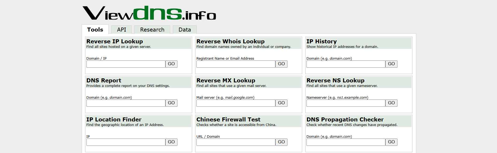

Ever wondered: _“Who is hosting this website?”._ Understanding the internet domain is crucial as it helps identify the web hosting provider behind a website. Whether you’re a curious web user, a budding developer, or someone interested in discovering more about the digital landscape, knowing the **web hosting** provider behind a website can be insightful and useful.

This blog post will walk you through the steps to easily identify the **web hosting service** provider of any website, as well as web server details that may impact performance, helping you easily answer the question "Who is hosting this?":

### **1. Use online tools for quick results**

If you’re looking for a fast and straightforward way to discover the **web hosting provider** of a website, many free online tools are available for this purpose. A hosting checker tool is specifically designed to give you instant information about who is hosting this website with just a few clicks.

- **Whois lookup**: Start with a Whois lookup tool, like [Whois.com](https://www.whois.com/whois/?srsltid=AfmBOorV_IAUKEnEOlPVQnx6HTnw5XA5FImIyRHXZL89jiuyngGEexlH). Enter the domain name, and you’ll get a detailed report. Pay attention to the “Registrar” or “Hosting Provider” sections, which often reveal the **web hosting company** or **web host**.

- **Hosting checker tools**: Websites like [HostingChecker.com](http://hostingchecker.com/) or [WhoIsHostingThis.com](http://whoishostingthis.com/) are dedicated to identifying **web hosting companies**. Simply enter the URL, and these tools will do the rest, giving you the name of the **web host** in seconds.

- **Reverse IP lookup**: For a more detailed approach, try a reverse IP lookup using [ViewDNS.info](http://viewdns.info/). This can show you all the domains hosted on the same **web server**, which can sometimes help you identify the **web hosting provider**.

### **2. Analyze DNS records for clues**

Another method to uncover a **web hosting service provider** is by analyzing its DNS records, which are part of the domain name system. This method gives you a deeper look into the website’s technical setup.

- **DNS Lookup Tools**: Tools like MXToolbox or DNSstuff can perform DNS lookups for you. Enter the domain name to see its DNS records. The nameservers (NS records) often point directly to the **web hosting company**. For example, if you see ns1.bluehost.com, the site is likely hosted by Bluehost, one of the top **web hosting companies**.

### **3. Inspect the website’s source code**

Sometimes, when asking yourself "Who is hosting this?", the information you need is hidden in plain sight—within the website’s source code.

- **Look for HTML comments**: Web developers occasionally leave comments in the HTML code that mention the **web hosting** environment. To find these, right-click on the website, select “View Page Source,” and search for terms like “hosted by” or “powered by.” You might also come across human-readable website addresses, which are easier to remember and can sometimes be found in the source code.
- **Check the CDN (Content Delivery Network)**: The URLs of images and other assets on a website can also give you clues. If you see something like cloudfront.net, it suggests the site is using Amazon Web Services as its **web hosting provider**.

### **4. Leverage command line tools**

For those who are more technically inclined, command-line tools offer another way to identify a **website’s hosting provider** and the **web server** hosting the website.

- **Using nslookup**: Open your command line interface and type nslookup followed by the domain name. This will return the IP address and sometimes the **web hosting provider**’s information.

- **Using traceroute**: The traceroute (or tracert on Windows) command shows the path your connection takes to reach the server. This path can sometimes reveal the data center or **web hosting provider** involved.

### **5. Contact the website owner**

If all else fails, or if you need confirmation, don’t hesitate to reach out directly to the website owner. Most websites have a “Contact Us” page or provide contact information in their privacy policy. A polite inquiry about their **web hosting provider** might get you the answer you need.

### **Conclusion**

Determining "Who is hosting this?" when looking at a website isn’t as challenging as it might seem. Choosing the right **web hosting providers** is crucial for optimal website performance and quality. With the variety of **web hosting companies** and tools available, you can find this information quickly and easily. Whether you’re using online lookup services, analyzing DNS records, inspecting source code, or diving into the command line, there’s a solution for every level of expertise.

If you’re in the market for a **web hosting provider** yourself, consider [Fleek](https://fleek.xyz/), a decentralized **web hosting service** that leverages IPFS and blockchain technology to offer a high-performance, low-cost, open-source, and censorship-resistant solution. Fleek’s seamless integration with popular tools and its focus on decentralized infrastructure make it an attractive option for developers looking to take control of their **web hosting** environment while ensuring maximum accessibility and security.

[**Get started with Fleek**](https://fleek.xyz/docs/platform/hosting/)

So next time you find yourself asking, _“Who is hosting this?”_ you’ll know exactly where to look—and maybe even where you’d like to host your next project.

**Happy hunting! ⚡️**
