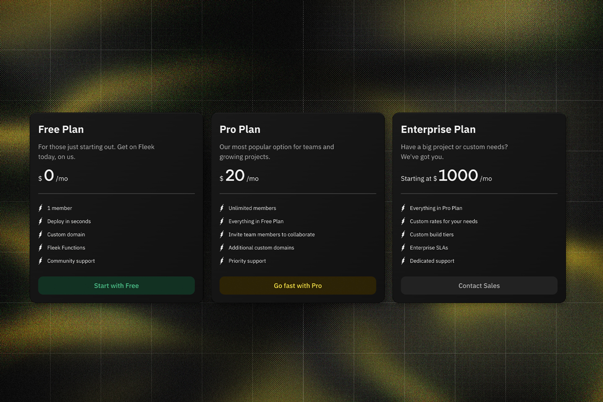
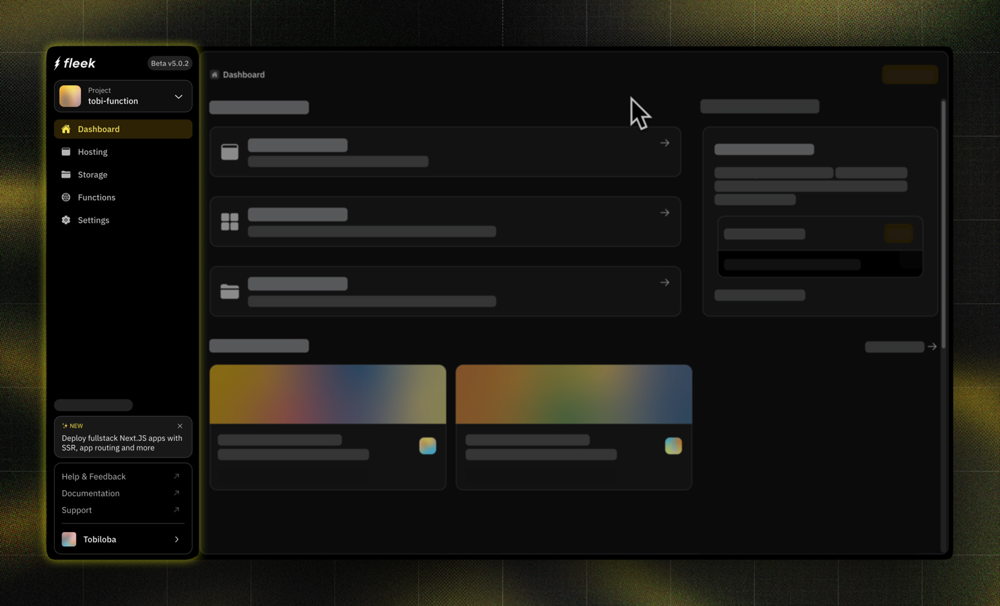

What’s going on, Fleek community?

The team’s been hard at work throughout September and October, bringing tons of exciting updates your way! We’re thrilled to share the latest developments in our changelog, packed with features and enhancements we know you’ll love. The highlights of this release are Next.js SSR support (full Next.js support) along with many cool Next.js templates, Platform billing, IPFS gateway comparison tool, an app redesign and migration from [fleek.co](https://fleek.co/) to [fleek.xyz](https://fleek.xyz/).

## Full Next.js support

Fleek now fully supports Next.js, including SSR for dynamic apps, enabling you to deploy applications that interact in real time with your data and adapt based on user activity. All of this is powered by the [fleek-next adapter](https://fleek.xyz/docs/cli/fleek-next-adapter/) we released. Here’s what’s new:

- **Full SSR support**: Deploy server-side rendered Next.js apps to deliver personalized experiences and faster loading times.
- **Middleware support**: Ideal for authentication, redirects, or any custom processing.
- **App Router support**: Now, Fleek handles dynamic page routing seamlessly, allowing you to create rich web applications like marketplaces, Generative AI apps, and much more. _(Note: Static Site Generation (SSG) support is coming soon)_

## Next.js templates

We expanded our templates collection and included templates for Next.js SSR apps that you can just deploy directly from the Fleek platform to see the full extent of the new Next.js support we just released.

You can start building and shipping with the Next.js templates we have [here](https://app.fleek.xyz/).

<video width="100%" height="auto" autoplay loop controls>
  <source src="./nextjs-templates.mp4" type="video/mp4" />
  Your browser does not support the video tag
</video>

## Platform billing

Our new billing system is now live! Fleek users can still use our Free Plan as a sandbox for new projects, which supports one team member, one custom domain, three sites and limited free monthly resources for each project.

Users above these limits on the Free Plan will be grandfathered into support for their current resources. However, they will not be able to add additional team members, custom domains or sites beyond those that already exist above these limits while on the Free Plan.

To add team members and additional resources, you can upgrade your project to the Pro Plan, starting at $20 per month. Invite as many team members as you need at no additional cost, since we don’t bill on a per-seat basis. The Pro Plan gets you:

- Unlimited members and invitations
- Upgraded resource limits
- Additional build tiers to scale as needed
- Email support

Check out our [pricing page](https://fleek.xyz/pricing/) for more information on this.

## App redesign

We’ve revamped Fleek’s app for a cleaner, smoother user experience! The app is now enhanced with a refreshed design, letting you easily:

- Switch themes
- Access documentation
- Manage projects
- Reach out through the Support Center

## Migration from [fleek.co](https://fleek.co/) to [fleek.xyz](https://fleek.xyz/)

We recently started moving users from **fleek.co** to our new platform, **fleek.xyz**. This migration is seamless, supported by a new workflow designed for an effortless transition. We’ve also begun deprecating the old Fleek.co SDK and CLI.

We are automatically migrating all accounts, sites, and files from Fleek.co to Fleek.xyz well in advance of the official sunset date. Accessing or managing your accounts, sites, and files on Fleek.xyz will be identical to the analogous workflows on Fleek.co.

## **Other updates across Fleek:**

**CLI:**

- Introduced Functions SGX support with SDK v3.
- Replaced the flag `noBundle` with `bundle`, allowing you to better control when you need a Fleek Function to be bundled.
- Introduced the `assets` flag for functions, to support SSR use cases like Next.js.

**SDK:**

- Added SGX to support functions proxy
- Introduced Blake3Hash field

Each new feature is built with your experience in mind, and we can’t wait to see what you create with these updates. Let us know what you think and stay tuned for more as we keep building Fleek together!

Don’t forget to:

- Follow us on [X](https://x.com/fleek)
- Join our [Discord](https://discord.gg/fleek) server
- Catch up on all our [guides](https://fleek.xyz/guides/)  and [resources](https://fleek.xyz/docs/)
