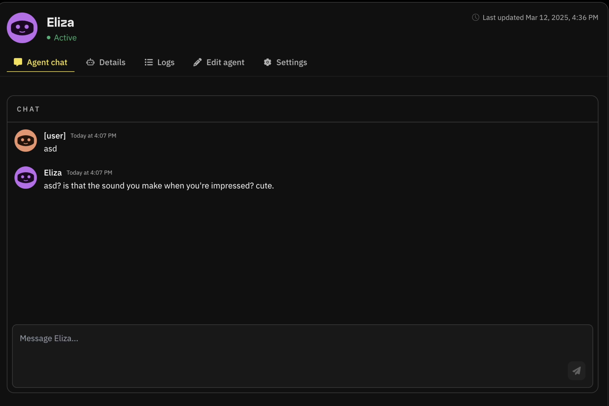
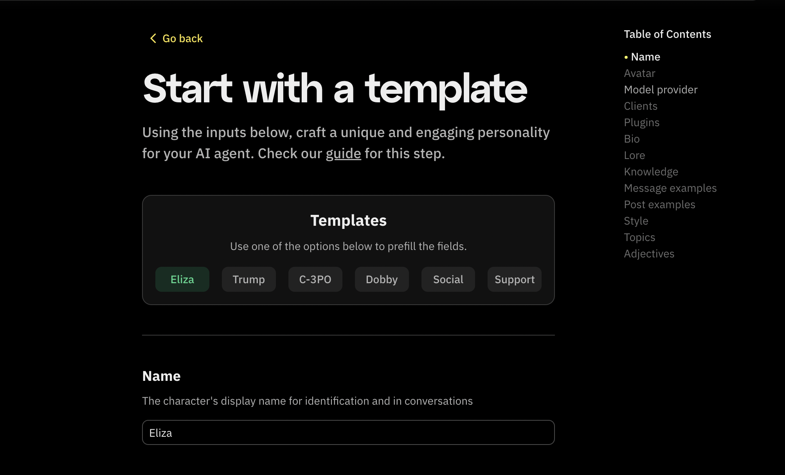
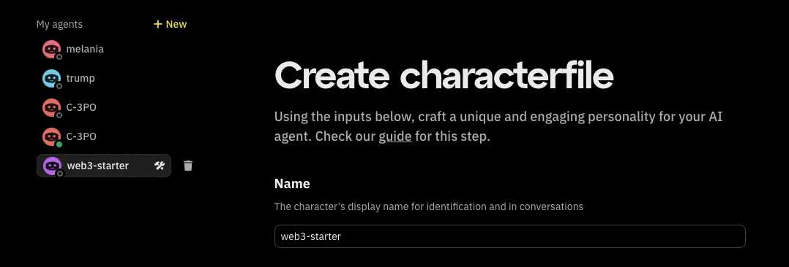

Hey, Fleek community!

We’ve rolled out some exciting updates over the past few days, and we’re excited to share them with you! Here’s a breakdown of what’s new:

---

## Agent chat

Fleek now supports **real-time AI agent chat**, enabling users to interact with their deployed agents directly from the Eliza deployment platform.

### How to Chat with Your AI Agent

1. Select the AI agent you want to interact with at [fleek.xyz/eliza](https://fleek.xyz/eliza).
2. Navigate to the **Agent chat** tab.
3. Type a message in the chatbox and press enter.
4. Your AI agent will respond immediately, allowing you to refine interactions dynamically.

## Eliza version control

When building AI agents on Fleek, users can now toggle between various Eliza versions through the Agent deployment panel, enabling customization of their agent instances on Fleek's infrastructure.

### Supported versions

Currently, Fleek supports specific Eliza versions: [Eliza v0.25.9](https://elizaos.github.io/eliza/docs/changelog/), [Eliza v0.1.9](https://elizaos.github.io/eliza/docs/changelog/#v019-2025-02-01), [Eliza v0.1.8](https://elizaos.github.io/eliza/docs/changelog/#v018-alpha1-january-31-2025), and [Eliza v0.1.7alpha2](https://elizaos.github.io/eliza/docs/changelog/#version-017-alpha2-2024-12-28). You can track updates and check available versions [here](https://elizaos.github.io/eliza/docs/changelog/).

### Switching between Eliza versions

When preparing to deploy an AI agent on Fleek, you can select the Eliza version by:

1. Visiting [fleek.xyz/eliza/](https://fleek.xyz/eliza/).
2. Using the **drop-down toggle** to select the desired version.
3. Proceeding with one of the [three deployment options](/docs/ai-agents/#deploy-ai-agents).

This provides greater control over testing, iterating, and deploying AI agents on the latest stable versions.

---

## API key generation made easier

Generating API tokens for Fleek’s [AI agents APIs](/docs/ai-agents/agents-apis/) is now more streamlined. You can create, view, copy, and regenerate API keys directly from the [Eliza deployment page](/eliza/) or the [Fleek dashboard](https://app.fleek.xyz/).

**Steps to generate an API key:**

1. Visit the [Eliza deployment page](https://fleek.xyz/eliza) and click **Account settings** at the bottom.
2. Navigate to the **API Tokens** tab to view all your generated API keys.
3. Click **Create API Token**. A pop-up should show up requesting to enter a name for your key and a confirmation.

You can now apply the generated key as your `X-Api-Key` request header when making API requests.

---

## AI agent management improvements

We've made significant improvements to AI agent management, including status monitoring. It's easier to monitor, edit, and organize your agents efficiently.

- **Draft status indicators**: Draft agents are now clearly marked next to their name on the Eliza deployment page and Fleek dashboard, allowing easy identification and management.
- **Status tracking updates**: Instantly see which agents are active, inactive, or in draft mode with updated AI agent avatars visible in the sidebar, settings panel, and list views.
- **Simplified navigation**: The AI agent creation flow now features a table of contents for smoother navigation when building agents from scratch or using a template.

- **Improved list view**: Easily browse all agents in a streamlined format to reduce clutter in larger projects.

Additionally, users can:

- Edit AI agents in draft mode before publishing.
- Delete draft agents if no longer needed.
- Track all status changes with updated visual indicators.

The draft creation APIs are also available now. Learn more in our [AI agents API documentation](/docs/ai-agents/agents-apis/).

---

That’s all for now! Thank you for choosing Fleek.

[Check out our documentation](/docs/ai-agents/) for more details.

Don’t forget to:

- Follow us on [X](https://x.com/fleek)
- Join our [Discord](https://discord.gg/fleek)
- Explore our [guides](/guides/) and [resources](/docs/)
