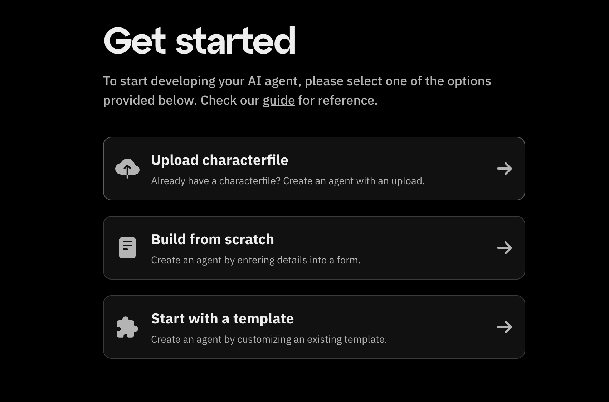
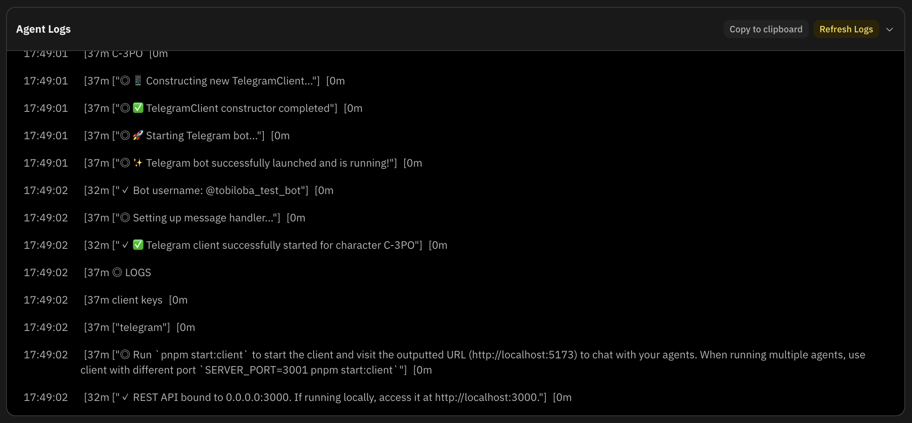

What’s new, Fleek community?

We’re excited to announce the launch of Fleek AI agent hosting with full support for the Eliza framework! Now, developers can seamlessly deploy AI agents in just one click, simplifying what has traditionally been a complex and time-consuming process.

## Eliza AI agent deployment

With Fleek, deploying Eliza-based AI agents is seamless. Whether you’re setting up AI researchers, chatbot assistants, or social media responders. Go to [fleek.xyz/eliza](https://fleek.xyz/eliza/) where you can use any of three deployment options:

1. [Manually enter details [⚡ : no developer experience needed]](https://fleek.xyz/guides/eliza-guide#manually-enter-agent-details)
2. [Use a predefined template [⚡ : no developer experience needed]](https://fleek.xyz/guides/eliza-guide#use-a-predefined-template)
3. [Upload a characterfile](https://fleek.xyz/guides/eliza-guide#upload-a-characterfile)

Users can:

- Deploy AI agents instantly using prebuilt templates or custom configurations
- Leverage seamless Twitter (X) integration
- Use Fleek’s cost-effective hosting plans, starting at $20 per agent per month

## AI agent logs

Fleek AI agent logs provide a **transparent view** of your agent’s actions, allowing users to **monitor performance, debug errors, and optimize deployments**. Logs include **timestamps, events, details, and status updates** to track agent behavior.

Users can access logs via the **Fleek dashboard**, refresh them for the latest updates, and temporarily hide logs for a cleaner interface. These logs improve **debugging, transparency, and performance tuning** for AI agents.

Fleek removes the complexity from AI agent deployment, allowing you to focus on building smarter, more responsive AI applications.

Check out our [documentation](https://fleek.xyz/docs/ai-agents/) to get started. We can’t wait to see what you build!

Don’t forget to:

- Follow us on [X](https://x.com/fleek)
- Join our [Discord](https://discord.gg/fleek) server
- Catch up on all our [guides](https://fleek.xyz/guides/) and [resources](https://fleek.xyz/docs/)
