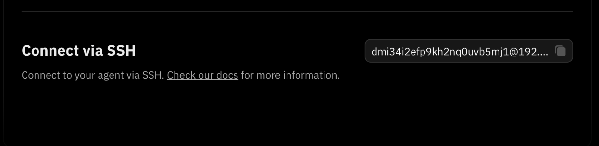

Hey, Fleek community!

We’ve rolled out some exciting updates over the past few days, and we’re excited to share them with you! Here’s a breakdown of what’s new:

## SSH Access to VM for Custom Actions & Plugins

Users can now SSH into their Eliza instance VM to add custom actions and plugins effortlessly. Previously, users had to rely on official Eliza plugins, but now, with just a few commands in the terminal, you can extend functionality as needed.

**How it works:**

1. Copy your auto-generated SSH command, paste it into your terminal, and run it.
2. Enter your password to access your VM.
3. Navigate to the `eliza` repo and add any `packages`—such as actions or plugins.

This new flexibility allows users to tailor their Eliza instances to their specific needs.

---

## API Key Generation Made Easier

Generating API tokens for Fleek’s [AI Agents APIs](/docs/ai-agents/agents-apis/) is now more streamlined. You can now create, view, copy, and regenerate API keys directly from the [Eliza deployment page](/eliza/) or the [Fleek dashboard](https://app.fleek.xyz/).

**Steps to generate an API key:**

1. Visit the [Eliza deployment page](https://fleek.xyz/eliza) and click **"Account settings"** at the bottom.
2. Navigate to the **"API Tokens"** tab to view all your generated API keys.
3. Click **"Create API Token". A** modal appears, \*\*\*\*enter a name for your key and confirm.

Use the generated key as your X-Api-Key for all API requests.

---

## AI Agent Draft Status

Agents still in draft mode will feature an icon next to their name on the Eliza deployment page and the Fleek dashboard.

Additionally, users can now:

- Easily view them with all the other agents
- Continue editing drafts before publishing
- Delete draft agents if no longer needed

This refinement streamlines agent development and ensures drafts don’t get lost in larger projects.

The draft creation APIs are also available now. Learn more in our [AI Agents API documentation](/docs/ai-agents/agents-apis/).

---

## Table of Contents for AI Agent Creation

The AI agent creation flow for both "Build from Scratch" and "Start with a Template" now includes a table of contents for seamless navigation. You can quickly jump between sections to review and edit details before proceeding to deployment.

---

## Sidebar Status Indicators for AI Agents

The AI Agents sidebar on the [Eliza deployment page](/eliza) now displays agent statuses at a glance. This helps you quickly identify which agents are active, inactive, or still in draft mode.

### Updated Sidebar Indicators

The sidebar now features visual status indicators for each AI agent:

- **Green dot**: Active agents
- **Gray dot**: Inactive agents

This makes monitoring and managing your AI agents easier than ever without navigating multiple menus.

---

That’s all for now! Thank you for choosing Fleek.

[Check out our documentation](/docs/ai-agents/) for more details.

Don’t forget to:

- Follow us on [X](https://x.com/fleek)
- Join our [Discord](https://discord.gg/fleek)
- Explore our [guides](/guides/) and [resources](/docs/)
