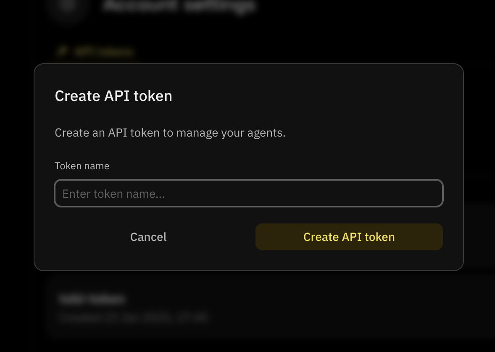
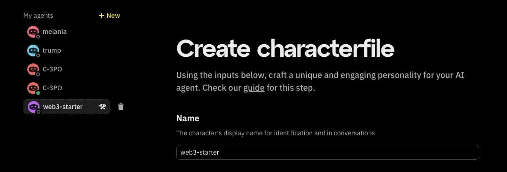
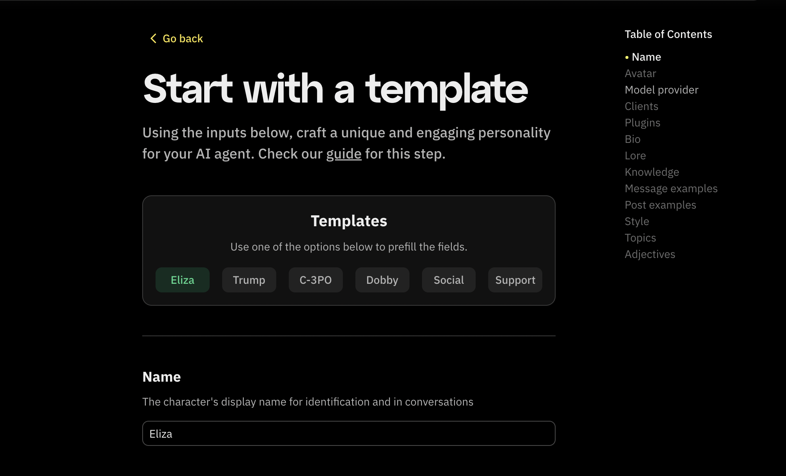

Hey, Fleek community!

We’ve rolled out some exciting updates over the past few days, and we’re excited to share them with you! Here’s a breakdown of what’s new:

---

## Eliza Version Control

Fleek allows users to switch between different versions of Eliza while building AI agents. Through the **Agent Deployment Portal**, users can select a specific Eliza version and adapt their agent’s instance on Fleek’s virtual machines.

### Supported Versions

Fleek currently supports [Eliza v0.25.9](https://elizaos.github.io/eliza/docs/changelog/), [Eliza v0.1.9](https://elizaos.github.io/eliza/docs/changelog/#v019-2025-02-01), [Eliza v0.1.8](https://elizaos.github.io/eliza/docs/changelog/#v018-alpha1-january-31-2025) and [Eliza v0.1.7alpha2](https://elizaos.github.io/eliza/docs/changelog/#version-017-alpha2-2024-12-28). You can track updates and available versions [here](https://elizaos.github.io/eliza/docs/changelog/).

### Switching Eliza Versions

To switch between Eliza versions:

1. Visit [fleek.xyz/eliza/](https://fleek.xyz/eliza/).
2. Use the **dropdown toggle** to select the desired version.
3. Proceed with one of the [three deployment options](/docs/ai-agents/#deploy-ai-agents) on the Deployment Portal.

This flexibility allows developers to test, iterate, and deploy AI agents on the latest stable versions while maintaining compatibility.

---

## API Key Generation Made Easier

Generating API tokens for Fleek’s [AI Agents APIs](/docs/ai-agents/agents-apis/) is now more streamlined. You can now create, view, copy, and regenerate API keys directly from the [Eliza deployment page](/eliza/) or the [Fleek dashboard](https://app.fleek.xyz/).

**Steps to generate an API key:**

1. Visit the [Eliza deployment page](https://fleek.xyz/eliza) and click **"Account settings"** at the bottom.
2. Navigate to the **"API Tokens"** tab to view all your generated API keys.
3. Click **"Create API Token". A** modal appears, \*\*\*\*enter a name for your key and confirm.

Use the generated key as your X-Api-Key for all API requests.

---

## AI Agent Draft Status

Agents still in draft mode will feature an icon next to their name on the Eliza deployment page and the Fleek dashboard.

Additionally, users can now:

- Easily view them with all the other agents
- Continue editing drafts before publishing
- Delete draft agents if no longer needed

This refinement streamlines agent development and ensures drafts don’t get lost in larger projects.

The draft creation APIs are also available now. Learn more in our [AI Agents API documentation](/docs/ai-agents/agents-apis/).

---

## Table of Contents for AI Agent Creation

The AI agent creation flow for both "Build from Scratch" and "Start with a Template" now includes a table of contents for seamless navigation. You can quickly jump between sections to review and edit details before proceeding to deployment.

---

## Sidebar Status Indicators for AI Agents

The AI Agents sidebar on the [Eliza deployment page](/eliza) now displays agent statuses at a glance. This helps you quickly identify which agents are active, inactive, or still in draft mode.

### Updated Sidebar Indicators

The sidebar now features visual status indicators for each AI agent:

- **Green dot**: Active agents
- **Gray dot**: Inactive agents

This makes monitoring and managing your AI agents easier than ever without navigating multiple menus.

---

That’s all for now! Thank you for choosing Fleek.

[Check out our documentation](/docs/ai-agents/) for more details.

Don’t forget to:

- Follow us on [X](https://x.com/fleek)
- Join our [Discord](https://discord.gg/fleek)
- Explore our [guides](/guides/) and [resources](/docs/)
