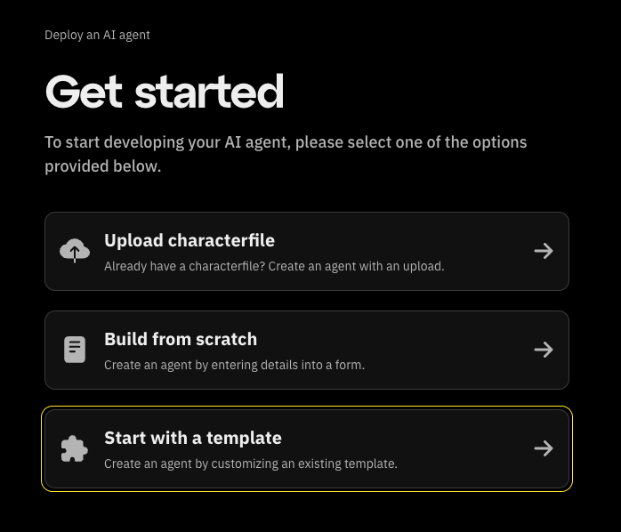

# 3. Starting with a Template

If you’re looking for a quick way to get started, using a pre-built template is an excellent option.
Templates are pre-configured setups that you can customize to fit your needs.
Follow these steps to create an agent using a template:

Click on "Start with Template"
From the Get Started screen.

At the top of the page, you’ll find predefined characters such as Donald Trump, Elon Musk, or Intern.
Clicking one will prefill the fields below, allowing you to start with a specific personality.

Finalize and Save
After filling in all the details:

Click "Continue" to review the setup.

The final step in creating and deploying your AI agent involves configuring environment variables.
These variables provide the necessary credentials and settings for your agent to interact with external services like OpenAI or social platforms.
Fill in sections below:

Your AI agent is now ready to interact with external services seamlessly.
