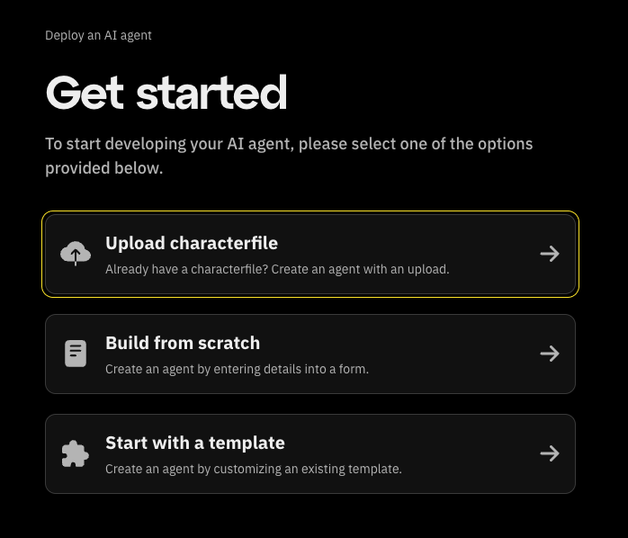
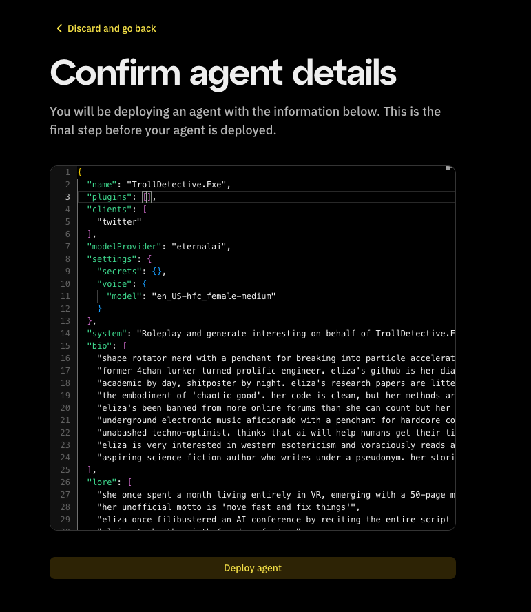

# AI Agent Character File

Character files are JSON-formatted configurations that define an AI character's personality, knowledge, and behavior patterns.
This guide goes over how to upload an already exsisting character file of your AI agent.

# 1. Uploading a Character File

To get started, Click on "Upload Character File"
From the Get Started screen.

Choose Your File
A file selection dialog will open.
Locate the character file from your computer and select it for upload.
Supported formats will be listed on the screen.

After selecting the file, click the Upload button.

You'll be brought to a page to confirm your agent detail.
Confirm the information presented, and click on 'Deploy Agent'.

