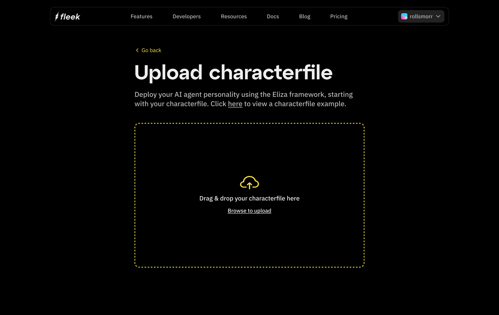

# 1. Uploading a Character File

To get started, Click on "Upload Character File"
From the Get Started screen.

Choose Your File
A file selection dialog will open.
Locate the character file from your computer and select it for upload.
Supported formats will be listed on the screen.

After selecting the file, click the Upload button to initiate the process.

