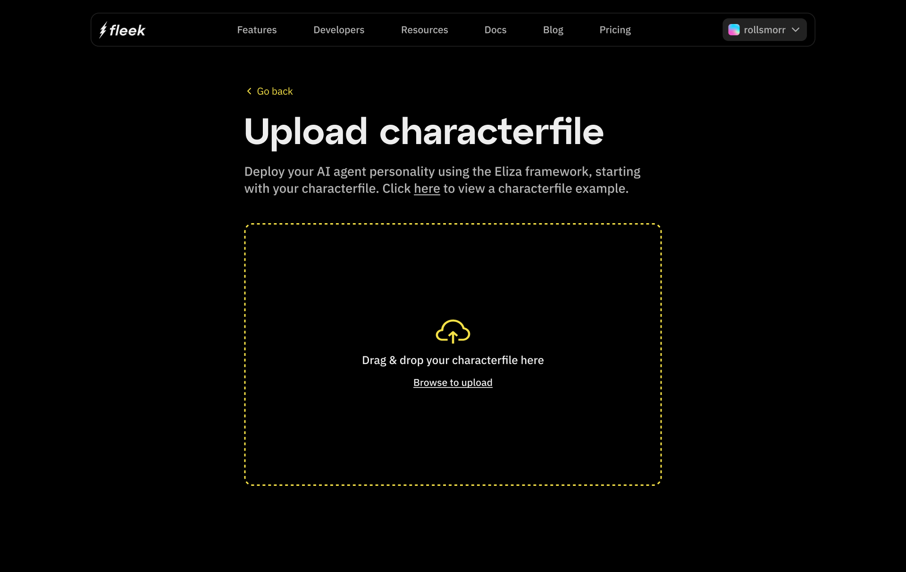

import { Button } from '@components/Button';
import DocIntroCard from '@components/DocIntroCard';

# Deploy AI agents

Fleek will soon be releasing one-click deployments for autonomous AI agents. This will allow developers to simply focus on the agent's personality traits and trustlessly deploy AI agents on Fleek. With support for Trusted Execution Environments (TEEs) and remote attestations, Fleek ensures that the execution of AI agents is both secure and verifiable. We enourage all developers to fill out the form below and be notified as soon as we release it.

  <Button
    variant="secondary"
    href="https://fleek.typeform.com/machinesaccess"
    target="_blank"
    rel="noopener noreferrer"
  >
    Sign up for one-click AI agent deployments
  </Button>

To start developing your AI agent, you have three options to choose from.
\
\
This section will guide you through the first option:

# 1. Uploading a Character File

Click on "Upload Character File"
From the Get Started screen.

Choose Your File
A file selection dialog will open.
Locate the character file from your computer and select it for upload.
Supported formats will be listed on the screen.

After selecting the file, click the Upload button to initiate the process.

# 2. Building an AI Agent from Scratch

If you don’t have a pre-configured character file, you can create your AI agent from scratch by filling in the required details.
Follow these steps:

Click on "Build from Scratch"
On the Get Started screen.

Fill in Agent Details
You’ll be prompted to provide essential information for your agent

# 3. Starting with a Template

If you’re looking for a quick way to get started, using a pre-built template is an excellent option.
Templates are pre-configured setups that you can customize to fit your needs.
Follow these steps to create an agent using a template:

Click on "Start with Template"
From the Get Started screen.

At the top of the page, you’ll find predefined characters such as Donald Trump, Elon Musk, or Intern.
Clicking one will prefill the fields below, allowing you to start with a specific personality.

Finalize and Save
After filling in all the details:

Click "Continue" to review the setup.

The final step in creating and deploying your AI agent involves configuring environment variables.
These variables provide the necessary credentials and settings for your agent to interact with external services like OpenAI or social platforms.
Fill in sections below:

Your AI agent is now ready to interact with external services seamlessly.
Proceed to deploy to see it in action!

## What you can build

The aim of this initiative is to provide developers with the tools and infrastructure to:

1. **Build**: Create AI agents with robust computational capabilities and modular architectures.

2. **Deploy**: Launch your agents on a globally distributed, secure, and privacy-preserving environment.

3. **Scale**: Handle increased loads effortlessly, ensuring your agents perform reliably under diverse conditions.

### Possible applications

1. **Automated personal assistants**: AI agents that manage tasks, schedules, and communications.

2. **Intelligent analytics engines**: Agents that analyze and generate actionable insights from vast datasets.

3. **Autonomous systems**: Decision-making systems for logistics, finance, and customer service.

4. **Custom AI integrations**: Agents tailored to solve niche industry-specific challenges.

## Impact

Deploying AI agents with Fleek enables:

1. **Enhanced privacy**: Built on secure and private compute environments powered by Fleek Machines.

2. **Cost efficiency**: Leverage Fleek’s infrastructure for optimized resource utilization.

3. **Developer agility**: Focus on building innovative agent personalities and configurations while Fleek handles the complexities of deployment and scaling.

With Fleek’s platform, AI agents become more than tools; they evolve into transformative solutions that redefine user experiences and business operations.

The future of AI agent deployment is almost here. Sign up now to be the first to access Fleek’s cutting-edge solution and revolutionize your AI projects.

  <Button
    variant="secondary"
    href="https://fleek.typeform.com/machinesaccess"
    target="_blank"
    rel="noopener noreferrer"
  >
    Sign up for one-click AI agent deployments
  </Button>

## Connect with us

Join our community and stay up-to-date with the latest news, features, and insights from our team. Follow us on social media to receive updates, engage with our community, and share your thoughts. Connect with us on Discord for real-time conversations, support, and collaboration. Together, we're shaping the future of our service.

  <Button
    variant="secondary"
    href="https://x.com/fleek"
    target="_blank"
    rel="noopener noreferrer"
  >
    Follow us on X
  </Button>
  <Button
    variant="secondary"
    href="https://discord.gg/fleek"
    target="_blank"
    rel="noopener noreferrer"
  >
    Join our Discord
  </Button>

