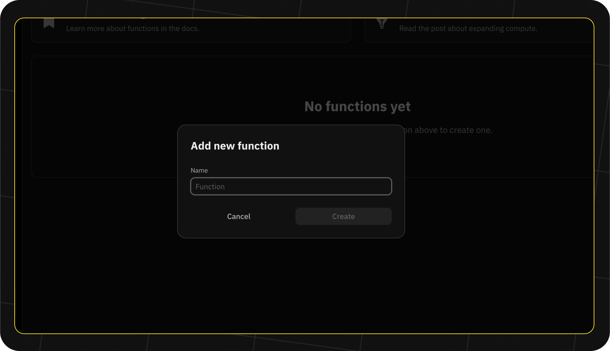
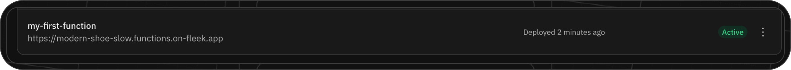
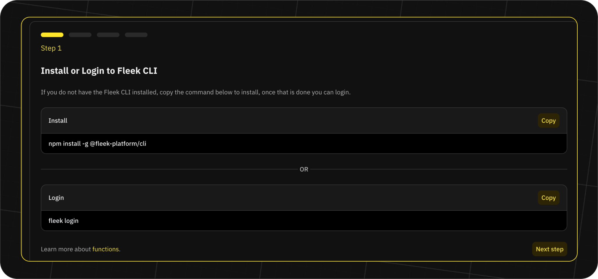
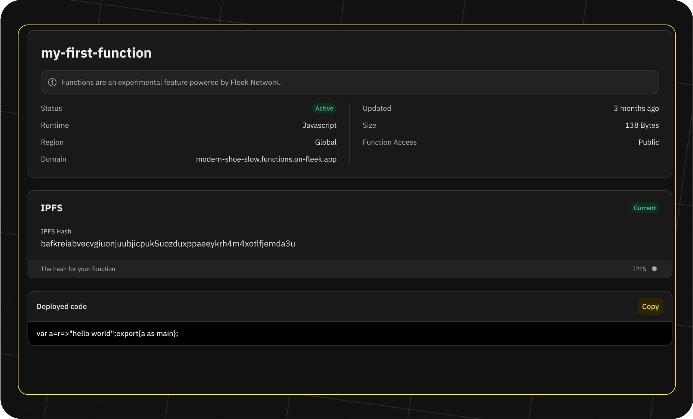

import { Button } from '@components/Button';
import DocIntroCard from '@components/DocIntroCard';
import Tabs from '@components/Tabs.astro';
import TabItem from '@components/TabItem.astro';

## Create and Deploy Fleek Functions

Learn how to create and deploy Fleek Functions using the Fleek Platform and the Fleek CLI. While you can create Fleek Functions using the Platform, you can access a broader set of features here using the Fleek CLI.

:::info
Ensure you have the Fleek CLI installed on your machine. Run `npm install -g @fleek-platform/cli` to install. Click [here](/docs/set_up/cli) to learn more on how to setup the CLI.
:::

<Tabs>
<TabItem title="Platform">
To create and deploy a Fleek Function from the platform's web application we start by creating any directory in our machine, and then we create a file named "my-first-function.js" within that directory. You can choose any name for the file:

```sh
touch my-first-function.js
```

Open your favourite text editor and declare a function. We'll write a simple function that returns the text "Hello world!" -

```js
export const main = (params) => {
  return 'hello world';
};
```

You are obligated to export a **main** function. The **main** signifies the entry point for computations or declarations within the file scope. It'll not compute or operate if you neglect to declare and export it.

## Create a Fleek Function from the Platform

To create a Fleek Function within your project:

1. On your project's dashboard, click on the "Functions" button on the sidebar.

2. Click on the "Add new function" button on the top right-hand side of the page:

3. A modal appears on the screen. Type in the desired name of your Fleek Function. In this guide, we will be using "my-first-function" and click on "Create.":



4. After that, we should see a badge on the function that says "Not deployed" on the Functions page as well as a URL for the function:



5. Click on the function to view the function details.

6. On the function details page, we should see multi-step with instructions on how to deploy the function from the Fleek CLI.



7. Following the four steps on the page to deploy the function:
   - We ensure that we have the Fleek CLI installed
   - Login to your Fleek account from your machine with the below command:
     ```sh
     fleek login
     ```
   - Copy the command from "Step 2" on the function details page and run it in your terminal. This command helps switch to your project where you created the Fleek Function from your terminal:
     ```sh
     fleek switch --id=<project-id>
     ```
   - Since we already have the function we want to deploy, go ahead and create the function locally:
     ```sh
     fleek functions create --name my-first-function
     ```
   - Final step is to deploy the function with the below command:
     ```sh
     fleek functions deploy --name my-first-function --path ~/some/path/my-first-function.js
     ```

The function has been deployed now and you can refresh the page of your function overview to see the status of the function as "active". The "my-first-function" page should look like this now:



Then you can click on the URL to invoke the function and see the results in your browser.

</TabItem>

<TabItem title="CLI">

To create your first Fleek Function, you must first draft the code and then configure the deployment settings accordingly. To follow the instructions, open your terminal, and change directory to your liking.

For our example, we'll create a file named "my-first-function.js", you can choose any name:

```sh
touch my-first-function.js
```

Open your favourite text editor and declare a function. We'll write a simple function that returns the text "Hello world!" -

```js
export const main = (params) => {
  return 'hello world';
};
```

You are obligated to export a **main** function. The **main** signifies the entry point for computations or declarations within the file scope. It'll not compute or operate if you neglect to declare and export it.

To learn more about what the export declaration is, read the MDN Web docs [here](https://developer.mozilla.org/en-US/docs/web/javascript/reference/statements/export).

:::note
If you are creating a TypeScript based Fleek Function, please make sure that you create a file with the `.ts` extension, you can choose any name-

```sh
touch my-first-function.ts
```

Here is what a simple function that returns the text "Hello world!" may look like in TypeScript -

```ts
export const main = (params: any): string => {
  return 'hello world';
};
```

Please make sure you are using fleek-platform CLI v2.9.1 to be able to access TypeScript capabilities.

:::

### HTTP requests and responses

Every execution of your Fleek Function receives an [HttpRequest](https://fleek-network.github.io/js-docs/~/Fleek.HttpRequest.html) argument. It represents the HTTP request made to your function. You can find all the relevant information of your request there.

```js
export const main = (params) => {
  const { method, path } = params;
  return `${method} request to ${path}`;
};
```

You can respond either with a string, that will be your HTTP response body, or with an [HttpResponse](https://fleek-network.github.io/js-docs/~/Fleek.HttpResponse.html) to set your response headers or status.

Check out our [docs](https://fleek-network.github.io/js-docs/) for more information on the APIs available to your Fleek Function code.

## Create a Fleek Function

To create a Fleek Function, we utilize the **functions** command. You can learn how to use it by appending **help**:

```sh
fleek functions help
```

For our example, we'll create a function named "my-first-function".

```sh
fleek functions create --name my-first-function
```

The `--name` flag takes a new unique identifier of your project list. It should be descriptive to help you identify it at later stage, e.g. if you have to manage a large number of Fleek Functions within a project.

```sh
✅ Success! The function has been successfully created.

> You can create a new deployment using the following command
> Fleek functions deploy
```

A few examples of valid syntax identifier names are calculator, my-custom-function or add_2. A name does not have to be the same as the function file name, or the export name. A good practice can be to name it in accordance to your project conventions.

## Deploy a Fleek Function

At this stage you should have created a [draft function file](#create-a-draft-function) in your local file system and a [Fleek Function](#create-a-fleek-function) via the Fleek Platform CLI.

To deploy the Fleek Function, we'll use the sub-command **deploy**. You can learn about it by appending help to the **functions** command.

```sh
fleek functions help
```

In order to deploy a Fleek Function, we need to provide a name and a file path.

In our example, we've titled our [draft function](#create-a-draft-function) file "my-first-function.js" and [created](#create-a-fleek-function) a Fleek Function called "my-first-function". It's important to note that we had the choice to give them different names as the file and Fleek Function names don't have to match.

Here, we'll pass those values as arguments to the --name and --path flag.

```sh
fleek functions deploy \
  --name my-first-function \
  --path ~/some/path/my-first-function.js
```

The response should be similar to:

```sh
✅ Success! The deployment has been successfully created.

> You can call this Fleek Function by making a request to the following URL
🤖 Make a request to the following URL
🔗 https://<SLUG>.functions.on-fleek.app
```

Given that our function is a basic 'Hello World' program and doesn't require any parameters, visit the provided invoke URL to execute your function code. However, keep in mind that the functions are deployed into IPFS, requiring a grace period for propagation.

</TabItem>

</Tabs>
