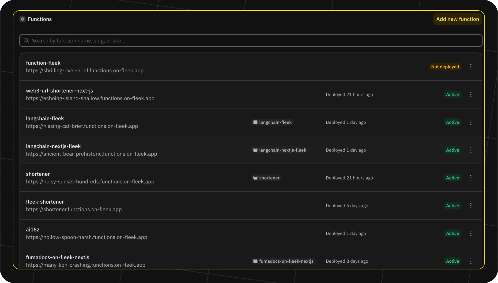
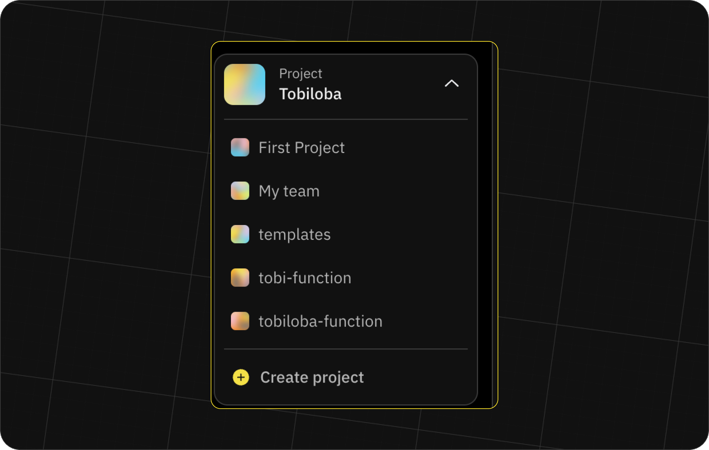

import { Button } from '@components/Button';
import DocIntroCard from '@components/DocIntroCard';
import Tabs from '@components/Tabs.astro';
import TabItem from '@components/TabItem.astro';

## List your Fleek Functions

Learn how to list all the Fleek Functions that you have created.

<Tabs>
<TabItem title="Platform">
To list the Fleek Functions within a project:

1. On the project's dashboard, click on the "Functions" button on the sidebar.

2. All the functions created within this project will be visible here:



3. To find more functions in other projects, feel free to switch the project from the selector. This is how you can access different Fleek Functions created in different projects that you're a part of:



You can search for functions with the search bar at the top of the page. This search bar allows you to search for functions by their name or slug.

</TabItem>

<TabItem title="CLI">

To display all the Fleek Functions you've deployed in your Fleek project, execute the following command:

```js
fleek functions list
```

This command will output a table showing the `ID`, `name`, `slug`, and `Fleek Function invocation URL` for each of your Fleek Functions.

</TabItem>

</Tabs>
