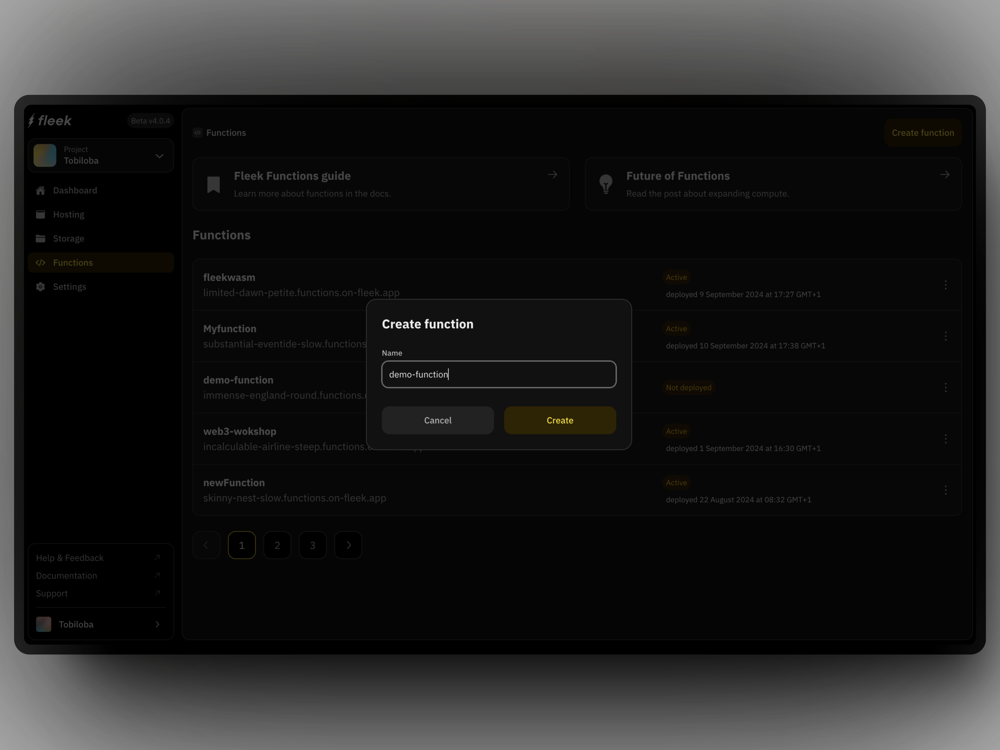

## Fleek Functions Quick Start

:::info
Fleek Functions are in alpha, running on a testnet. Avoid using them in production as changes are expected during development.
:::

Fleek Functions are edge-optimized functions on the Fleek Network, you can use them to perform server-side operations.

Ensure you have the Fleek CLI by running the command:

```bash
npm install -g @fleek-platform/cli
```

For this quick start, we will deploy a simple function that returns an "hello world" string response. You can use the [Fleek app](/docs/platform/fleek-functions#creating-and-using-fleek-functions) or [Fleek CLI](docs/cli/functions#create-a-fleek-function) for this.

## Using the Fleek App

1. On the project’s dashboard, click on the “Functions” button on the secondary navigation

2. Click on the “Create function” button on the extreme right-hand of the secondary navigation and a modal pops up:
   

3. Go through the steps (from step 1 through to step 4) and follow the instructions per step

   - Since you have the Fleek CLI installed, type the following command to log in to your Fleek account from the CLI:

   ```bash
   fleek login
   ```

   - We also need to switch to the Fleek project we created the Fleek Function within from the platform using the project ID. We use the command below to do that from the CLI:

   ```bash
   fleek projects switch --id={{PROJECT_ID}}
   ```

   - Create a file in a directory on your machine and name it `function.js`. In the file, write the below code:

   ```javascript
   export const main = (params) => {
     return 'hello world';
   };
   ```

   - Create the Fleek Function with the same name as the one you inputted on the Fleek platform using the below command:

   ```bash
       fleek functions create  --name demo-function
   ```

   - Deploy the Fleek Function, using the below command:

   ```bash
   fleek functions deploy --name demo-function --path <code_path>
   ```

You have successfully deployed a Fleek Function using the above steps from the Fleek platform UI and now the first section of our Fleek Function "Overview" page should look like this now with the "Pending" status updated:

## Using the Fleek CLI

Deploying one is as easy as 4 steps:

1. **Login to your Fleek account**

   ```
   fleek login
   ```

2. **Create a draft function**: You can write a Typescript or JavaScript function

   To start, create a new Fleek project by running:

   ```bash
   touch my-first-function.js
   ```

   In your text editor, add the following code:

   ```js
   export const main = (params) => {
     return 'hello world';
   };
   ```

3. **Create your Fleek Function**

   To start, create a new Fleek project by running:

   ```bash
   fleek functions create --name my-first-function
   ```

4. **Deploy your Fleek Function**

   To start, create a new Fleek project by running:

   ```bash
   fleek functions deploy \
   --name my-first-function \
   --path ~/some/path/my-first-function.js
   ```
