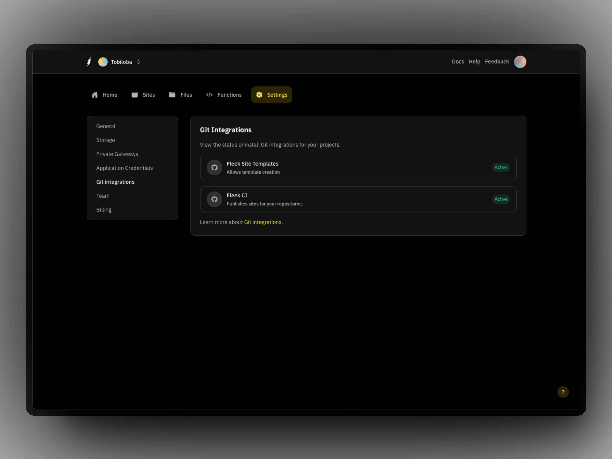
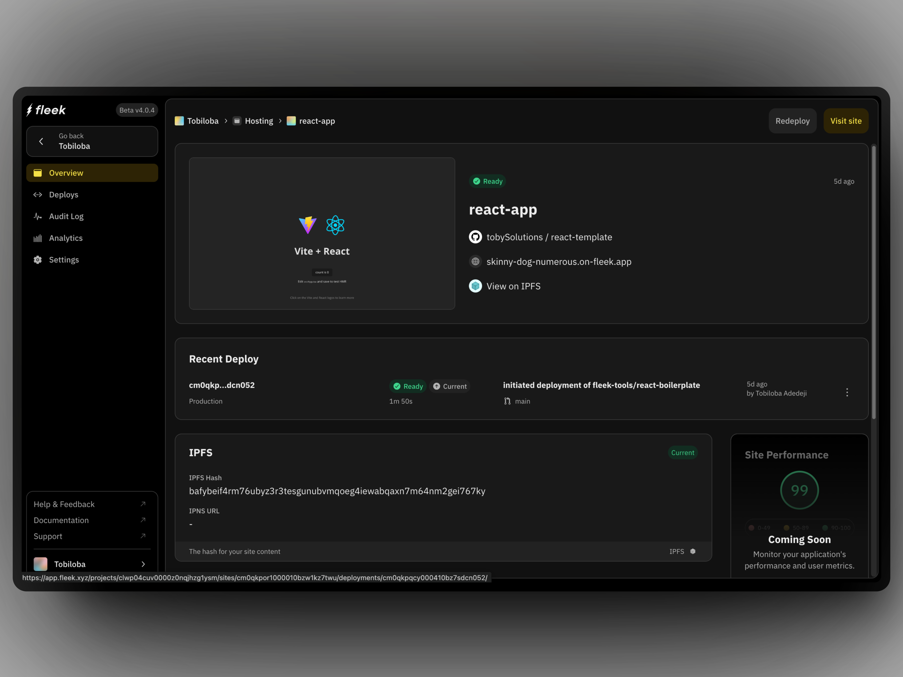
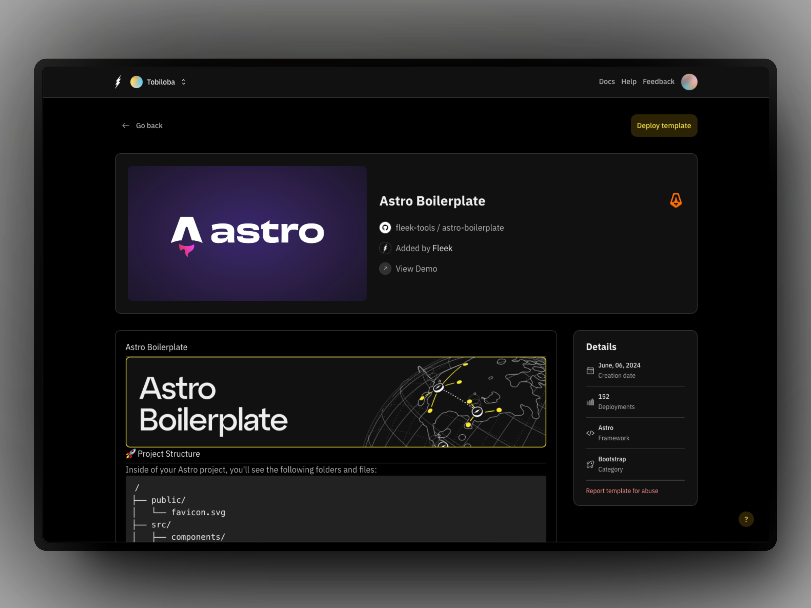
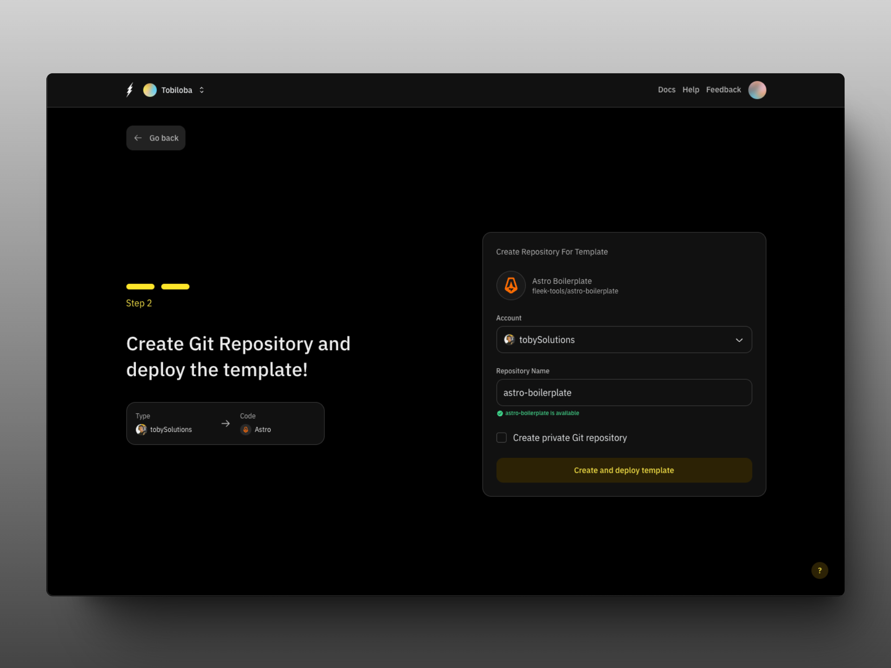
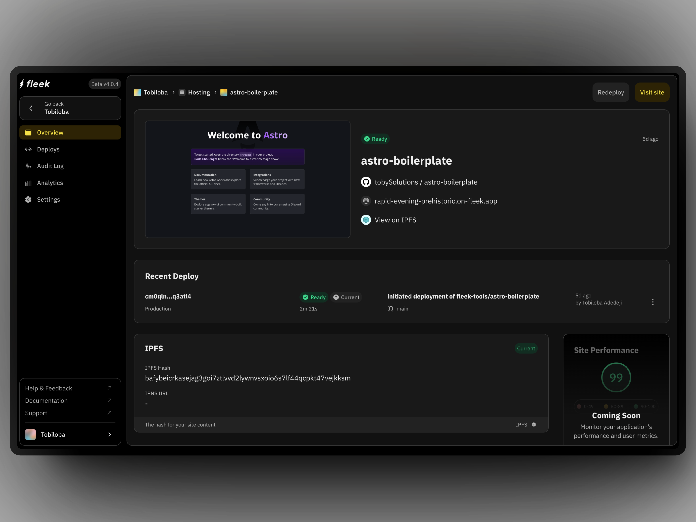

# Host an app

Learn how to host a React app and a Fleek template app in Astro on Fleek using the Fleek platform app. You will need to have an account on the [Fleek app](https://app.fleek.xyz) to follow the steps below.

:::info
Fleek supports static sites currently. SSR support is a work in progress and is not yet available for deployed sites.
:::

## Host a React app

1. Create a react app with [Vite](https://vitejs.dev/guide/) or [Create-React-App (CRA)](https://create-react-app.dev/docs/getting-started)

2. If you are using Vite, make sure your Vite config has the base set to "./" as seen below:

   ```ts
   import { defineConfig } from 'vite';
   import react from '@vitejs/plugin-react-swc';

   // https://vitejs.dev/config/
   export default defineConfig({
     plugins: [react()],
     base: './',
   });
   ```

3. When using Create React App (CRA), ensure that your `package.json` includes the following `homepage` attribute:
   ```js
   {
       // ...
       "homepage": ".",
       // ...
   }
   ```
4. Push your app to Github
5. Go to the [Fleek app](https://app.fleek.xyz/) and go to `Settings` and click on "Git Integrations"
6. Ensure that you install both of the Github applications and that they both have the "Active" badge as below. They are important for any deployment from Fleek:
   
7. Go to the "Sites" tab, click on "Add new" and select the Github repository where your app is hosted
8. Ensure everything is correct with the build settings and click on "Deploy site". The correct build settings for a React app are:
   - Build command: `npm run dev && npm run build`
   - Publish directory: `dist`
9. Your site has been deployed and you can access it by clicking on the "Visit site" button:
   

## Host a Fleek template app

Deploy a Fleek template app in Astro on Fleek using the Fleek platform app.

1. Go to the [Fleek app](https://app.fleek.xyz/) and go to the "Sites" tab
2. Click on "Add new" and from the dropdown, select the "Use a template" option and it takes you to the templates page
3. Search for the "Astro Boilerplate" template and click on it
   
4. Select Github. Ensure you have your Github account connected, as in the Github integration step 6 in the React app section
5. You get a page you can customize the name that Fleek is to create and the account the Github account you connected earlier appears as well. You can choose if you want the repository private or public.
   
6. Fleek will start the deployment process and you can see the progress in the "Deploys" tab. Once the deployment is complete, you can access the site by clicking on the "Visit site" button.
   

## Using the Fleek CLI

You can also deploy your app using the Fleek CLI. To do this, you need to have the Fleek CLI installed. You can install it by running the following command:

```bash
npm install -g @fleek-platform/cli
```

Once you have the Fleek CLI installed, you have to login to your Fleek account by running the following command:

```bash
fleek login
```

Cloning and deploying a site using the Fleek CLI is as simple as initializing the site, adding the files, and deploying the site. You can follow the steps [here](/docs/cli/sites).

To deploy a simple site using the Fleek CLI, you can follow the steps below:

1. **Create a project**

   To start, create a new Fleek project by running:

   ```bash
   fleek projects create
   ```

2. **Set Up a Simple Page**

   First, create a directory for your project (e.g., ~/fleek-quick-start) and navigate into it:

   ```bash
   mkdir ~/fleek-quick-start && cd ~/fleek-quick-start
   ```

   Create a simple HTML page:

   ```bash
   echo "Hello world" > index.html
   ```

3. **Set Up a Fleek Site**

   To deploy your page, initialize a Fleek site by running:

   ```bash
   fleek sites init
   ```

   Follow the prompts:

   - Enter a site name.
   - Specify the directory (use . for the current directory).
   - Skip the build command by typing "n."
   - Choose your preferred configuration format (e.g., JSON).

   Once completed, you’ll see a success message.

4. **Deploy the Fleek Site**

   Finally, deploy your site::

   ```bash
    fleek sites deploy
   ```

   After successful deployment, you'll receive a confirmation with the IPFS CID and a link to access your site:

   ```bash
   Site IPFS Content Identifier (CID): xxxxx
   Access via: https://<SLUG>.on-fleek.app
   ```
