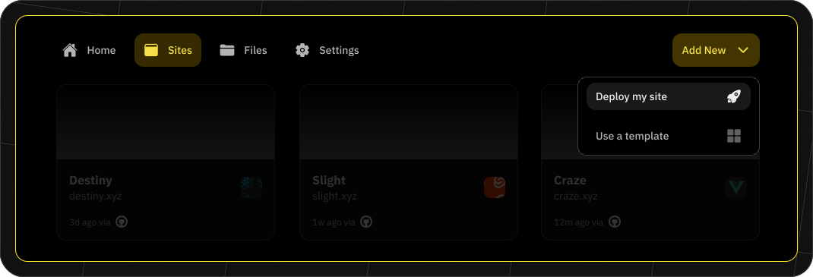
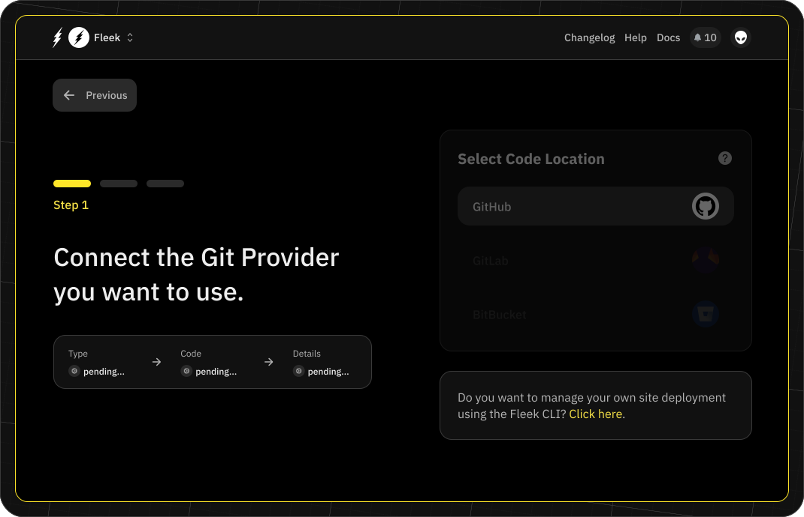
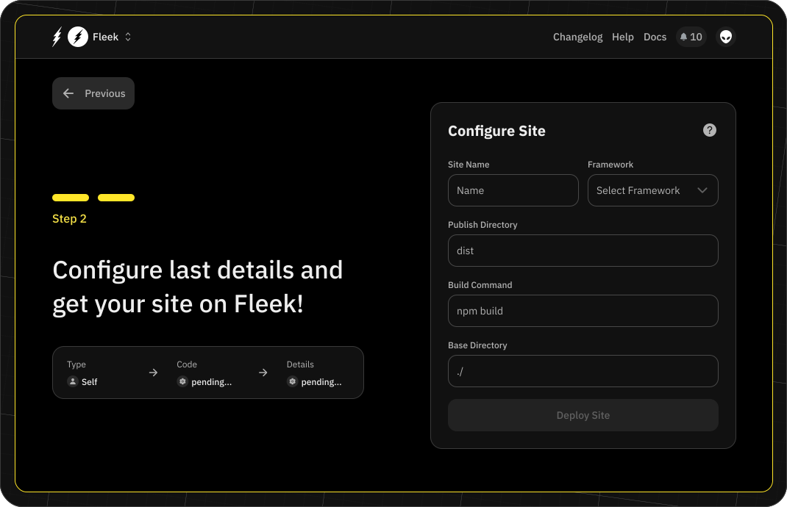

import { Button } from '@components/Button';
import DocIntroCard from '@components/DocIntroCard';
import Tabs from '@components/Tabs.astro';
import TabItem from '@components/TabItem.astro';

## Self-managed deployments

In self-managed deployments, you can configure your site with your code repository. This allows you to trigger a deploy manually or connect it to your CI pipeline.

### First steps

As with managed deployments, navigate to the “Sites” tab and click the “Add New” button, choosing the “Deploy my site” option.

### Select self-deployment

To set up a self-managed deployment, choose the "Click here" option at the bottom of the git provider screen.

### Set up your site

To set up your site, you will need to add some information about it:

- **Site name**: The name of the site, e.g. your repo or project name.
- **Framework**: The framework used to build your site, e.g. Gatsby, Hugo, etc.
- **Publish directory**: The directory (e.g. 'dist') where projects with a build command compile code, bundle dependencies, and optimize content for production. Projects without a build command can set this as the directory holding the main HTML file.
- **Build command**: The commands to execute to build the site, e.g. npm install && npm run build.
- **Base directory**: The directory where Fleek checks for dependency management files, e.g. package.json

Once your site settings are configured, you can click “Deploy Site,” where you will be redirected to the Site Overview page. Here you will find two different files that you need to add to your repository. More information is provided in the next step.

### Add files to codebase

Within the Site Overview page, follow the steps to add these files to your codebase:

- Fleek.json: This file contains the configuration of your site.
- GHA workflow: This file contains the configuration of the Github Action workflow that will trigger the deploy process.

Though the Fleek.json file is mandatory, you can decide not to use the Github Action workflow and trigger the deploy process in your own way.

### Deploy a self-managed site

Once all of the files have been added to your codebase, you will be able to deploy the site using the Fleek CLI.
