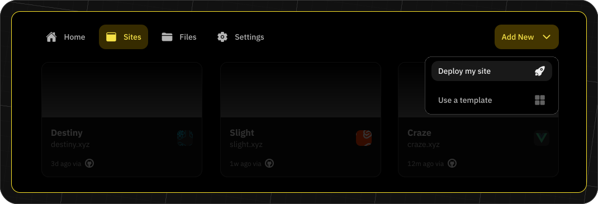

import { Button } from '@components/Button';
import DocIntroCard from '@components/DocIntroCard';
import Tabs from '@components/Tabs.astro'
import TabItem from '@components/TabItem.astro'


## Start Hosting
Fleek’s hosting services allow users to easily upload, maintain, store and serve your sites. Our goal is to provide a user-friendly platform that can help developers streamline their use of infrastructure.


<Tabs>
  <TabItem title="Platform">
    ## Fleek-managed deployments

In managed deployments, you will be able to connect your code repository to Fleek and we will take care of the build and deploy process. This allows you to focus on your code and not worry about the infrastructure.

This is a multi-step process that will require you to connect your code repository, configure your build settings, and deploy your site.

### Start hosting

The first step is to navigate to the "Sites" tab and click the "Add New" button, choosing the "Deploy my site" option.



### Select your repository

After choosing the "Deploy my site" option, you will be prompted to select the Git Provider where your code is located (Currently only GitHub).


In this process, you will need to authorize Fleek to access your repository. Once you have authorized Fleek, you will be able to select the repository and continue.


### Configure your build settings

Fleek will automatically name your site after the repository, auto-detect the framework, publish a directory and set up a build command for your site. You are able to select the branch you want to deploy from as well.

In the advanced settings, you can also configure the docker image, base directory, and environment variables you want to use in your build process.


### Deploy your site

Once your build settings are configured, you can click "Deploy Site," where we will trigger the initial deployment. This process can take a few minutes depending on the size of your site. Once the deployment is complete, you will be able to see the site URL and the status of the deployment.

<div className="my-12 bg-gray-dark-6 p-[1px]" />

## Self-managed deployments

In self-managed deployments, you can configure your site with your code repository. This allows you to trigger a deploy manually or connect it to your CI pipeline.

### First steps

As with managed deployments, navigate to the “Sites” tab and click the “Add New” button, choosing the “Deploy my site” option.


### Select self-deployment

To set up a self-managed deployment, choose the "Click here" option at the bottom of the git provider screen.


### Set up your site

To set up your site, you will need to add some information about it:

- **Site name**: The name of the site, e.g. your repo or project name.
- **Framework**: The framework used to build your site, e.g. Gatsby, Hugo, etc.
- **Publish directory**: The directory (e.g. 'dist') where projects with a build command compile code, bundle dependencies, and optimize content for production. Projects without a build command can set this as the directory holding the main HTML file.
- **Build command**: The commands to execute to build the site, e.g. npm install && npm run build.
- **Base directory**: The directory where Fleek checks for dependency management files, e.g. package.json

Once your site settings are configured, you can click “Deploy Site,” where you will be redirected to the Site Overview page. Here you will find two different files that you need to add to your repository. More information is provided in the next step.


### Add files to codebase

Within the Site Overview page, follow the steps to add these files to your codebase:

- Fleek.json: This file contains the configuration of your site.
- GHA workflow: This file contains the configuration of the Github Action workflow that will trigger the deploy process.

Though the Fleek.json file is mandatory, you can decide not to use the Github Action workflow and trigger the deploy process in your own way.

### Deploy a self-managed site

Once all of the files have been added to your codebase, you will be able to deploy the site using the Fleek CLI.

<div className="my-12 bg-gray-dark-6 p-[1px]" />

## Monitor deployments

You can monitor the deployment process by clicking on the 'Deploys' tab when viewing a particular project. You will find the list of all the deployments for your site and the status of each deployment. By clicking on a particular deployment, you will be able to see the logs of the deployment process.

  </TabItem>
  <TabItem title="CLI">
    ## Set up a site

When planning to deploy a site, you must first set up a Fleek Site. If you have followed the [quick start](/docs/cli/), this should be familiar.

For this example we are using a Next.js application that you can find in the [template repository](https://github.com/fleek-tools/nextjs-boilerplate).

We can clone the repository to our local file system. Firstly, switch to a location of your preference and run the command:

```sh
git clone https://github.com/fleekxyz/nextjs-template.git
```

Change directory to the nextjs-template directory. If you've provided a different clone directory, change accordingly.

Here, we're sticking with the default relative location.

```sh
cd nextjs-template
```

### Initialize the Fleek site

Run the sites **init** command to initialise the process:

```sh
fleek sites init
```

You'll be prompted to create a new Fleek Site or use an existing one.

```sh
? Choose one of the existing sites or create a new one. ›
❯   Create a new site
```

We'll create a new one by providing a name. For our example, we'll name it "my-first-site".

```sh
✔ Choose one of the existing sites or create a new one. › Create a new site
✔ Type name of you new site. … my-first-site
```

With the site name in place, you will have to input the directory where the build files will be stored. In this example, we are using a Next.js application thus the output directory is `out`.

After defining the Fleek Site name, you must specify the build directory for the static files to be deployed.

In the context of a Next.js application, the output directory is "out".

```sh
✔ Specify the dist directory from where the site will be uploaded from > out
```

Then you'll be asked to configure the build command that will be executed in the process to output the necessary static assets to the directory you have specified in the previous step.

In this case we'll declare the command:

```sh
npm run build
```

The prompt should be similar to:

```sh
✔ Do you want to include the optional "build" command? … yes
✔ Specify `build` command … npm run build
```

Next, you'll pick the format for your configuration file. If you opt for the Typescript option, make sure the Fleek SDK is part of your project dependencies to prevent deployment issues.

For most use-cases the json format is preferred.

```sh
? Select a format how the site's configuration will be saved: ›
>    JSON (fleek.config.json)
```

For simplicity, we've selected the JSON format and receive a confirmation message.

```sh
✅ Success! The Fleek configuration file has been successfully saved
```

Great, your site is ready to deploy!

### Fleek site configuration file

The Fleek Site configuration file contains important deployment configuration settings for your project.

If you version control your projects, it is advised to checkout and keep track of configuration file changes.

You can open the file in your favourite text editor and make any changes you might find necessary, such as updating the build command.

For our example, the original JSON content is based on our choices:

```json
{
  "sites": [
    {
      "slug": "large-apple-screeching",
      "distDir": ".",
      "buildCommand": "npm run build"
    }
  ]
}
```

If we imagine a scenario, where our package manager tool changes from npm to pnpm or yarn, we'd change it to:

```json
{
  "sites": [
    {
      "slug": "large-apple-screeching",
      "distDir": ".",
      "buildCommand": "pnpm build"
    }
  ]
}
```

## Deploy a site

Deploying your site is straightforward; simply run the sites deploy command in the directory where you initialized the site.

```sh
fleek sites deploy
```

As the deployment starts, you'll be given the option to create a new site or use an existing one. First, the process will carry out the build command outlined in the fleek.json file and subsequently upload the build directory to the designated storage.

If sucessfully, you'll get a confirmation message.

```sh
> Site IPFS Content Identifier (CID): QmbAwexQq1wqk9XZEzZs6CycbARDEp42ZRg5tUHp1XW2RQ
💡 You can access it through the gateway:
🔗 https://<SLUG>.on-fleek.app
```

The site is available at the gateway described in the output message. Visit it by open it in your browser!

Optionally, you can learn to create a [custom gateway](/docs/cli/gateways/) of your liking and control.

## Continuous integration (CI)

To set up Continuous Integration (CI), use the fleek sites ci command. This command generates a new workflow file in your repository, which you can customize according to your needs.

Currently we only support Github Actions. So, selecting GitHub Actions as your CI solution allows you to set up an action that triggers automatic deployments of your site via Fleek Platform.

You can run the command in the root of your project as follows:

```sh
> fleek sites ci
```

```sh
? Select the provider you prefer for building and deploying your sites: ›
❯   GitHub Actions
    GitHub Actions YAML file generator
```

Next, you'll have to answer the prompt questions, e.g. provide the install command, lockfile or the location where the workflow should be stored.

```sh
✔ The workflow configuration will be saved in: ~/MySite/.github/workflows/fleek-deploy.yaml. Would you like to choose a different path? … no
⚠ Warning! The .github/workflows directory cannot be found.
⚠ Warning! Generating the .github/workflows directory.

✅ Success! The GitHub Actions workflow has been saved to the ~/MySite/.github/workflows/fleek-deploy.yaml file.

🤖 Configure the following secrets in your GitHub repository settings:

Name              Value
-------------------------------------------
FLEEK_TOKEN       ***
FLEEK_PROJECT_ID  ***
```

It's critical to declare the secrets in your GitHub repository settings. So, make sure this is set up correctly to avoid disappointment.

The generate GitHub Workflow can be customized to your needs. If you version control your project, it's advised to checkout and track the file changes.

Open the file in your favourite text editor. It should be similar to:

```yaml
name: Deploy site via Fleek
on: push
jobs:
    deploy-to-fleek:
    runs-on: ubuntu-latest
    env:
        FLEEK_TOKEN: ${{ secrets.FLEEK_TOKEN }}
        FLEEK_PROJECT_ID: ${{ secrets.FLEEK_PROJECT_ID }}
    steps:
        - name: Checkout
        uses: actions/checkout@v3
        - name: Install Node.js
        uses: actions/setup-node@v3
        with:
            node-version: 16
        - name: Install Fleek CLI
        run: npm i -g @fleek-platform/cli
        - name: Build & deploy sites
        run: fleek sites deploy
```

Again, take note of the two secrets **secrets.FLEEK_TOKEN** and **secrets.FLEEK_PROJECT_ID**. These details are presented at the end of the process and require configuration in your GitHub Repository.

To learn how to set up the secrets in GitHub visit the documentation [here](https://docs.github.com/en/actions/security-guides/using-secrets-in-github-actions).

  </TabItem>
</Tabs>