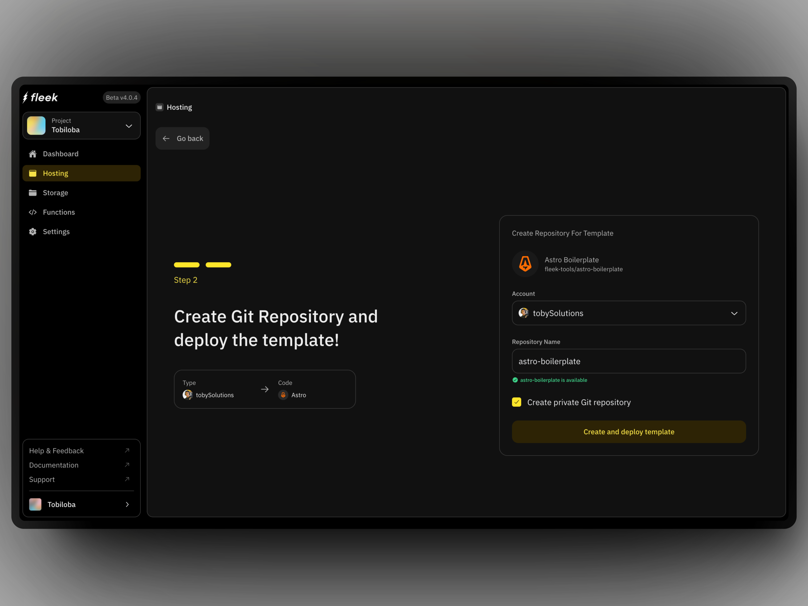

# Frameworks on Fleek

As you begin building on Fleek, you may be curious which types of projects you can build and any limitations that the use of our platform imposes. We aim to be a one-size-fits-all platform for a wide swath of use cases, and with that in mind have designed the platform to accommodate a variety of frameworks without requiring a cumbersome setup.

<div className="my-12 bg-gray-dark-6 p-[1px]" />

## Which frameworks does Fleek support?

Fleek supports a variety of frameworks and libraries for building sites and applications. It is largely framework-agnostic, though applications that leverage more popular frameworks can be auto-detected and configured with appropriate build settings, whereas applications built using less popular frameworks require some minimal configuration on the user's part.

### Popular frameworks

Some of the more popular frameworks Fleek supports include:

- Next.js
- SvelteKit
- Astro
- Create React App
- Gatsby
- Nuxt
- Vite
- Jekyll
- Hugo
- Gridsome
- Svelte + Sapper

### Auto-detected frameworks

For the most popular frameworks bulleted above along with several other less popular frameworks, we can perform auto-detection to automatically apply the correct build settings. We will find the correct Docker image from our [Dockerhub organization](https://hub.docker.com/u/fleek) depending on the detected framework and offer support for additional frameworks through custom Docker images users create.

### Other frameworks: npm package dependencies

The frameworks we can auto-detect are a small subset of those we support, however. _Any_ framework that is a dependency for an npm package will be supported, since we apply a Node-based Docker image by default when none are selected.

### Additional framework support through custom Docker images

If you’re using a framework which is neither auto-detected by Fleek nor an npm dependency, that does not preclude you from using it for a project on Fleek, since you can always create your own Docker image to build the app. In this way, we can support nearly any framework that outputs HTML.

### Beyond frameworks: what types of applications can be built on Fleek?

Some elements of Fleek's platform are hosted on Fleek, including not only the docs you are reading now, but also the landing page and blog. Each of these applications is hosted on the [fleek.xyz](https://fleek.xyz) site.

At the moment Fleek is introducing more full stack capabilities. This will be done in a phased approach over time, as Fleek Network and web services needed are launched, hardened and tested. Fleek aims to be a one-size-fits-all platform for developers.

## Using framework templates to get started

If you're ready to start building with Fleek and have a favored framework in mind, we offer several templates for popular frameworks that make it easy to deploy an application to Fleek of those respective types. You can browse our templates [here](/templates).

### Host a React app

1. Create a React app with [Vite](https://vitejs.dev/guide/) or [Create-React-App (CRA)](https://create-react-app.dev/docs/getting-started)

2. If you are using Vite, make sure your Vite config has the base set to "./" as seen below:

   ```ts
   import { defineConfig } from 'vite';
   import react from '@vitejs/plugin-react-swc';

   // https://vitejs.dev/config/
   export default defineConfig({
     plugins: [react()],
     base: './',
   });
   ```

3. When using Create React App (CRA), ensure that your `package.json` includes the following `homepage` attribute:
   ```js
   {
       // ...
       "homepage": ".",
       // ...
   }
   ```
4. Push your app to Github
5. Go to the [Fleek app](https://app.fleek.xyz/) and go to `Settings` and click on "Git Integrations"
6. Ensure that you install both of the Github applications and that they both have the "Active" badge as below. They are important for any deployment from Fleek:

   

7. Go to the "Sites" tab, click on "Add new" and select the Github repository where your app is hosted
8. Ensure everything is correct with the build settings and click on "Deploy site." The correct build settings for a React app are:
   - Build command: `npm run dev && npm run build`
   - Publish directory: `dist`
9. Your site has been deployed and you can access it by clicking on the "Visit site" button:

   

### Host an Astro template

Deploy a Fleek template app in Astro on Fleek using the Fleek platform app.

1. Go to the [Fleek app](https://app.fleek.xyz/) and go to the "Sites" tab
2. Click on "Add new" and from the dropdown and select the "Use a template" option. It will take you to the "Templates" page. 
3. Search for the "Astro Boilerplate" template and click on it. 

   

4. Select Github. Ensure you have your Github account connected, as in the Github integration step 6 in the React app section. 
5. You will land on a page where you can customize the name. The Github account you connected earlier appears as well. You can choose if you want the repository private or public.

   

6. Fleek will start the deployment process and you can see the progress in the "Deploys" tab. Once the deployment is complete, you can access the site by clicking on the "Visit site" button.

   
