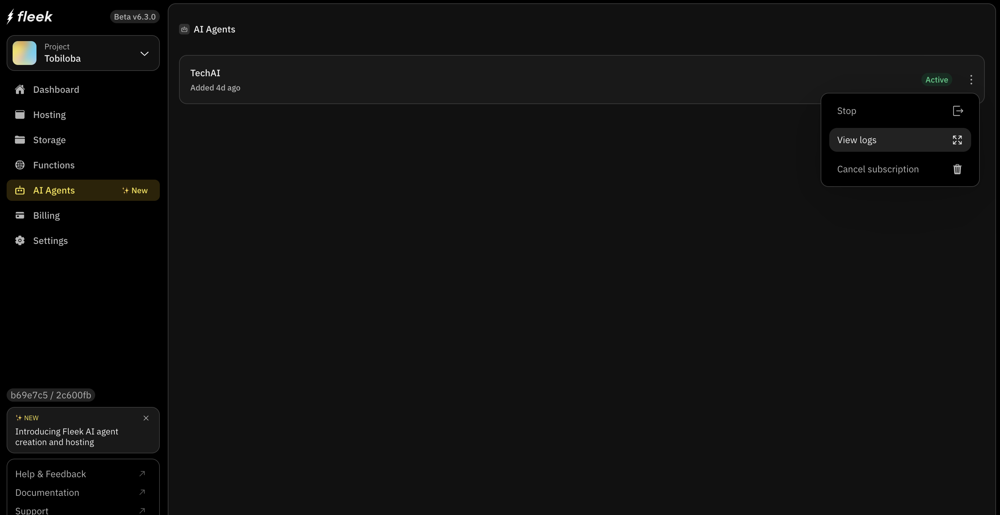
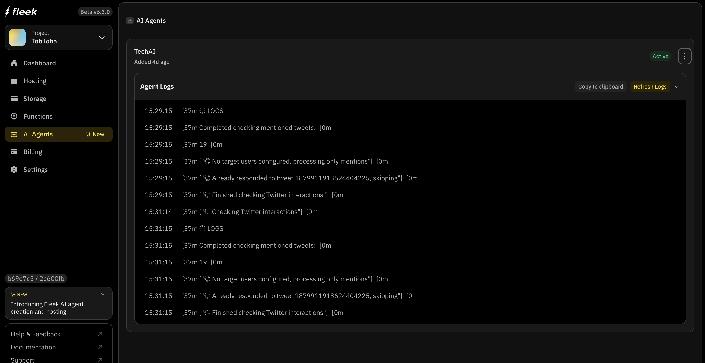
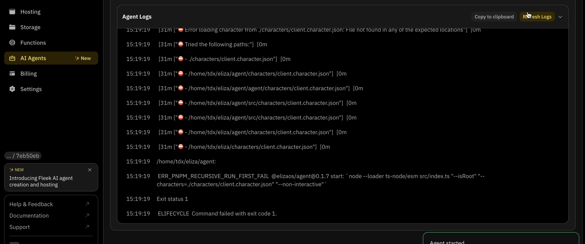
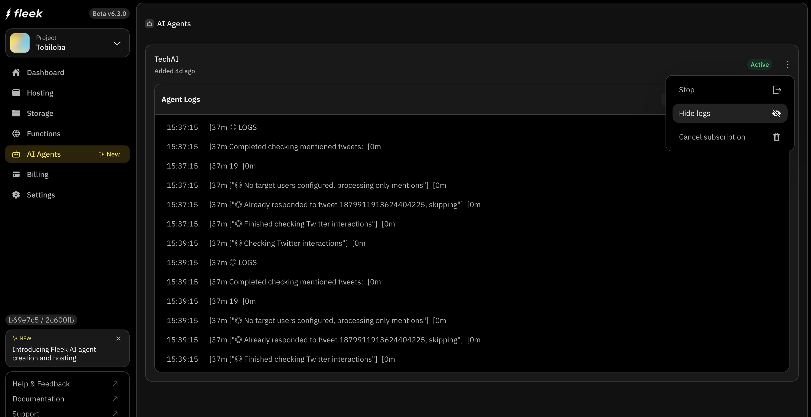

# Agent logs on Fleek

Agent logs are an important feature for hosting an AI agent on Fleek, providing users with a transparent view of their AI agent’s actions.
This explains how agent logs work and why they are essential for optimizing and managing your AI agents effectively.

## Overview

Agent logs are detailed records of an AI agent’s actions, capturing every step of the agent’s journey from start to finish. These logs allow users to:

- Monitor agent behavior in real-time or retrospectively.
- Debug issues and identify errors quickly.
- Gain insights into agent performance to optimize future deployments.

Agent logs on Fleek provide the following key information:

- **Timestamp**: The exact time each action occurred.
- **Event**: A descriptive label for the action (e.g., "[◎ Already responded to tweet 1879911913624404225, skipping"]”).
- **Details**: Additional context about the event, such as input data or configuration details.
- **Status**: The result of the action, such as "success" or "error," with error messages if applicable.

## How to access agent logs

1. Navigate to the Fleek app dashboard.
2. Go to the “Agents” tab on the sidebar
3. Select your deployed AI agent.
4. Click on the three vertical dots to open the dropdown
5. Select the “View logs” option:
   

6. You should see something similar to the below appear:
   

## Refreshing logs

n the logs page, you can see the most recent information about how your agent is running by clicking the **Refresh Logs** button.
This will update the display with the latest log entries.

**Key log information**

- Action Logs: Record each agent's action, such as API calls or message responses.

- Error Logs: Capture issues encountered during execution, including debugging details to assist with resolution.

**Benefits of Agent Logs**

- Improved Debugging: Pinpoint the exact source of issues without guesswork.

- Enhanced Transparency: Gain visibility into your agent’s workflow and actions.

- Optimized Performance: Identify bottlenecks and inefficiencies for fine-tuning

## Hiding agent logs

Hiding logs only affects the current view and doesn't delete any log data.
This is useful when you want to temporarily reduce visual clutter while monitoring your agent.

To hide logs in the Fleek AI agent interface:

1. Select your deployed AI agent
2. Click the "Hide logs" button (marked with a toggle/hide icon)
3. Click on the three vertical dots to open the dropdown
4. Select the “Hide logs” option:

   
