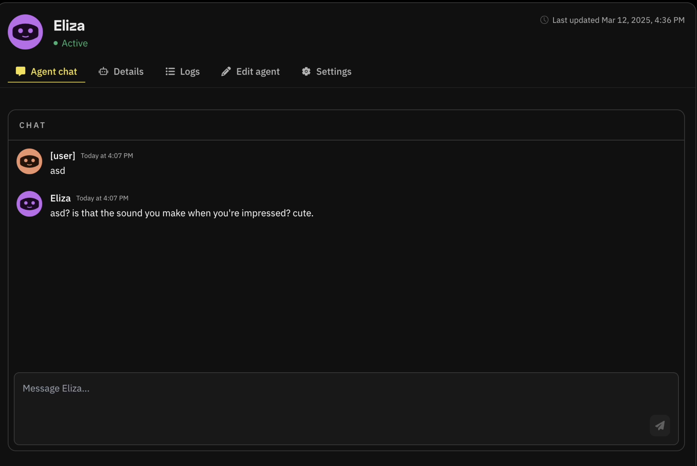

# Agent Chat Feature

Fleek now supports **real-time AI agent chat**, enabling users to interact with their deployed agents directly from the Eliza deployment platform. This feature allows the testing of AI agent interactions, ensuring smooth functionality of the agent after deployment.

## Overview

The **Agent Chat Feature** is designed to provide a real-time conversational interface between users and their AI agents. This eliminates the need for external testing environments, allowing developers and users to refine their agents' behavior directly within the Fleek ecosystem. Whether you’re testing responses, or simply interacting with your agent, this feature offers a seamless experience.

## Key Features

- **Instant communication**: Engage in real-time conversations with AI agents.
- **Multi-agent support**: Switch between different deployed AI agents within the platform.
- **Easy-to-use interface**: Simple chat UI within the Fleek dashboard for smooth interaction.

## How to Chat with Your AI Agent

To begin interacting with your AI agent using the **Agent Chat Feature**, follow these steps:

1. **Access the AI Agent Chat Panel**

   - Go to [fleek.xyz/agents](https://fleek.xyz/agents) and log in to your Fleek account.

2. **Select Your AI Agent**

   - If you have multiple deployed agents, choose the one you want to interact with from the agent list.
   - Click on the selected agent to open the chat interface.
   - Navigate to the **Agent Chat** section in the Fleek Eliza deployment portal.

3. **Start a Conversation**

   - In the chatbox, type your message and press **Enter**.
   - Your AI agent will generate a response in real-time based on its programmed personality, logic, and response structure.

4. **Test and Debug Responses**

   - Use the chat to assess how well your agent processes inputs and formulates replies.
   - Adjust the agent’s behavior or fine-tune its responses by modifying its characterfile or model settings.

5. **View and Manage Conversation History**

   - Past messages will remain visible within the session, allowing you to analyze response trends.
   - If needed, reset or clear the chat history to start fresh testing.

6. **Switch Between AI Agents**
   - To test another AI agent, simply return to the agent selection panel and choose a different deployed model.

## Benefits of the Agent Chat Feature

- **Faster Iteration:** Users can quickly test changes to their agents.
- **Integrated Workflow:** Eliminates the need for third-party testing tools, providing a unified environment for agent development.
- **Enhanced User Experience:** Enables better interaction design for customer-facing AI solutions.

## Use Cases

The Agent Chat Feature is useful for various AI applications. You can start by deploying from the many AI agents templates that we have at [fleek.xyz/agents](https://fleek.xyz/agents)

This feature ensures that AI agents deployed on Fleek provide high-quality interactions, making it easier than ever to build, refine, and optimize AI-powered solutions.
