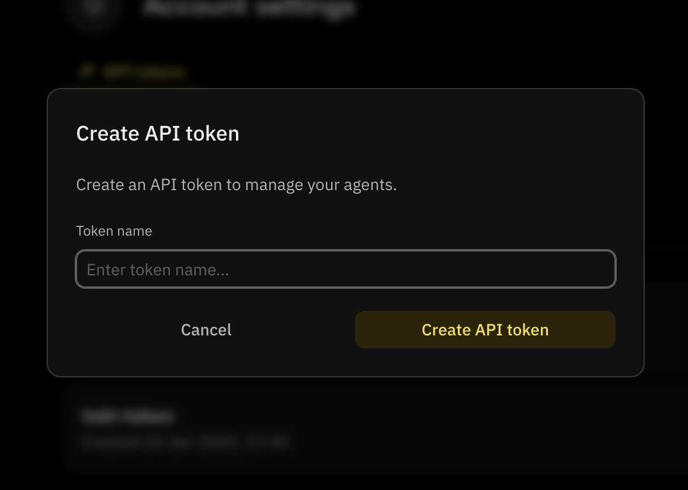
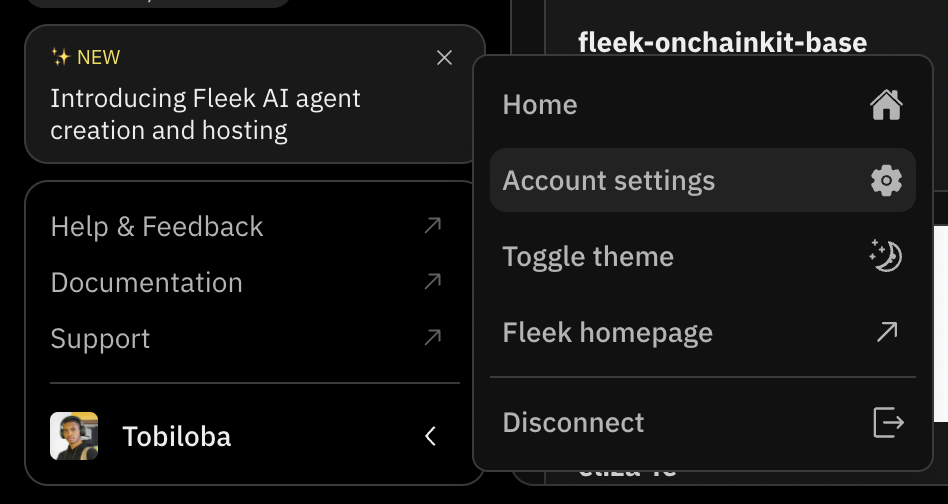

# Fleek AI Agent APIs

:::info
Fleek currently runs the latest stable release of the Eliza framework -- [Version 0.18](https://github.com/elizaOS/eliza/releases).
:::

Deploying AI agents on Fleek has never been a hassle and you can now deploy from within your applications and projects as well. By exposing these APIs, Fleek enables users to seamlessly integrate AI agent management capabilities into their applications.

## Prerequisites and setup

To follow the guide below, you need to ensure that you have a Fleek account. You can sign up for one if you don’t already have one at app.fleek.xyz.

**API Base Endpoint**: <a href="https://api.fleek.xyz/api" target="_blank">https://api.fleek.xyz/api</a>

## Creating API Keys

### Create an API key from the Eliza deployment page

To create an API key:

1. On the [fleek.xyz/eliza](https://fleek.xyz/eliza/) page. Click on the "Account settings" button at the bottom of the page.
2. The "API tokens" tab shows up with all the API keys you have created.


3. To create an API key from the Eliza deployment page, click on the "Create API token" button and a modal appears.
4. Type in the name of the API key you want to create and click on the "Create API token" button.



### Create an API key from the Fleek dashboard

To create an API key:

1. Navigate to your [Fleek project's](https://app.fleek.xyz/) dashboard.
2. In the sidebar, click on your profile icon to reveal the menu.
3. Select the menu option "Account settings".



4. In the account settings page, click on the "API Keys" tab.
5. On this panel, you will find a list of managed API keys.


To create an API key, type your desired key name in the input field and click on the "Add API token" button.

## Using the Fleek agent APIs

You can find the API documentation <a href="https://api.fleek.xyz/api-docs/openapi.json" target="_blank">here</a>. With these APIs, you can:

- Fetch an agent’s details
- Create agents
- Get an agent’s status (active or inactive)
- View your created agents
- Delete agents
- Update agents
- Get agent logs
- Start an agent
- Stop an agent

## Adding an AI agent via API

Users with an existing subscription can add additional agents by updating their subscription quantity.

1. First, retrieve the current subscription details using the Get Subscription by ID endpoint:

   - [GET /api/v1/subscriptions/{subscription_id}](https://api.fleek.xyz/api#tag/subscriptions/GET/api/v1/subscriptions/{subscription_id})
   - This provides the current quantity of agents assigned to the subscription.

2. Next, call the Update Subscription endpoint to increase the quantity:

   - [PUT /api/v1/subscriptions/{subscription_id}](https://api.fleek.xyz/api#tag/subscriptions/PUT/api/v1/subscriptions/{subscription_id})
   - Update with the new quantity number

You can view your list of subscriptions to get the {subscriptionId} with the endpoint [here](https://api.fleek.xyz/api#tag/subscriptions/GET/api/v1/subscriptions).

## AI agent proxy on Fleek

Fleek provides an endpoint that proxies requests to an AI agent's API on Fleek, supporting **GET, POST, PUT, DELETE**, etc.

**URL structure:**

```jsx

https://api.fleek.xyz/api/v1/ai-agents/{agentId}/api/{*key}

```

**Headers:**

- **`X-Api-Key`** – Required for authentication.

**Path Parameters:**

- **`agentId`** – AI agent's ID.
- **`key`** – API path on the agent’s server.

**Example Request**

```jsx
fetch('https://api.fleek.xyz/api/v1/ai-agents/12345/api/message', {
  method: 'POST',

  headers: {
    'X-Api-Key': 'your-api-key',
    'Content-Type': 'application/json',
  },

  body: JSON.stringify({ text: 'Hello, AI!' }),
});
```

For more details, check the <a href="https://api.fleek.xyz/api#tag/ai-agents" target="_blank">full API docs</a> .
