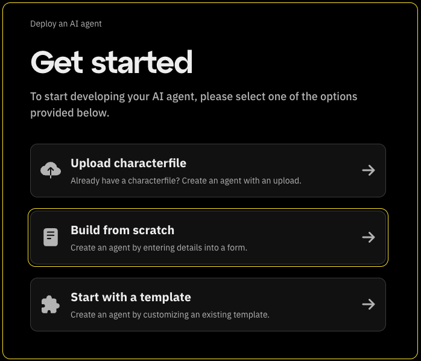
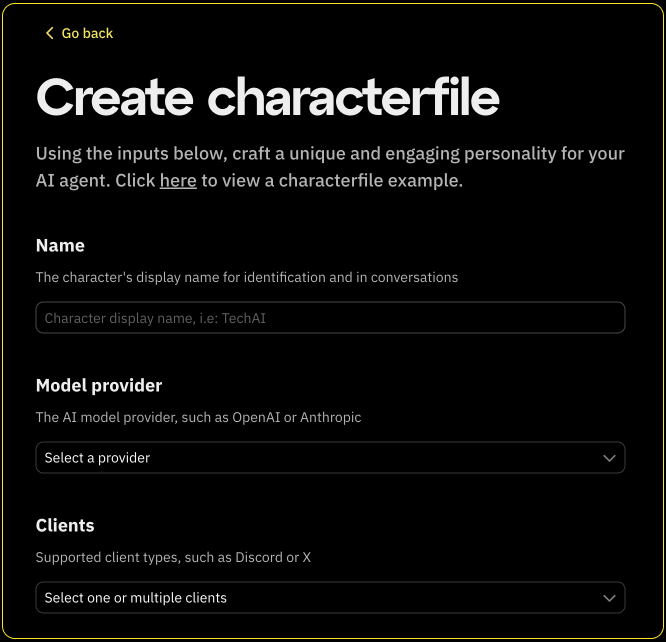
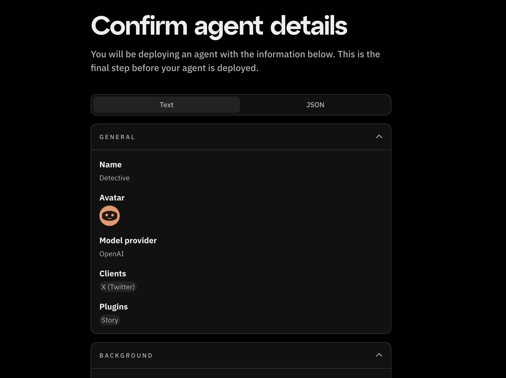
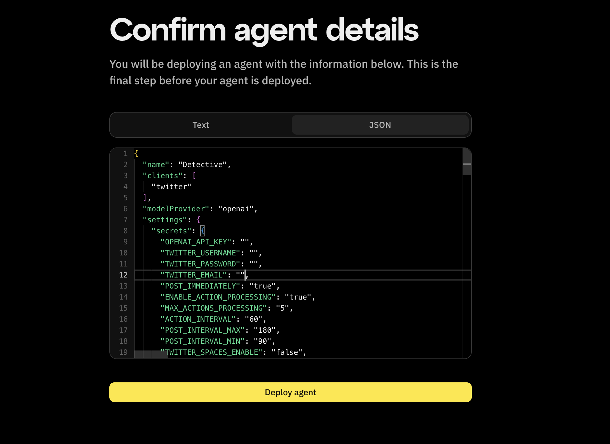

# Building an AI agent from scratch

:::info
Eliza's latest version ([v0.25.9](https://elizaos.github.io/eliza/docs/changelog/#v0259-march-02-2025)) is now available on Fleek.
:::

## Create an AI agent on Fleek

You can create your AI agent from scratch by filling in the required details.

Follow these steps:

1. Click on "Build from scratch" on the "[Get started](https://fleek.xyz/agents/)" screen.

2. Fill in your agent details, and you’ll be prompted to provide essential information for your agent.
   

## Review AI agent details and deploy

You will be directed to a page to confirm your agent details. You can choose one of two ways to review your agent's details:

1. **As Text**. You can see an overview of all the agent's details in foldable sections. You will not be able to edit any of the details:

2. **As JSON**. You can see all the agent's details as they are in the characterfile you uploaded. You can edit the JSON directly:

Review the information provided and click 'Deploy agent'. Your AI agent is now ready to interact seamlessly with external services.
