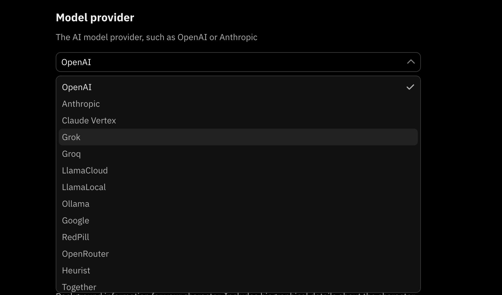
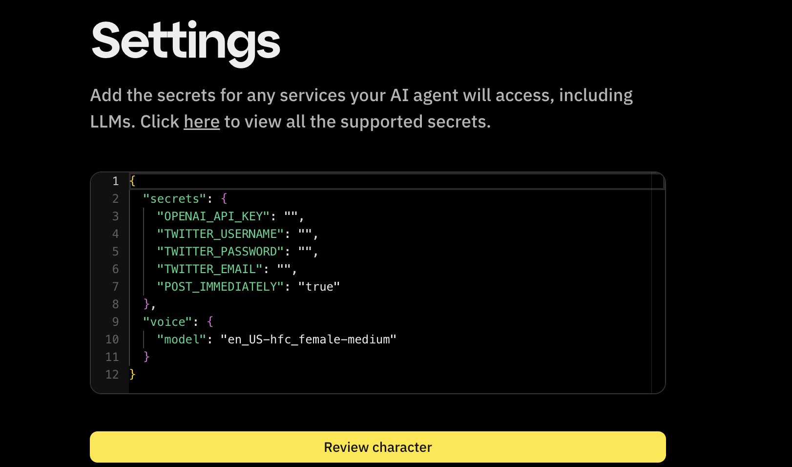

# Model Providers

:::info
Fleek currently runs version the latest stable release of the Eliza framework -- [Version 0.18](https://github.com/elizaOS/eliza/releases).
:::

In the Eliza framework, "Models" refer to the various types of AI models that can be utilized to create and manage autonomous agents. These models define the behavior, personality, and capabilities of the agents, allowing them to interact intelligently in different environments.

Key features of models:

- **Type Aliases**: Models serve as templates for creating specific instances of agents with defined characteristics.

- **Flexibility**: Users can integrate and customize models to meet specific application needs.

- **Interaction**: Models ensure consistent agent personalities and knowledge across platforms.

- **Extensibility**: Developers can extend existing models or create new ones for evolving requirements.

Eliza provides a wide range of model providers, each with their own secrets and configurations. Some popular model providers include:

By leveraging these models, Eliza facilitates the development of sophisticated AI agents capable of performing tasks ranging from simple interactions to complex decision-making processes.

## Supported Model Providers on Fleek

To access the full list of supported model providers, please visit the [Eliza repository](https://github.com/elizaOS/eliza/blob/main/packages/core/src/types.ts) for the list of models provided there.
Here are some notable providers:

- **Deepseek**: To use Deepseek models, you need to sign up for an account and obtain API keys. Deepseek offers a range of models for various applications, including text generation, image recognition, and more. There a few values you need to ensure are in your "secrets" object as part your Characterfile:

```json
{
    "modelProvider": "deepseek",
    ...
    "settings": {
        "secrets": {
            "DEEPSEEK_API_URL": "https://api.deepseek.com",
            "SMALL_DEEPSEEK_MODEL": "deepseek-chat",
        }
        ...
    }
    ...
}
```

You can also choose larger models by choosing to replace "SMALL_DEEPSEEK_MODEL" with any of

```bash
"MEDIUM_DEEPSEEK_MODEL": "deepseek-chat",
"LARGE_DEEPSEEK_MODEL": "deepseek-chat"
```

- **OpenAI**: OpenAI offers a wide range of models, including GPT-3, GPT-4, and ChatGPT, along with various other AI tools. To use OpenAI models, you need to sign up for an account and obtain API keys. Here are some values you need to ensure are in your "secrets" object as part your Characterfile:

```json
{
    "modelProvider": "openai",
    ...
    "settings": {
        "secrets": {
            "OPENAI_API_KEY": "your-openai-api-key",
        }
        ...
        }
    ...
}
```

You can also configure other things like:

```bash
OPENAI_API_URL=                 # OpenAI API Endpoint (optional), Default: https://api.openai.com/v1
SMALL_OPENAI_MODEL=             # Default: gpt-4o-mini
MEDIUM_OPENAI_MODEL=            # Default: gpt-4o
LARGE_OPENAI_MODEL=             # Default: gpt-4o
EMBEDDING_OPENAI_MODEL=         # Default: text-embedding-3-small
IMAGE_OPENAI_MODEL=             # Default: dall-e-3
USE_OPENAI_EMBEDDING=           # Set to TRUE for OpenAI/1536, leave blank for local
```

- **Anthropic**: Anthropic provides a range of models for natural language processing. To use Anthropic models, you need to sign up for an account and obtain API keys. You need to ensure are in your "secrets" object as part your Characterfile:

```json
{
    "modelProvider": "anthropic",
    ...
    "settings": {
        "secrets": {
            "ANTHROPIC_API_KEY": "your-anthropic-api-key",
        }
        ...
        }
    ...
}
```

You can also configure other things like:

```bash
SMALL_ANTHROPIC_MODEL=          # Default: claude-3-haiku-20240307
MEDIUM_ANTHROPIC_MODEL=         # Default: claude-3-5-sonnet-20241022
LARGE_ANTHROPIC_MODEL=          # Default: claude-3-5-sonnet-20241022
```

You can find the full list of supported models and their configurations in the [Eliza repository](https://github.com/elizaOS/eliza/blob/main/packages/core/src/types.ts).

## Using Models on Fleek

### From Characterfile

You can configure the model provider and settings in your Characterfile using the "modelProvider" and "settings" fields. For example:

```json
{
    "name": "C-3PO",
    "clients": ["telegram"],
    "modelProvider": "openai",
    ...
    "settings": {
        "secrets": {
            "OPENAI_API_KEY":  "sk-rest_of_you_openai_api_key",
            ...
        }
        ...
    }
    ...
}
```

### Fleek Eliza UI

You may be building your agent from scratch on Fleek or using a template. You can use the dropdown on the form to choose model providers:



After selecting a model provider, and providing the necessary details on the form, you will be taken to the settings configuration page where you can secrets and other configurations including model settings and API keys:


