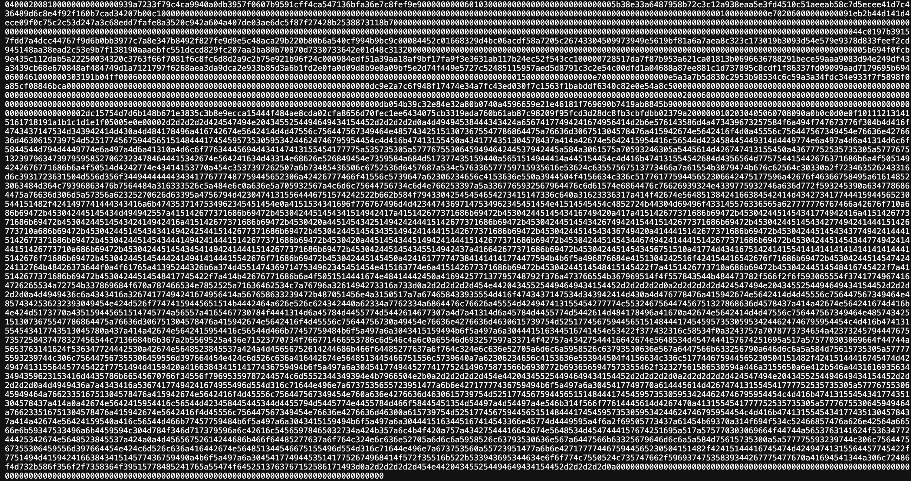

:::note
We're improving the UX for TDX quotes in the coming weeks to make the process more intuitive. Your feedback is welcome as we refine this feature.
:::

## Getting a TDX Quote

A new "Get TDX quote" panel has been added for each agent on the Agents tab on app.fleek.xyz. This option allows you to retrieve a raw text output representing the TDX quote for your agent.

### How to use:

1. Navigate to the Agents tab on [app.fleek.xyz](app.fleek.xyz)
2. Locate the agent for which you want a TDX quote.
   {{Screenshot}}
3. Scroll to the panel that says “Remote attestation”
4. Select "Get hash".
5. You will see an output display of the raw text output:

You can then go ahead to copy the above binary and verify the attestation using a tool like [proof.t16z.com/](https://proof.t16z.com/) which then gives you the below:

