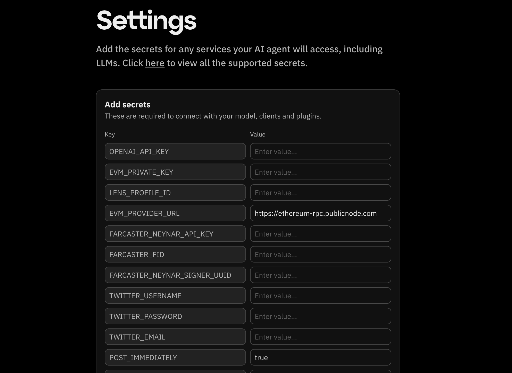

# Starting with a template

If you’re looking for a quick way to get started, using a pre-built template is an excellent option.
Templates are pre-configured setups that you can customize to fit your needs.
Follow these steps to create an agent using a template:

Click on "Start with Template"
From the [Get Started](http://fleek.xyz/eliza/) screen.

At the top of the page, you’ll find predefined characters.
Clicking one will prefill the fields below, allowing you to start with a specific personality.

After filling in all the details, click "Continue".

Complete your AI agent setup by configuring its settings. Enter the required credentials to enable seamless integration with external services like OpenAI and social platforms. Once filled, click "Review character".

You will be brought to a page to confirm your agent details, review the information provided and click ‘Deploy Agent’.

Your AI agent is now ready to interact seamlessly with external services.
