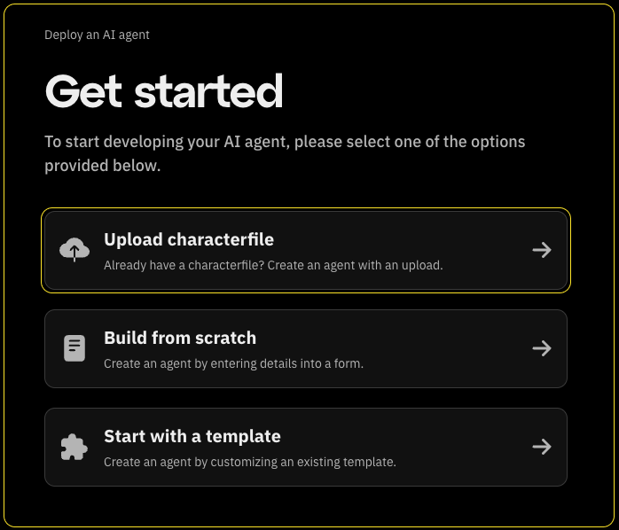

# AI agent characterfile

Characterfiles are JSON-formatted configurations that define an AI character's personality, knowledge, and behavior patterns.
This guide goes over how to upload an existing characterfile of your AI agent.

## Uploading a characterfile

To get started, Click on "Upload characterfile"
from the [Get started](https://fleek.xyz/eliza/) screen.



Choose your file and a file selection dialog will open.
Locate the characterfile from your computer and select it for upload.
Supported formats will be listed on the screen.

After selecting the file, click the "Upload" button.


You will be directed to a page to confirm your agent details.
Review the information provided and click 'Deploy Agent'.


Your AI agent is now ready to interact seamlessly with external services.

## How to handle secrets

When uploading a characterfile, you may need to provide sensitive information such as API keys or other credentials.
The recommended way to do this is to include it in the "settings" key of your characterfile like so:

```json
{
   "name": "TestEliza",
    "clients": ["twitter"],
    "modelProvider": "openai",
    "settings": {
        "secrets": {
            "OPENAI_API_KEY": "myapikey",
            "TWITTER_DRY_RUN": "false",
            "TWITTER_USERNAME": "myTwitterUsername",
            "TWITTER_PASSWORD": "MyTwitterPasswords",
            "TWITTER_EMAIL": "myemail@gmail.com",
            "XAI_MODEL": "gpt-4o-mini"
        },
        "voice": { "model": "en_US-male-medium" }
    },
    ...
}
```
