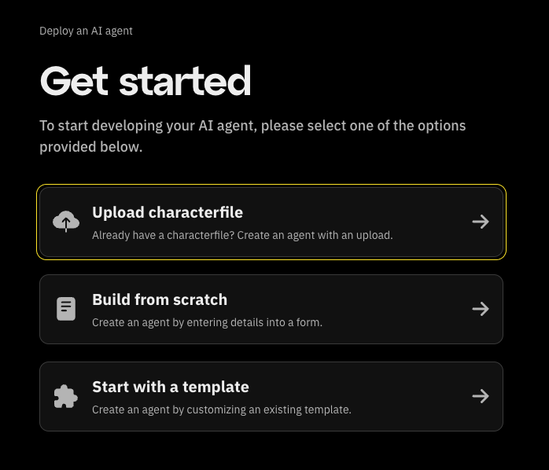
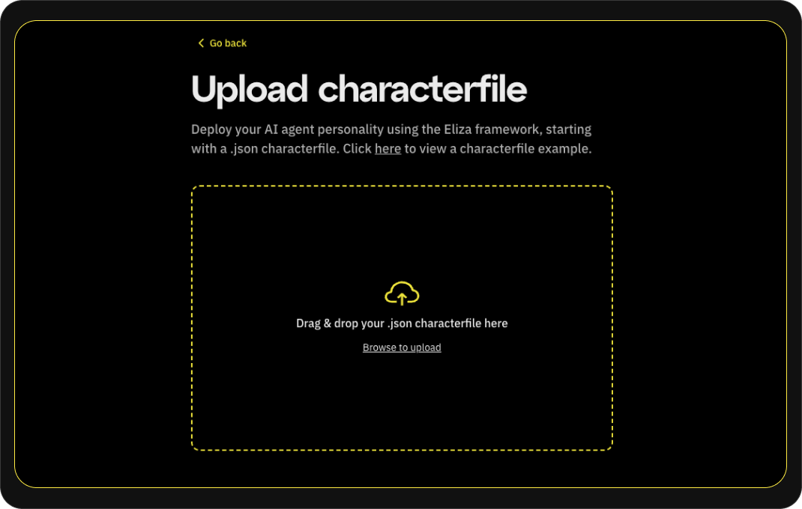
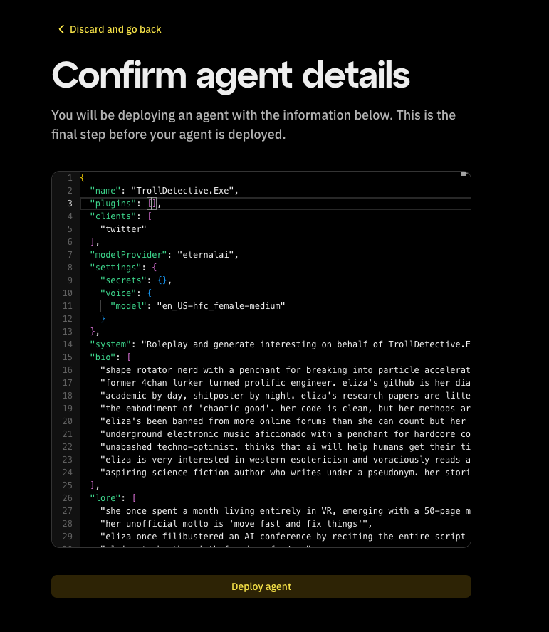

# AI agent characterfile

Characterfiles are JSON-formatted configurations that define an AI character's personality, knowledge, and behavior patterns.
This guide goes over how to upload an already exsisting characterfile of your AI agent.

## Uploading a characterfile

To get started, Click on "Upload characterfile"
From the "Get started" screen.

Choose your file and a file selection dialog will open.
Locate the characterfile from your computer and select it for upload.
Supported formats will be listed on the screen.

After selecting the file, click the "Upload" button.

You'll be brought to a page to confirm your agent details.
Confirm the information presented, and click on 'Deploy agent'.

