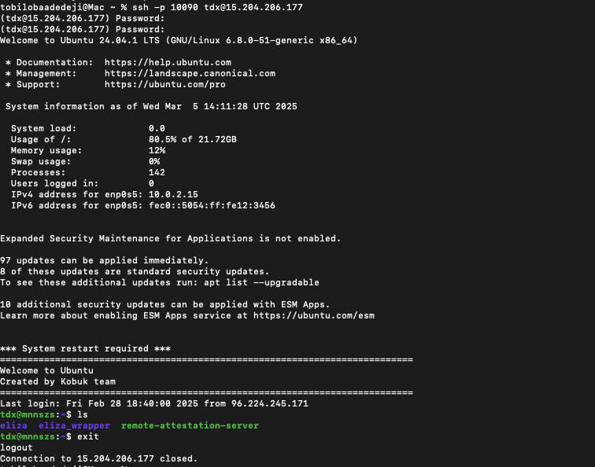

# Access agent instances via SSH

Users can now use Secure Shell (SSH) access to interact with their agent’s Virtual Machine (VM) instance and perform operations such as adding custom [Eliza plugins](/docs/ai-agents/plugins/) or actions.

With SSH access, users can gain access to the Fleek Machine VM that holds their AI agent’s instance. Accessing and interacting with your AI agent’s virtual machine is straightforward.

## How to access agent instances with SSH

1. Go to [fleek.xyz/eliza](/eliza)
2. If you haven’t yet deployed an agent, use one of the [three options](/docs/ai-agents/#deploy-ai-agents) listed on the page to do so.
3. Click on an agent from the lefthand sidebar, then click on its Settings tab.
4. On the Settings tab, you will see a “Connect via SSH” section.
5. An SSH connection command and password will be automatically generated for you.
6. Go to a terminal on your machine and run the command generated on the UI.
7. You will be prompted to type in your password as well.

Now you can interact with your agent as pictured below:

## How can I use SSH access to build and manage my agent?

- Uploading forked Eliza builds
- Adding custom actions
- Editing a characterfile from the terminal
- Making adjustments to custom plugins and actions
- And in general, taking any create, read, update or delete (CRUD) action on your agent’s codebase.
