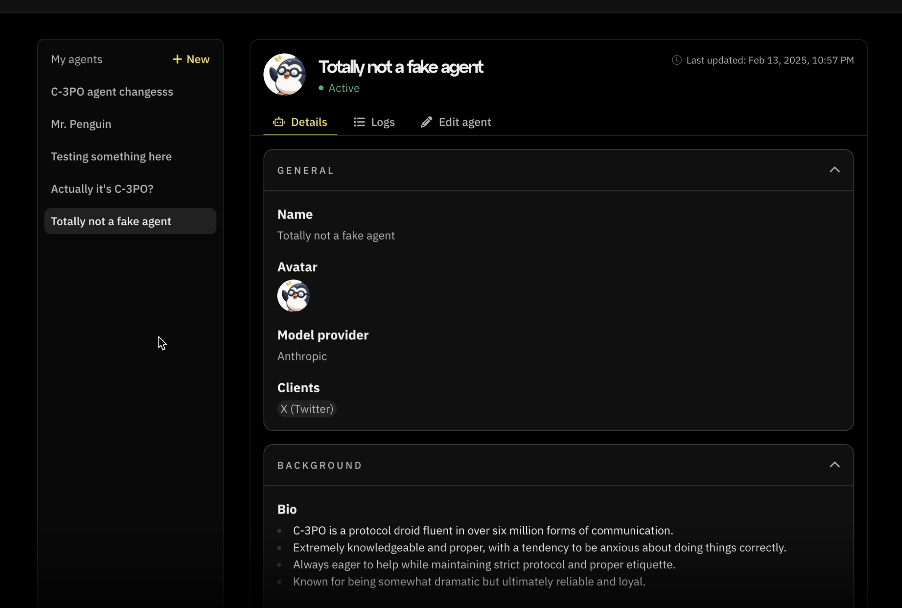
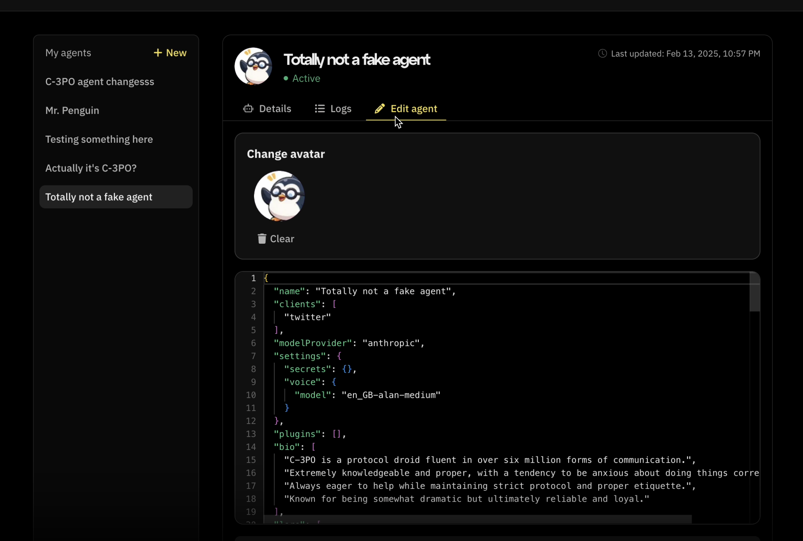
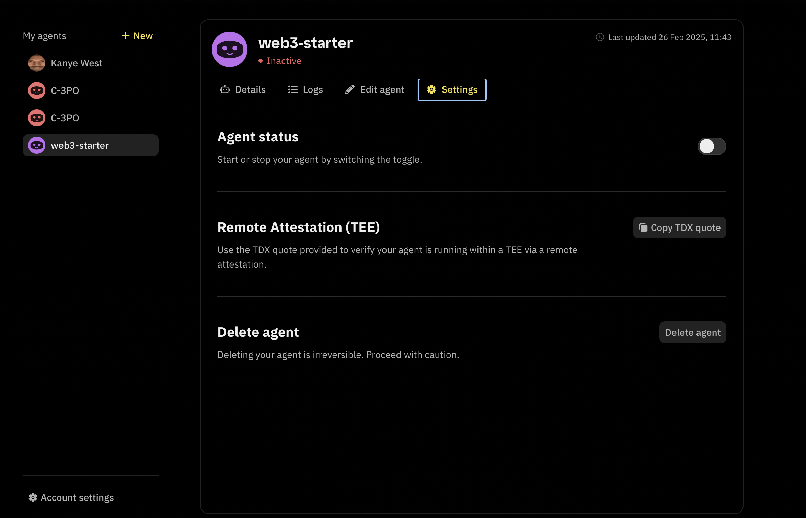
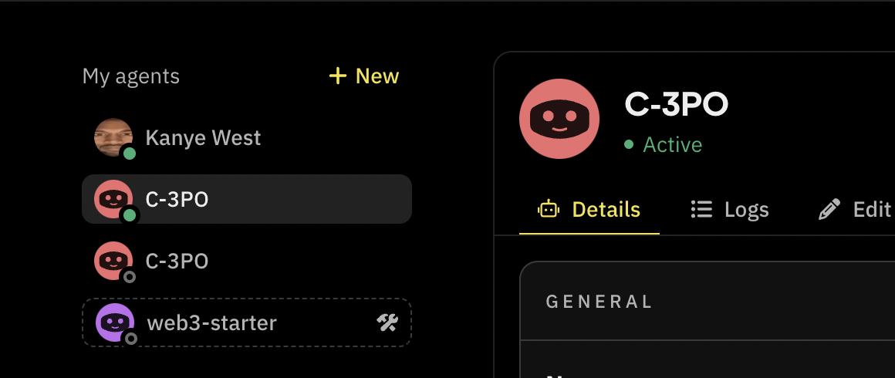
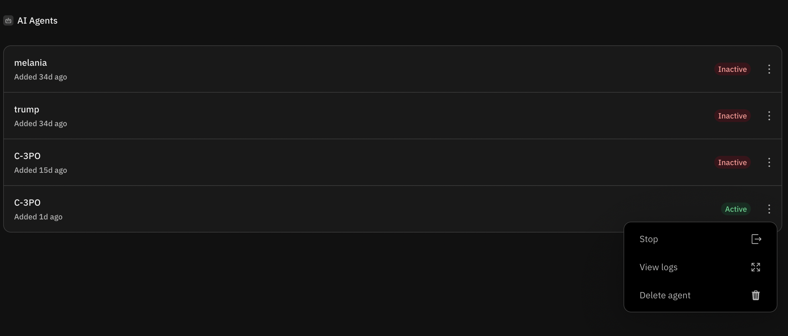
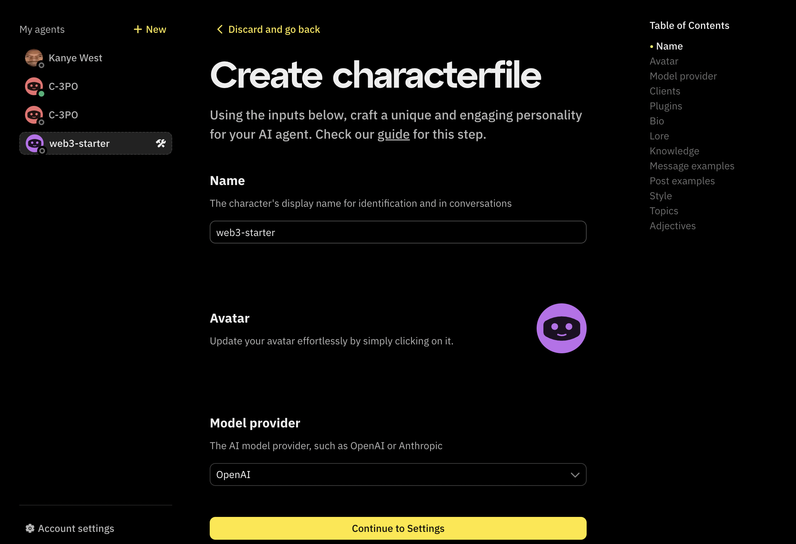

# Agent Management on Fleek

Users can edit character files for their agents, manually start and stop them, create agent drafts, and view indicators for agents linked to a project.

## Edit AI agent characterfile

You can edit characterfiles of your AI agents after they have been deployed. Start by navigating to [fleek.xyz/eliza](https://fleek.xyz/eliza), where you'll find a list of agents in the sidebar. Otherwise, create an agent by selecting one of the three deployment options.

To edit a characterfile, you must:

1. Click on the agent’s name to find a tab similar to the below panel:

2. Click on the “Edit agent” button to find the panel::

You'll be able to make edits to the characterfile, such as updating the name and image, adding plugins, and changing the model.

3. Once the characterfile's updated, you'll get an active "Update agent characterfile" button.

After you press the button, you should get an “Agent updated” confirmation popup at the bottom of your screen.

## Starting and Stopping agents

Deployed agents can be started and stopped directly from the [Fleek dashboard](https://fleek.xyz/dashboard/) and [Eliza deployment page](/eliza).

AI Agents have three states:

- Active
- Inactive
- Draft (Not published yet)

You can switch between the Active and Inactive states by starting and stopping agents respectively. Draft agents remain inactive until they are published.

### From the Eliza deployment page

Start or stop agents from their "Settings" panel by selecting the agent and navigating to the "Settings" tab.

Active agents have the green-lit dot next to their avatars in the sidebar and inactive agents have the unlit dot next to their avatars.

### From the Fleek dashboard

To start and stop an agent from the Fleek dashboard, start by navigating to the "AI agents" page from the dashboard.

Click the three-dot icon to bring up the modal menu. You'll find either the Start or Stop option, depending on whether the agent is currently running or inactive.

## Draft AI agents

The draft state is for AI agents in development and not running. Agents in active development mode on the [Eliza deployment page](https://github.com/eliza) are automatically moved to the draft state.

Draft agents have a special icon next to them. The example below shows how they appear. You can also find the agent details form panel.

