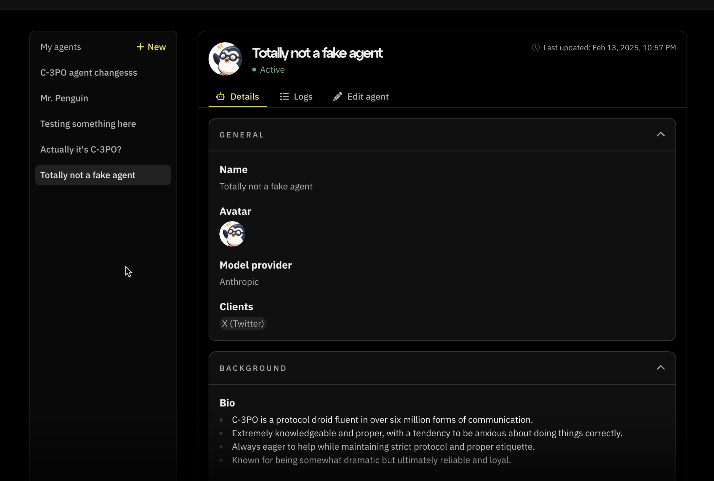
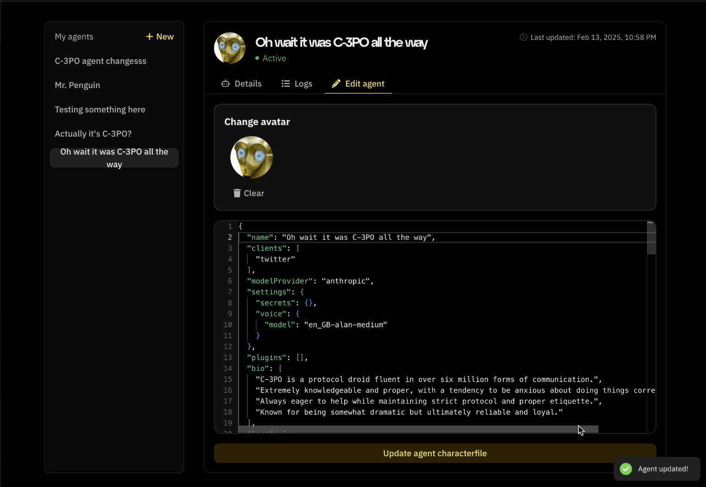

# Edit characterfile on Fleek

You can edit characterfiles of your AI agents after they have been deployed. Start by navigating to [fleek.xyz/eliza](https://fleek.xyz/eliza). If you have deployed agents previously, you will see a list of agents in the sidebar on the screen. Select any of the three deployment options if you have not deployed any agents. To edit a characterfile:

1. Click on the agent’s name and you should see a tab similar to the below:

2. Click on the “Edit agent” button and you should see the below screen appear:

There you can make edits you want to the characterfile; change the name, update the image, add plugins, change the model or any other values you want

3. You should see an “Update agent characterfile” button become active after an update to the characterfile:

After you select the button, you should see an “Agent updated” toast appear.
