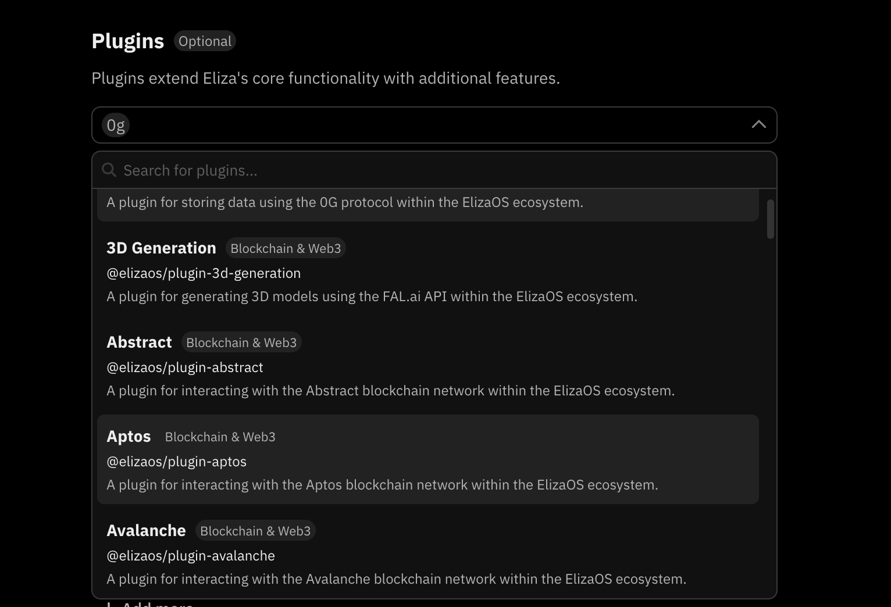
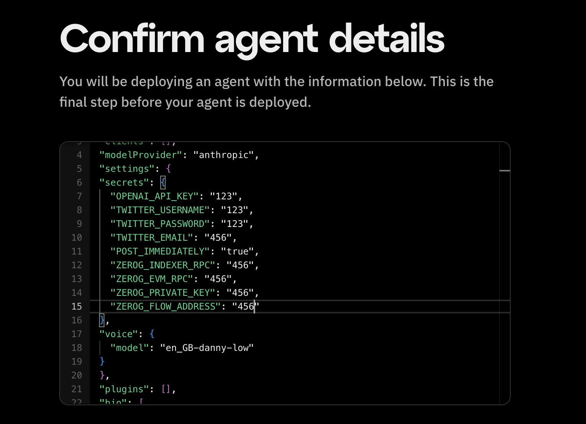

# Eliza Plugins

:::info
Fleek currently runs the latest stable release of the Eliza framework -- [Version 0.18](https://github.com/elizaOS/eliza/releases).
:::

Eliza's plugin system provides a versatile way to expand its core functionality by incorporating additional features, actions, evaluators, and providers. These standalone modules can be effortlessly added or removed, enabling you to customize your agent's capabilities to suit your requirements.
Fleek supports plugins available within the Eliza repository, allowing you to deploy your agents along with those plugins seamlessly.

:::note
Support for custom plugins is not currently available. The team is working on adding support for them.
:::

## Adding plugins

### From characterfile

Adding plugins when deploying your characterfile directly is easy. All you have to do is add your plugins to the "plugins" array. For example, to add the “story” plugin:

```json
"plugins": ["@elizaos/plugin-0g"]
```

### Fleek’s Eliza UI

You can also add plugins to your agent directly from the form UI. To add a plugin:

1. Go to the “Plugins” section on the form
2. Click on the dropdown, then browse or search to select your plugin of choice to add it directly to your agent:



3. You should see your selected plugins on the UI like this:


Most plugins require some secrets to make them function properly. For example, for the 0g plugin referenced above, we would add to the “secrets” object in the “settings” key in your characterfile like so:


