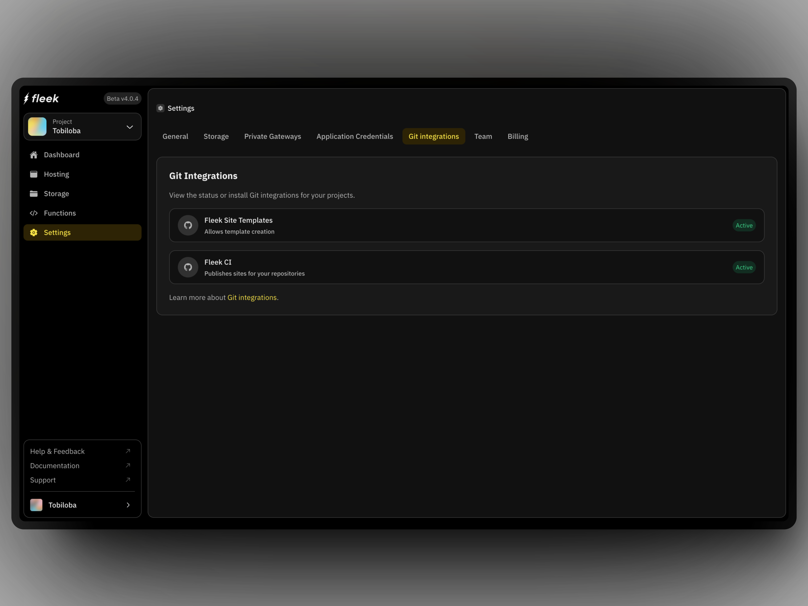
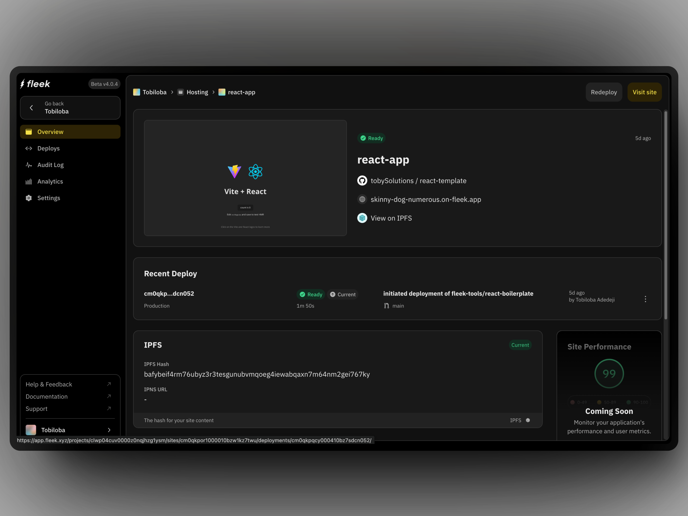
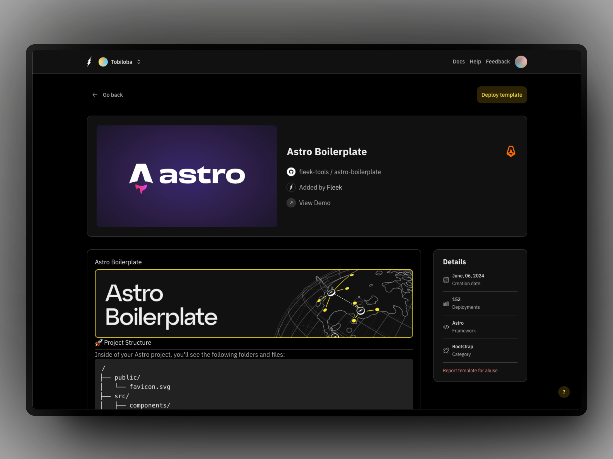
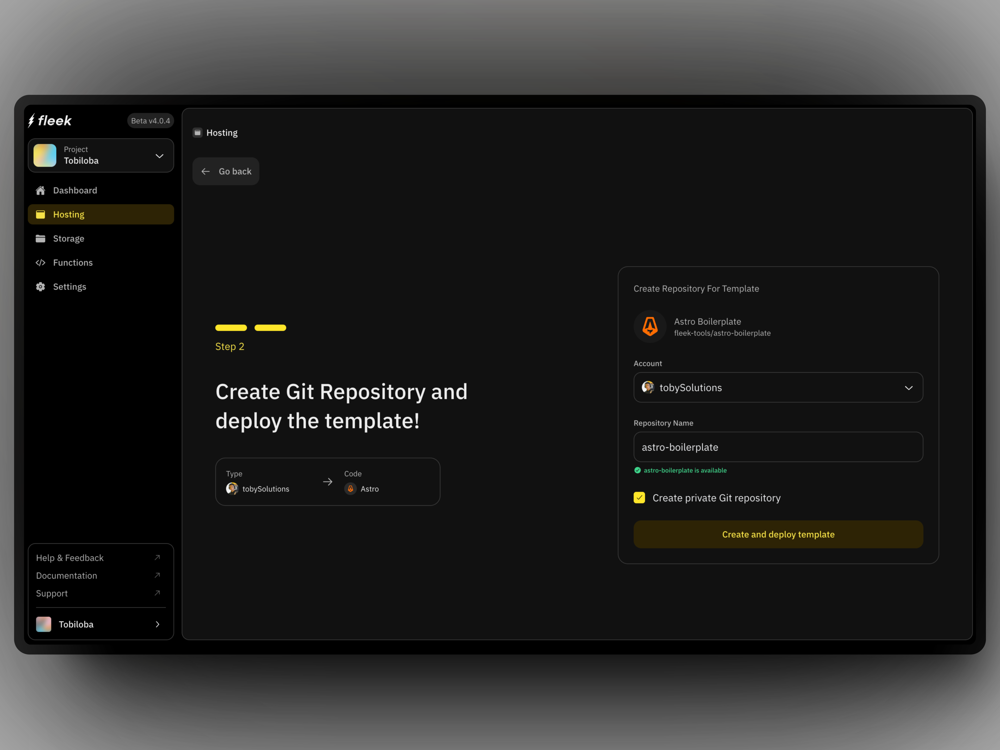
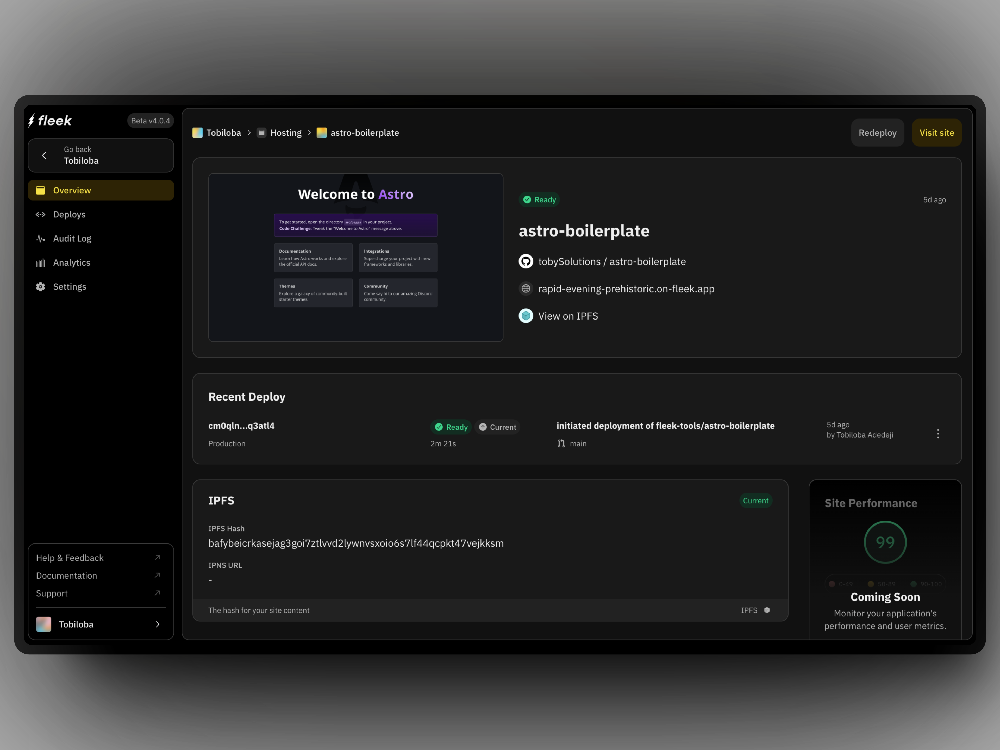

import ButtonGray from '@components/ButtonGray';


## What is Fleek?

Fleek is an onchain edge-optimized cloud platform that allows users to build, host, and deploy websites and applications efficiently, empowering developers to create fast and high-performing apps.

Fleek is powered by the onchain edge-optimized cloud network known called [Fleek Network](/docs/infrastructure/) and it gives access to a variety of features and capabilities that makes it easy to manage cloud infrastructure.

{/* {{Image mashup showing the platform, sdk and cli vibe or just a short video}} */}

<div className="my-12 bg-gray-dark-6 p-[1px]" />

## How to get started

Below are a few resources to help you get started with Fleek. Whether you're new to the platform or looking to dive deeper into our features, these sections below will help you navigate Fleek.

<div className="my-12 bg-gray-dark-6 p-[1px]" />

## Host an app

Learn how to host a React app and a Fleek template app in Astro on Fleek using the Fleek platform app. You will need to have an account on the [Fleek app](https://app.fleek.xyz) to follow the steps below.

:::info
Fleek supports static sites currently. SSR support is a work in progress and is not yet available for deployed sites.
:::

### Host a React app

1. Create a react app with [Vite](https://vitejs.dev/guide/) or [Create-React-App (CRA)](https://create-react-app.dev/docs/getting-started)

2. If you are using Vite, make sure your Vite config has the base set to "./" as seen below:

   ```ts
   import { defineConfig } from 'vite';
   import react from '@vitejs/plugin-react-swc';

   // https://vitejs.dev/config/
   export default defineConfig({
     plugins: [react()],
     base: './',
   });
   ```

3. When using Create React App (CRA), ensure that your `package.json` includes the following `homepage` attribute:
   ```js
   {
       // ...
       "homepage": ".",
       // ...
   }
   ```
4. Push your app to Github
5. Go to the [Fleek app](https://app.fleek.xyz/) and go to `Settings` and click on "Git Integrations"
6. Ensure that you install both of the Github applications and that they both have the "Active" badge as below. They are important for any deployment from Fleek:

   

7. Go to the "Sites" tab, click on "Add new" and select the Github repository where your app is hosted
8. Ensure everything is correct with the build settings and click on "Deploy site". The correct build settings for a React app are:
   - Build command: `npm run dev && npm run build`
   - Publish directory: `dist`
9. Your site has been deployed and you can access it by clicking on the "Visit site" button:

   

### Host a Fleek template app

Deploy a Fleek template app in Astro on Fleek using the Fleek platform app.

1. Go to the [Fleek app](https://app.fleek.xyz/) and go to the "Sites" tab
2. Click on "Add new" and from the dropdown, select the "Use a template" option and it takes you to the templates page
3. Search for the "Astro Boilerplate" template and click on it

   

4. Select Github. Ensure you have your Github account connected, as in the Github integration step 6 in the React app section
5. You get a page you can customize the name that Fleek is to create and the account the Github account you connected earlier appears as well. You can choose if you want the repository private or public.

   

6. Fleek will start the deployment process and you can see the progress in the "Deploys" tab. Once the deployment is complete, you can access the site by clicking on the "Visit site" button.

   

<div className="my-12 bg-gray-dark-6 p-[1px]" />

### Using the Fleek CLI

You can also deploy your app using the Fleek CLI. To do this, you need to have the Fleek CLI installed. You can install it by running the following command:

```bash
npm install -g @fleek-platform/cli
```

Once you have the Fleek CLI installed, you have to login to your Fleek account by running the following command:

```bash
fleek login
```

Cloning and deploying a site using the Fleek CLI is as simple as initializing the site, adding the files, and deploying the site. You can follow the steps [here](/docs/cli/sites).

To deploy a simple site using the Fleek CLI, you can follow the steps below:

1. **Create a project**

   To start, create a new Fleek project by running:

   ```bash
   fleek projects create
   ```

2. **Set Up a Simple Page**

   First, create a directory for your project (e.g., ~/fleek-quick-start) and navigate into it:

   ```bash
   mkdir ~/fleek-quick-start && cd ~/fleek-quick-start
   ```

   Create a simple HTML page:

   ```bash
   echo "Hello world" > index.html
   ```

3. **Set Up a Fleek Site**

   To deploy your page, initialize a Fleek site by running:

   ```bash
   fleek sites init
   ```

   Follow the prompts:

   - Enter a site name.
   - Specify the directory (use . for the current directory).
   - Skip the build command by typing "n."
   - Choose your preferred configuration format (e.g., JSON).

   Once completed, you’ll see a success message.

4. **Deploy the Fleek Site**

   Finally, deploy your site::

   ```bash
    fleek sites deploy
   ```

   After successful deployment, you'll receive a confirmation with the IPFS CID and a link to access your site:

   ```bash
   Site IPFS Content Identifier (CID): xxxxx
   Access via: https://<SLUG>.on-fleek.app
   ```

<div className="my-12 bg-gray-dark-6 p-[1px]" />

## Fleek Functions quick start

:::info
Fleek Functions are in alpha, running on a testnet. Avoid using them in production as changes are expected during development.
:::

Fleek Functions are edge-optimized functions on the Fleek Network, you can use them to perform server-side operations.

Ensure you have the Fleek CLI by running the command:

```bash
npm install -g @fleek-platform/cli
```

For this quick start, we will deploy a simple function that returns an "hello world" string response. You can use the [Fleek app](/docs/platform/fleek-functions#creating-and-using-fleek-functions) or [Fleek CLI](docs/cli/functions#create-a-fleek-function) for this.

### Using the Fleek app

1. On the project’s dashboard, click on the “Functions” button on the secondary navigation

2. Click on the “Create function” button on the extreme right-hand of the secondary navigation and a modal pops up:

   

3. Go through the steps (from step 1 through to step 4) and follow the instructions per step

   - Since you have the Fleek CLI installed, type the following command to log in to your Fleek account from the CLI:

   ```bash
   fleek login
   ```

   - We also need to switch to the Fleek project we created the Fleek Function within from the platform using the project ID. We use the command below to do that from the CLI:

   ```bash
   fleek projects switch --id={{PROJECT_ID}}
   ```

   - Create a file in a directory on your machine and name it `function.js`. In the file, write the below code:

   ```javascript
   export const main = (params) => {
     return 'hello world';
   };
   ```

   - Create the Fleek Function with the same name as the one you inputted on the Fleek platform using the below command:

   ```bash
       fleek functions create  --name demo-function
   ```

   - Deploy the Fleek Function, using the below command:

   ```bash
   fleek functions deploy --name demo-function --path <code_path>
   ```

You have successfully deployed a Fleek Function using the above steps from the Fleek platform UI and now the first section of our Fleek Function "Overview" page should look like this now with the "Pending" status updated:

### Using the Fleek CLI

Deploying one is as easy as 4 steps:

1. **Login to your Fleek account**

   ```
   fleek login
   ```

2. **Create a draft function**: You can write a Typescript or JavaScript function

   To start, create a new Fleek project by running:

   ```bash
   touch my-first-function.js
   ```

   In your text editor, add the following code:

   ```js
   export const main = (params) => {
     return 'hello world';
   };
   ```

3. **Create your Fleek Function**

   To start, create a new Fleek project by running:

   ```bash
   fleek functions create --name my-first-function
   ```

4. **Deploy your Fleek Function**

   To start, create a new Fleek project by running:

   ```bash
   fleek functions deploy \
   --name my-first-function \
   --path ~/some/path/my-first-function.js
   ```

<div className="my-12 bg-gray-dark-6 p-[1px]" />

## Help and tutorials

Find links to useful resources to help get started, understand a concept or to get yourself onboarded
to using Fleek for building edge-optimized applications.

### Videos to help you with Fleek

- [Quickly Deploy A Next.js App To IPFS Using Fleek CLI](https://www.youtube.com/watch?v=ZR6hoLODDvI)
- [Deploy an Astro App to IPFS Using Fleek CLI](https://www.youtube.com/watch?v=PejRu-zaJtY)
- [Fleek & Fleek Network in 10 Minutes - Explainer](https://www.youtube.com/watch?v=1zwwyTQ8JIM)
- [Pin Files on IPFS Using the Fleek SDK In Minutes](https://www.youtube.com/watch?v=2OzwtDH7K0A)

### Read our guides

In this section, you'll find helpful guides designed to assist you with the most commonly-encountered tasks on Fleek. For a deeper understanding and more extensive information, our documentation is available to provide further insights and support.

<div className="typo-btn-l mb-32">
  <a href="/guides" target="_blank" rel="noopener noreferrer">
    <ButtonGray className="flex items-center justify-center gap-12">
      <div>View guides</div>
    </ButtonGray>
  </a>
</div>

<div className="my-12 bg-gray-dark-6 p-[1px]" />

### Follow us

Join our community and stay up-to-date with the latest news, features, and insights from our team. Follow us on social media to receive updates, engage with our community, and share your thoughts. Connect with us on Discord for real-time conversations, support, and collaboration. Together, we're shaping the future of our service.

<div className="justify-left mt-12 flex flex-col sm:flex-row gap-16 mb-32">
  <div className="typo-btn-l">
    <a href="https://x.com/fleek" target="_blank" rel="noopener noreferrer">
      <ButtonGray className="flex items-center justify-center gap-12">
        <div>Follow us on X</div>
      </ButtonGray>
    </a>
  </div>

  <div className="typo-btn-l">
    <a
      href="https://discord.gg/fleek"
      target="_blank"
      rel="noopener noreferrer"
    >
      <ButtonGray className="flex items-center justify-center gap-12">
        <div>Join our Discord</div>
      </ButtonGray>
    </a>
  </div>
</div>
