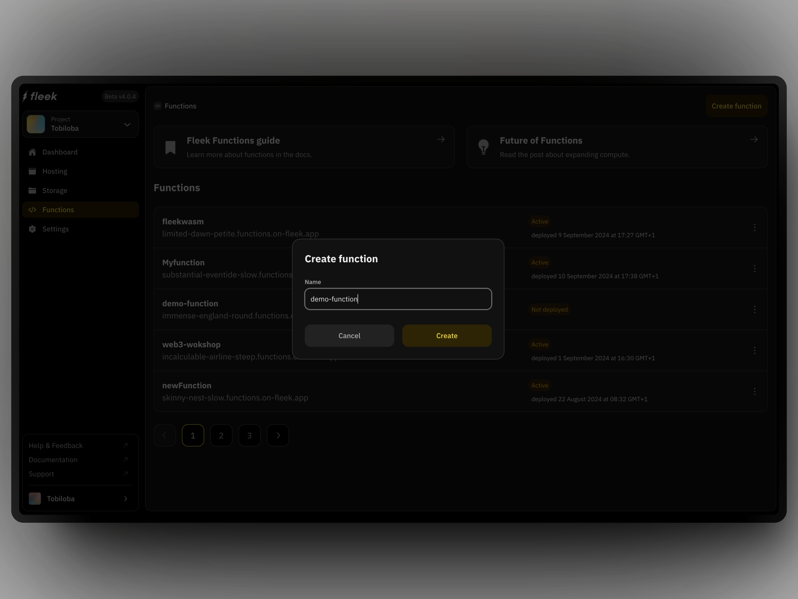

import { Button } from '@components/Button';


## What is Fleek?

Fleek is an onchain edge-optimized cloud platform that allows users to build, host, and deploy websites and applications efficiently, empowering developers to create fast and high-performing apps.

Fleek is powered by the onchain edge-optimized cloud network known as [Fleek Network](/docs/infrastructure/) and it gives access to a variety of features and capabilities that makes it easy to manage cloud infrastructure.

{/* {{Image mashup showing the platform, sdk and cli vibe or just a short video}} */}

<div className="my-12 bg-gray-dark-6 p-[1px]" />

## How to get started

Below are a few resources to help you get started with Fleek. Whether you're new to the platform or looking to dive deeper into our features, these sections below will help you navigate Fleek.

<div className="my-12 bg-gray-dark-6 p-[1px]" />

## Deploy Next.js on Fleek

Effortlessly deploy your fullstack or static Next.js applications on Fleek. Our dedicated Next.js adapter simplifies the deployment process, enabling you to run your Next.js app at the edge with ease.

<div className="justify-left mb-32 mt-12 flex flex-col gap-16 sm:flex-row">

  <Button
    variant="secondary"
    href="/docs/platform/frameworks#nextjs-on-fleek"
    target="_blank"
    rel="noopener noreferrer"
  >
    Learn more
  </Button>
  <Button
    variant="secondary"
    href="/docs/cli/fleek-next-cli"
    target="_blank"
    rel="noopener noreferrer"
  >
    Get the Fleek Next.js adapter
  </Button>
</div>

<div className="my-12 bg-gray-dark-6 p-[1px]" />
## Host an app

Learn how to host a React app and a Fleek template app in Astro on Fleek using the Fleek platform app. You will need to have an account on the [Fleek app](https://app.fleek.xyz) to follow the steps below.

:::info
Fleek supports static sites currently. SSR support is a work in progress and is not yet available for deployed sites.
:::

### Using the Fleek app

The platform provides seamless integration with Git, allowing you to deploy directly from your repositories. Fleek’s hosting service simplifies the deployment process with just a few clicks.

For step-by-step instructions on selecting repositories, and deploying your project, you can refer to Fleek platform's [Hosting documentation](/docs/platform/hosting).
This guide will walk you through the entire process of deploying your live site from the Fleek app.

<div className="my-12 bg-gray-dark-6 p-[1px]" />

### Using the Fleek CLI

Fleek CLI provides a streamlined way to deploy your projects, giving you full control from the command line. With simple commands, you can create, configure, and deploy sites directly to the Fleek platform.

To get started with the Fleek CLI, you'll first need to install it and log in to your account. For detailed instructions on deploying sites, including cloning repositories and initializing projects, refer to [Fleek's CLI Documentation](/docs/cli/).

A quick overview of deploying a site via Fleek CLI is as simple as:

- Create a project
- Set up pages
- Initialize a Fleek site
- Deploy the site

<div className="my-12 bg-gray-dark-6 p-[1px]" />

## Fleek Functions quick start

:::info
Fleek Functions are in alpha, running on a testnet. Avoid using them in production as changes are expected during development.
:::

Fleek Functions are edge-optimized functions on the Fleek Network, you can use them to perform server-side operations.

Ensure you have the Fleek CLI by running the command:

```bash
npm install -g @fleek-platform/cli
```

For this quick start, we will deploy a simple function that returns an "hello world" string response. You can use the [Fleek app](/docs/platform/fleek-functions#creating-and-using-fleek-functions) or [Fleek CLI](/docs/platform/fleek-functions/) for this.

### Using the Fleek app

1. On the project’s dashboard, click on the “Functions” button on the secondary navigation

2. Click on the “Create function” button on the extreme right-hand of the secondary navigation and a modal pops up:

   

3. Go through the steps (from step 1 through to step 4) and follow the instructions per step

   - Since you have the Fleek CLI installed, type the following command to log in to your Fleek account from the CLI:

   ```bash
   fleek login
   ```

   - We also need to switch to the Fleek project we created the Fleek Function within from the platform using the project ID. We use the command below to do that from the CLI:

   ```bash
   fleek projects switch --id={{PROJECT_ID}}
   ```

   - Create a file in a directory on your machine and name it `function.js`. In the file, write the below code:

   ```javascript
   export const main = (params) => {
     return 'hello world';
   };
   ```

   - Create the Fleek Function with the same name as the one you inputted on the Fleek platform using the below command:

   ```bash
       fleek functions create  --name demo-function
   ```

   - Deploy the Fleek Function, using the below command:

   ```bash
   fleek functions deploy --name demo-function --path <code_path>
   ```

You have successfully deployed a Fleek Function using the above steps from the Fleek platform UI and now the first section of our Fleek Function "Overview" page should look like this now with the "Pending" status updated:

### Using the Fleek CLI

Deploying one is as easy as 4 steps:

1. **Login to your Fleek account**

   ```
   fleek login
   ```

2. **Create a draft function**: You can write a Typescript or JavaScript function

   To start, create a new Fleek project by running:

   ```bash
   touch my-first-function.js
   ```

   In your text editor, add the following code:

   ```js
   export const main = (params) => {
     return 'hello world';
   };
   ```

3. **Create your Fleek Function**

   To start, create a new Fleek project by running:

   ```bash
   fleek functions create --name my-first-function
   ```

4. **Deploy your Fleek Function**

   To start, create a new Fleek project by running:

   ```bash
   fleek functions deploy \
   --name my-first-function \
   --path ~/some/path/my-first-function.js
   ```

<div className="my-12 bg-gray-dark-6 p-[1px]" />

## Fleek storage quickstart

:::info
There is an option to configure a private gateway for increased rate limits when retrieving resources
:::

Fleek's storage service enables the decentralized storage of your files by leveraging the edge-optimized Fleek Network. The service supports IPFS as our main storage protocol, complemented by Arweave and Filecoin as a backup layer

### Using the Fleek app

To use Fleek storage, you can follow the steps below:

1. **Navigate to the "Storage" tab**
2. **Click the "Add New" button to upload a file or folder**

### Using the Fleek CLI

With the CLI already installed, you can also access the Fleek storage service.

To add a file "hello_world.txt" to Fleek Storage simply run the command:

```sh
fleek storage add ~/MyFiles/hello_world.txt
```

You can also perform other operations listing all the files or directories in the Fleek Storage for the current project and deleting a file or directory from the Fleek Storage. You can find more information on the Fleek CLI storage commands [here](/docs/cli/storage).

<div className="my-12 bg-gray-dark-6 p-[1px]" />

## Help and tutorials

Find links to useful resources to help get started, understand a concept or to get yourself onboarded
to using Fleek for building edge-optimized applications.

### Videos to help you with Fleek

- [Quickly Deploy A Next.js App To IPFS Using Fleek CLI](https://www.youtube.com/watch?v=ZR6hoLODDvI)
- [Deploy an Astro App to IPFS Using Fleek CLI](https://www.youtube.com/watch?v=PejRu-zaJtY)
- [Fleek & Fleek Network in 10 Minutes - Explainer](https://www.youtube.com/watch?v=1zwwyTQ8JIM)
- [Pin Files on IPFS Using the Fleek SDK In Minutes](https://www.youtube.com/watch?v=2OzwtDH7K0A)

### Read our guides

In this section, you'll find helpful guides designed to assist you with the most commonly-encountered tasks on Fleek. For a deeper understanding and more extensive information, our documentation is available to provide further insights and support.

To get up to speed with deploying your website or application, check out the below guides:

- [Deploy a React app](/docs/platform/frameworks#host-a-react-app)
- [Deploy an Astro website](/docs/platform/frameworks#host-a-react-app)

For all of our guides and more, visit our guides section:

<div className="w-fit">
  <Button
    variant="secondary"
    href="/guides"
    target="_blank"
    rel="noopener noreferrer"
  >
    View guides
  </Button>
</div>

<div className="my-12 bg-gray-dark-6 p-[1px]" />

### Follow us

Join our community and stay up-to-date with the latest news, features, and insights from our team. Follow us on social media to receive updates, engage with our community, and share your thoughts. Connect with us on Discord for real-time conversations, support, and collaboration. Together, we're shaping the future of our service.

<div className="justify-left mb-32 mt-12 flex flex-col gap-16 sm:flex-row">
  <Button
    variant="secondary"
    href="https://x.com/fleek"
    target="_blank"
    rel="noopener noreferrer"
  >
    Follow us on X
  </Button>
  <Button
    variant="secondary"
    href="https://discord.gg/fleek"
    target="_blank"
    rel="noopener noreferrer"
  >
    Join our Discord
  </Button>
</div>
