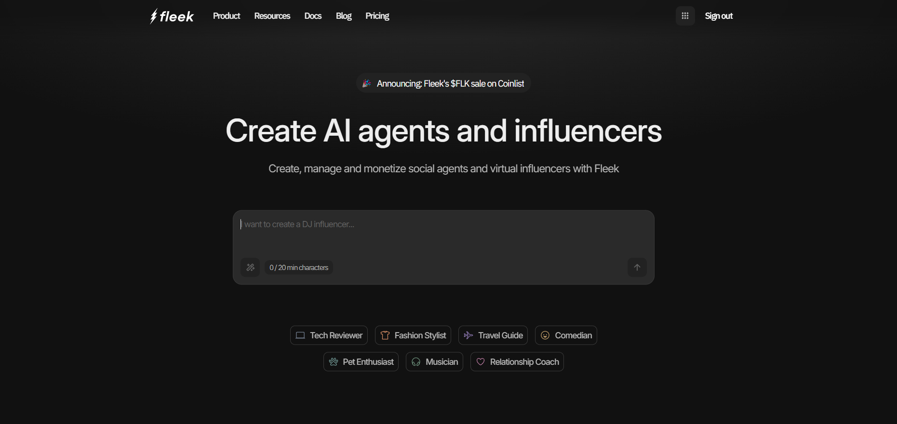
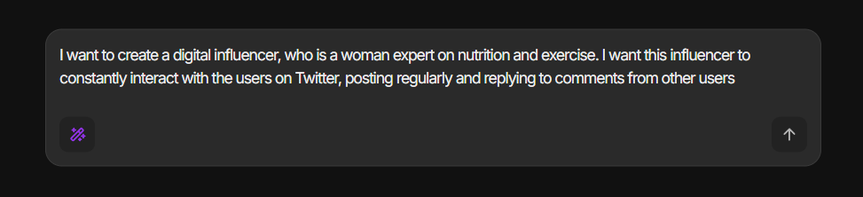
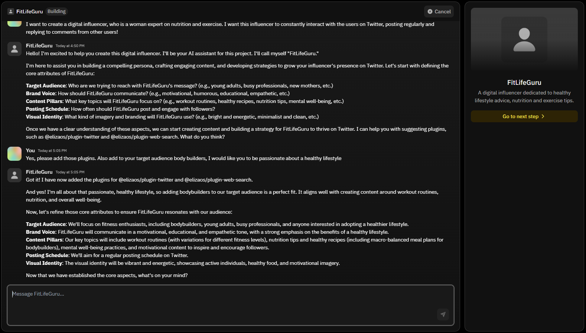
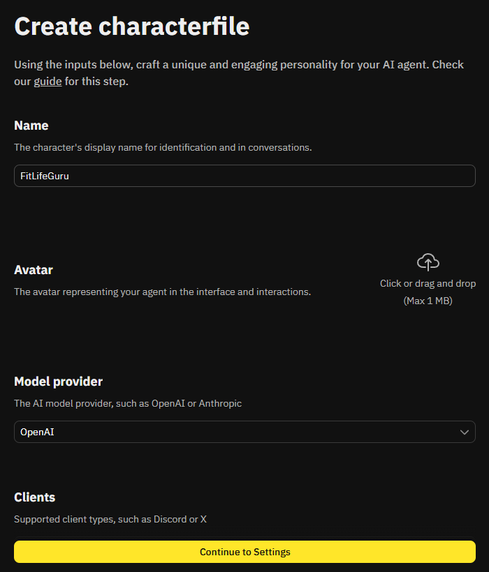
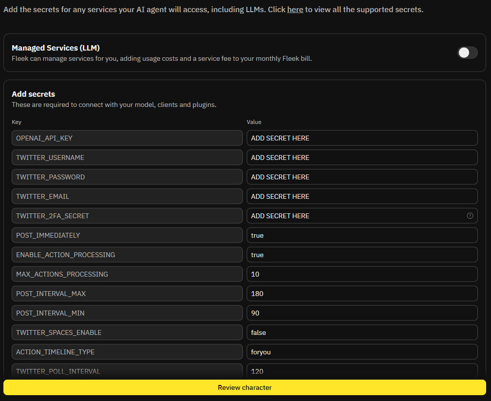

# **Conversational Creator**

Conversationally build and update agents with natural language. Simply describe what you want, and your idea becomes a fully functional agent in seconds. Whether you're adjusting behavior, adding plugins, or starting from scratch, the process is as easy as having a conversation. In this guide, we’ll walk you through the step-by-step process to go from idea to deployed agent.

## **Step 1: Log In and Describe Your Agent**

1. Head to [eliza.fleek.xyz](https://eliza.fleek.xyz/) and log in to your account.
2. Once you're in, you'll land on the **Create AI agents and influencers** page.
3. In the description box, describe the agent or virtual influencer you want to create.
   - Example: _“I want to create a digital influencer, who is a woman expert on nutrition and exercise. I want this influencer to constantly interact with users on Twitter, posting regularly and replying to comments.”_
4. Need inspiration? You can also select one of our **premade agent templates** at the bottom of the page — such as **Tech Reviewer**, **Fashion Stylist**, **Travel Guide**, and more — to give yourself a head start.

## **Step 2: Chat With Your Agent to Refine It**

1. After describing your agent, you'll enter a chat session where you can collaborate with your AI agent.
2. Use this conversation to upgrade and fine-tune your agent:
   - Discuss target audience, brand voice, content pillars, posting schedule, and visual identity.
   - Suggest any specific functionalities you want — like connecting to social media plugins (e.g., Twitter or web search) — and the agent will automatically add them to its settings.
3. The more detailed the information you provide here, the better your agent will perform once live.
4. When you're happy with the setup, click the **"Go to next step"** button on the right side to review your agent’s full settings.

## **Step 3: Review and Finalize Your Agent’s Characterfile**

1. On the **Create characterfile** page, you’ll see the core settings of your agent.
2. Here you can review all the information of your agent like the name, plugins that you want to add, knowledge, style of communication, adjectives, and more.
3. If you want to adjust any details you discussed with the agent earlier, this is the perfect place to do it.
4. Once you're happy with the setup, click the **"Continue to Settings"** button at the bottom to move on to adding your agent’s secrets (API keys, credentials, etc).

## **Step 4: Add Your Secrets and Configure Managed Services**

1. On the **Settings** page, you’ll be asked to fill in the secrets needed for your agent to work properly.
2. These secrets typically include API keys, tokens, or credentials for the plugins or integrations you selected earlier (e.g., Twitter API keys if your agent will post on Twitter).
3. You’ll also see an option to toggle **Managed Services (LLM)**.
   - If you enable this, **Fleek will manage the LLM (Large Language Model) service for you**.
   - Instead of providing your own API key for the model (like OpenAI), Fleek will handle it and simply add the usage costs + a small service fee to your monthly Fleek bill.
   - This is a great option if you want an easier setup without having to manage keys yourself.
4. Make sure to add all the secrets required for the plugins and features you selected, so your agent can function seamlessly across the platforms you want.

Once everything is filled in, you’re ready to move forward!

## **Step 5: Review and Deploy Your Agent**

1. After filling in your secrets, click on **Review Character** to see a full summary of your AI agent’s setup.
2. Double-check all the details—your agent’s name, avatar, settings, model provider, and the secrets you added.
3. When you’re ready, click **Deploy** to launch your agent into action!
4. If you don’t have an active subscription yet, you’ll be prompted to subscribe at this stage.
   - **Good news:** Fleek offers a **24-hour free trial**, so you can deploy your agent and start using it right away without any upfront cost.

After deployment, your agent will be live and ready to start engaging with users based on the strategy you created!
