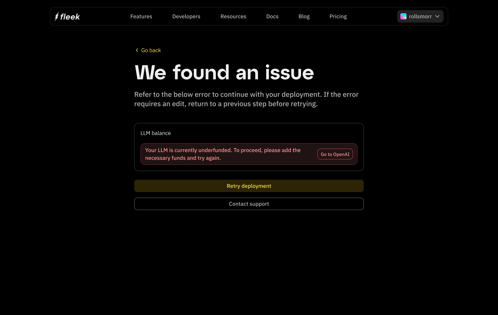

# Troubleshooting

:::info
Eliza's latest version ([v0.25.9](https://elizaos.github.io/eliza/docs/changelog/#v0259-march-02-2025)) is now available on Fleek.
:::

This section goes over deployment errors.

When a deployment fails, you can retry or contact [Support](https://support.fleek.xyz)

Here, we have an LLM-specific issue. Follow the on-screen instructions to resolve any issue.

For additional assistance, check out our [Support](https://support.fleek.xyz) page or connect with us on [Discord](http://discord.gg/fleek).
